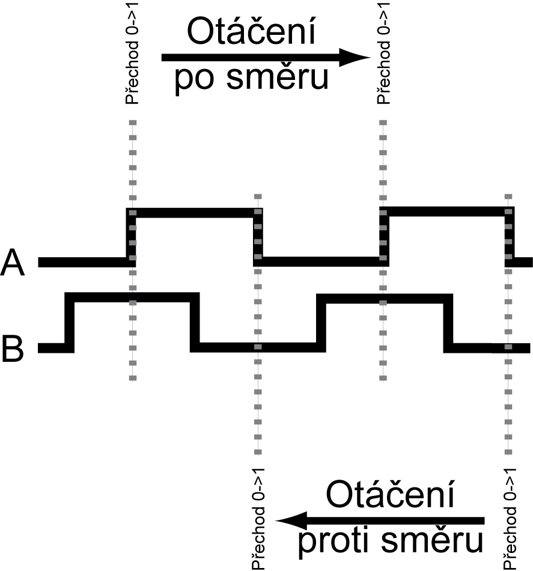
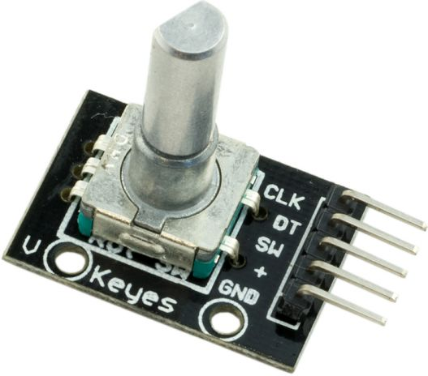

## 20.6 Rotační enkodér {#20-6-rota-n-enkod-r}

Samozřejmě, že se takovéhle věci používají i v praxi. Těm součástkám se říká rotační enkodéry _(rotary encoder)_, a často se používají pro ovládání různých zařízení. Vypadají jako potenciometry, ale mohou se točit „donekonečna“, a většinou cítíte jemné vrčení, když jimi otáčíte.

Taková součástka má uvnitř podobný kotouček s Grayovým kódem. Má dva vývody, na kterých se střídají hodnoty 00 – 01 – 11 – 10, nebo 00 – 10 – 11 – 01, to podle směru otáčení. Na jednu otáčku mívají typicky 20 kroků, a navíc bývají kombinovány s tlačítkem, takže lze zařízení ovládat pomocí otáčení do dvou směrů a mačkání tlačítka.

Jak takové signály číst? No, jsou dva možné způsoby. Buď budete vzorkovat oba signály a podle přechodové funkce zkoušet, jestli se ovladač otáčí doleva nebo doprava. No a nebo se podíváte na graf průběhů výše a dojde vám to…

Stačí signál A nazvat „hodinovým“ (CLK) a hlídat, kdy se změní z 0 na 1 (viz obrázek). V ten okamžik přečtěte stav na vstupu B (nazvu ho datovým, DT). Pokud je 1, znamená to otáčení jedním směrem, pokud 0, znamená to otáčení druhým směrem. _Za domácí úkol si zkuste, co se stane, když vstupy A a B prohodíte._

Já vím, tohle je trošku divoké na představivost, ale to půjde… Sledujte okem první řádek, signál A, a hledejte vzestupnou hranu – tedy změnu 0-1\. Jakmile ji najdete, podívejte se, jakou hodnotu má právě v tu chvíli signál B. Když jedete okem zleva doprava, tak vzestupné hrany přicházejí vždy ve chvíli, když je na vstupu B logická 1\. Když to zkusíte v protisměru a pojedete okem zprava doleva, přijde změna 0-&gt;1 vždy ve chvíli, kdy je vstup B v logické 0.
