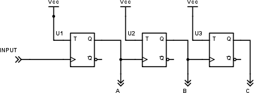
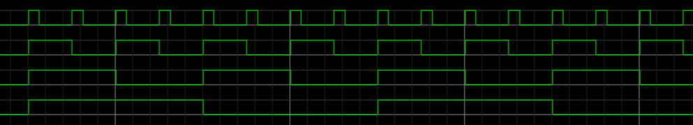
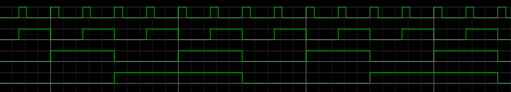

# 20 Čítače {#20-ta-e}

Musím se vám k něčemu přiznat. Když jsem jako desetiletý chlapec dostal do ruky katalog integrovaných obvodů Tesla a viděl jsem obvody, které se jmenují „čítače“, tak jsem si říkal: „Asi udělali chybu, asi tam mělo být napsáno _počítače_,“ a fakt jsem se těšil, že _tohle už je to ono_. No, není. Trochu mě to mrzelo, ale jen chvilku, brzo jsem totiž zjistil, že čítače jsou opravdu šikovné součástky.

Představte si, že vezmete několik „děliček kmitočtů“ a zapojíte je za sebe. Nějak takto:

[eknh.cz/cit3](https://eknh.cz/cit3)

Vstupy T jsou připojené na Vcc – napájecí napětí, takže jsou ve stavu log. 1 a obvod funguje jako dělička kmitočtu.

Na vstup pak přivedeme hodinový signál. Co se stane?

Na výstupu A bude hodinový signál s polovičním kmitočtem, na výstupu B se čtvrtinovým, na výstupu C s osminovým… A když se podíváte na stav na vývodech CBA v čase, uvidíte opakující se vzorec:

111–110–101–100–011–010–001–000–111

…

Tedy v dvojkovém kódu 7 – 6 – 5 – 4 – 3 – 2 – 1 – 0 – 7 – 6 atd.

Když vezmete data z negovaných vývodů, dostanete vzestupnou sekvenci:

[eknh.cz/citn](https://eknh.cz/citn)

Právě jste stvořili dvojkový (binární) tříbitový asynchronní čítač. Pokud budete jeho tři vývody považovat za tři bity informace, bude se s každým pulsem na vstupu hodnota na výstupu zvyšovat o 1 a bude postupně střídat hodnoty 0 až 7 stále dokola.

Když přidáte další klopný obvod do řady, získáte čtyřbitový čítač, který bude mít hodnoty 0 – 15\. Takhle můžete skládat čítače za sebe, každý další klopný obvod zvýší počet hodnot na dvojnásobek. Patnáctibitový čítač tak bude nabývat hodnot 0 až 32767…

K čemu to může být dobré kromě dělení frekvence? Co třeba k počítání nějakých událostí? Třeba když budete počítat pulsy s frekvencí 1 Hz, získáme hodiny.

Nojo, říkáte si, ale hodiny se přeci nepočítají do osmi, ale do šedesáti sekund, šedesáti minut a 24 hodin. Co s tím?
