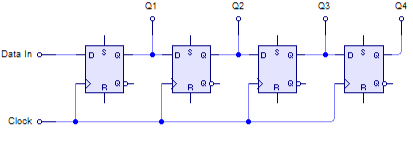
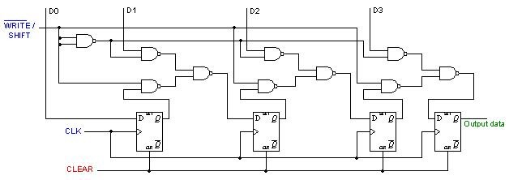

# 21 Posuvné registry {#21-posuvn-registry}

Vraťme se teď myšlenkami o kousek zpátky. Johnsonův čítač… Klopné obvody typu D, zapojené za sebou… máte? Co to trochu zobecnit?

Představte si takovéhle zapojení. S každým pulsem hodin se do levého klopného obvodu zapíše informace ze vstupu Data In, do druhého obvodu se zapíše předchozí informace z prvního, do třetího se zapíše informace z druhého… No a nakonec po čtyřech pulsech hodin se zapíšou čtyři bity hezky postupně do všech klopných obvodů. Nějak takhle – představte si, že po každém řádku přijde puls na vstup Clock:

| Data In | Q1 | Q2 | Q3 | Q4 |
| --- | --- | --- | --- | --- |
| 0 | x | x | x | x |
| 1 | 0 | x | x | x |
| 0 | 1 | 0 | x | x |
| 1 | 0 | 1 | 0 | x |
| 1 | 1 | 0 | 1 | 0 |
| 0 | 1 | 1 | 0 | 1 |
| x | 0 | 1 | 1 | 0 |

Všimněte si, že vlastně takto bereme bity, které jdou za sebou, sériově, po jednom vodiči Data In, a převádíme je do paralelní podoby.

Takovému uspořádání se říká posuvný registr – důvod je asi jasný: každý puls hodin posouvá informaci uvnitř o jednu pozici dál. Tento typ se označuje jako SIPO: Serial In, Parallel Out, tedy _sériově dovnitř, paralelně ven_.

Samozřejmě existují i opačné registry PISO. Mají několik datových vstupů (většinou 4 nebo 8), pak signál, kterým se zapíše tato informace do vnitřních klopných obvodů, a pak hodiny, které posílají jednotlivé bity na výstup Q. Jeho zapojení je ale o něco složitější.

Kombinací obého dostáváme hybridní registry SISO-PISO-SIPO, tedy takové, které mohou mít vstupy i výstupy obojího typu. Častá kombinace je SISO-SIPO, tedy registry, které mají sériový vstup i výstup, a k tomu paralelní výstup. Lze je totiž snadno zapojit za sebe a poskládat tak třeba dvacetibitové převodníky.

K čemu je taková věc dobrá? No, třeba když potřebujete přenést signál na delší vzdálenost, tak je dobré převést jej nejprve na sériovou podobu, tedy na proud bitů, přenést je hezky po jednom, a pak opět poskládat dohromady do celých slov.

Proč?

Víte co, pojďme si zatím říct něco o komunikačních rozhraních, pak to bude třeba jasnější.

##### 22 Paralelní a sériová rozhraní {#22-paraleln-a-s-riov-rozhran}
