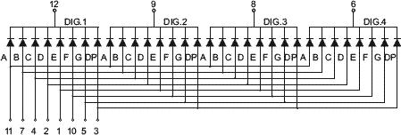
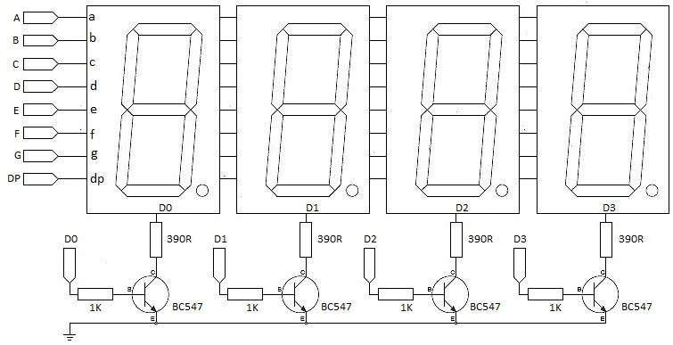

## 22.1 Buzení displeje ze sedmisegmentovek {#22-1-buzen-displeje-ze-sedmisegmentovek}

Když to vezmete kolem a kolem, je takový displej ze sedmisegmentovek velice náročná záležitost. Představte si čtyřmístný displej. Každá sedmisegmentovka má osm vývodů, to máte 32 vývodů, ani nemrknete…

Ve skutečnosti se ale takto vícemístné sedmisegmentovky nezapojují. Zapojují se tak, že mají spojené všechny segmentové vstupy (a-g a tečku), tedy 8 vývodů, a pak jsou vyvedené společné anody / katody pro každou pozici. Nějak takto:

Pro N pozic stačí tedy 8 + N vývodů – pro čtyřmístný displej 12.

Na používání takového displeje musí být určitý trik. Je jasné, že nemůžeme zobrazovat všechno najednou – nemáme jak. Používá se proto řešení jiné: přivedeme na segmentové vstupy kombinaci pro první pozici, a aktivujeme společný vývod pro pozici 1\. Necháme ji chvilku svítit, a pak totéž opakujeme pro druhou, třetí, … pozici. Říká se tomu _multiplexované řízení_ displeje. Pokud takhle blikáme dostatečně rychle, lidské oko nevidí, že vždy svítí jen jedna sedmisegmentovka a zdá se mu, že svítí celý displej. „Dostatečně rychle“ znamená alespoň padesátkrát za sekundu. K tomu se opět používají buď specializované obvody, nebo se to nechá na jednočipu, který má dostatečný výkon, aby se tímhle zabýval. Bohužel, takový displej sebere hodně vývodů (třeba těch 12), a když máte jednočip s dvaceti vývody, moc vám jich už nezbývá.

Technická poznámka: pro buzení takových displejů je vhodné použít tranzistorový budič. Pokud každý segment chce proud třeba 5 mA , tak vám při rozsvícené „osmičce“ poteče společným vývodem 35 mA, a to je víc, než je většina jednočipů schopna a ochotna poskytnout.

Co dělat v situaci, kdy:

• blikání displeje, byť rychlé, je na závadu (třeba je snímané kamerou)

• nemáte sdružený displej, ale opravdu čtyři sedmisegmentovky

• chcete ušetřit počet nutných signálů?
