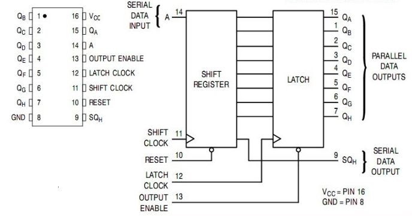
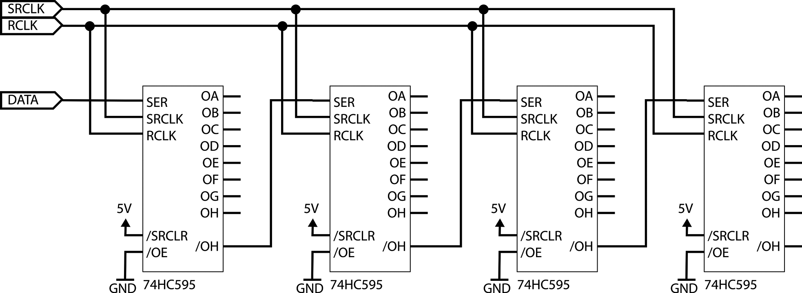
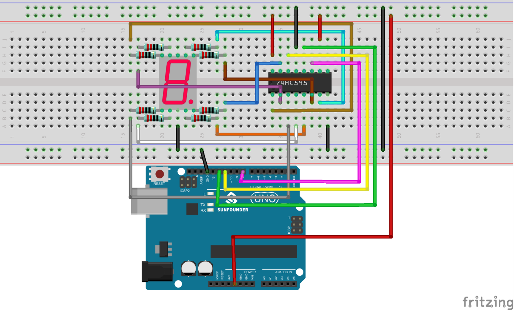
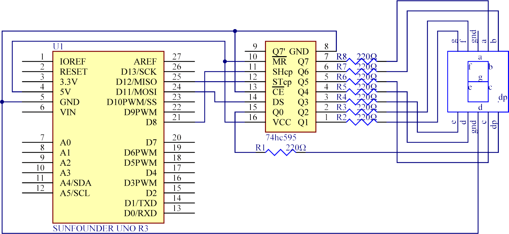

## 22.2 Posuvný řadič SIPO 74HCT595 {#22-2-posuvn-adi-sipo-74hct595}

Jak už z mezititulku tipujete, půjde asi zas o nějaký skvělý integrovaný obvod. A přesně tak to je!

74595 je obvod, který se skládá z osmibitového posuvného registru a osmibitového klopného obvodu typu D.

Všimněte si, že posuvný registr má sériový vstup A, sériový výstup SQh, hodinový vstup Shift Clock, též SRCLK (náběžná hrana posouvá informace v registru) a nulovací vstup /RESET. Díky tomu můžeme po dvou signálech (Serial In a Clock) poslat do posuvného registru osm bitů tak, jak potřebujeme. Náběžnou hranou na vstupu Load (Latch Clock, RCLK – každý výrobce značí vývody jinak, ale význam je stejný) přeneseme stav posuvného registru do klopných obvodů D. Ty budou tento stav pouštět na výstup a zároveň jej budou držet až do příští náběžné hrany na RCLK.

Obvod má ještě vstup /OE, kterým můžeme vývody odpojit, pokud je to potřeba.

Díky tomu, že posuvný registr má i sériový výstup, můžeme těchto obvodů zapojit za sebe několik. Vstupy SRCLK a RCLK můžeme propojit navzájem, a výstup jednoho sériového registru zavedeme na sériový vstup druhého.

Pomocí tří vodičů (Serial In, SRCLK a RCLK) tak můžeme ovládat teoreticky neomezené množství registrů. Každý registr má k dispozici osm výstupů…

Ke každému registru můžeme (přes rezistory) připojit sedmisegmentovku. Výstupy mají budiče a jsou schopné dodávat 6 mA. Celý obvod je navíc poměrně rychlý a dokáže pracovat na frekvenci 25 MHz.

Pojďte si to zapojit. Jen obvod 74595 a sedmisegmentovku. Bude se to celé budit z Arduina. Aspoň se pocvičíte v práci se sériovými daty.

Schéma a zdrojový kód najdete na [eknh.cz/595](https://eknh.cz/595)

A teď pojďte, zapojte si ještě jednu sedmisegmentovku hned vedle té, co jste si zapojili teď. Použijte další obvod 74595, zase osm rezistorů, propojte sériový výstup prvního registru se vstupem druhého, spojte SRCLK a RCLK, upravte kód…

Pamatujte: pokaždé, když bojujete s malým počtem dostupných pinů, zvažte použití podobného řešení. Pokud budete potřebovat vícebitové řešení, popř. obsloužit i vstupy, zvažte použití obvodů MCP23xxx od Microchip, např. MCP23008 (8 bitů, I2C), MCP23S08 (8 bitů, SPI), MCP23017/MCP23S17 (16 bitů) atd.

##### 23 Sériová komunikace {#23-s-riov-komunikace}
