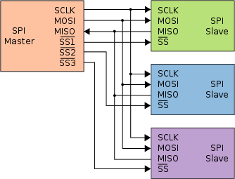
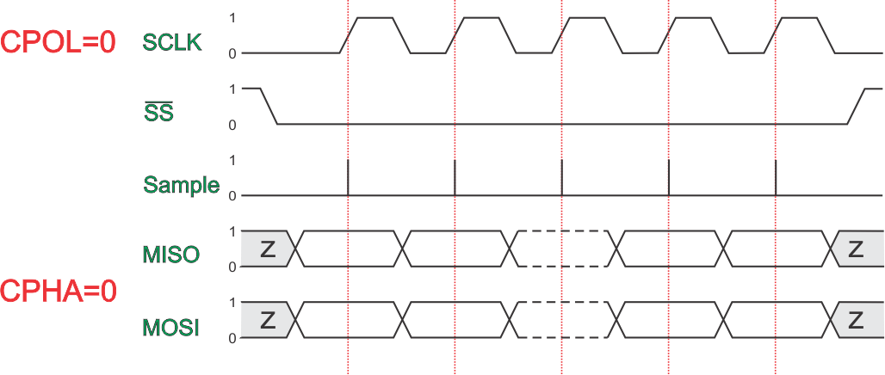

## 23.1 Sériová sběrnice SPI {#23-1-s-riov-sb-rnice-spi}

Asi nejjednodušší na pochopení je sběrnice SPI (z anglického Serial Peripheral Interface). Tímto rozhraním bývají vybavené různé paměti nebo některé senzory.

U rozhraní SPI je vždy jeden řídicí obvod (Master) a jeden či více periferních obvodů (Slave). Master řídí celou komunikaci a pomocí signálů /SlaveSelect určuje, se kterým periferním zařízením se právě pracuje.

Obecně vypadá komunikace tak, že master aktivuje signál /SlaveSelect pro ten obvod, s nímž chce komunikovat, a uvede jej do log. 0 (je to invertovaný signál).

Poté, co je obvod vybraný, začne Master na výstupu SCLK (Serial Clock) posílat hodinové pulsy, a zároveň na výstupu MOSI posílá data od nejnižšího bitu.

Jak na straně masteru, tak na straně slave zařízení jsou použity posuvné registry. Master pošle do zařízení požadované informace, nejčastěji příkaz a nějaké parametry, a jakmile skončí přenos, uvede vstup /SlaveSelect opět do neaktivního stavu.

Sběrnice SPI je plně duplexní, to znamená, že v ten samý čas mohou jít data jak ve směru MASTER -&gt; SLAVE, tak i v opačném, tedy z periferie do řídicího zařízení. K tomu slouží druhý vodič, MISO.

Vodiče MISO a MOSI se mohou začátečníkům plést, proto si pamatujte, co to znamená: MISO je Master In, Slave Out, MOSI je Master Out, Slave In.

Stačí nám tedy tři komunikační vodiče – SCLK, MOSI a MISO, a k tomu jeden „výběrový“ signál pro každé zařízení.

Ale aby to nebylo tak jednoduché, tak si můžeme vybrat, jestli se bity čtou se vzestupnou nebo sestupnou hranou, a jestli jsou hodiny v klidovém stavu v log. 1, nebo v log. 0\. Protokol se nastavuje většinou pomocí konfigurace SPI rozhraní (např. v procesoru). Zařízení mívají dané, jaký typ komunikace používají.

Konfigurační bit CPOL udává polaritu hodin (Clock Polarity). 0 znamená, že hodiny jsou v klidu ve stavu log. 0, CPOL = 1 znamená, že hodiny jsou invertované (ve stavu 0). Konfigurační informace CPHA udává, při které hraně se čtou informace (Clock Phase). Pokud je to 0, čte se informace při přechodu z neaktivního stavu hodin do aktivního (což je vzestupná hrana u CPOL 0, sestupná u CPOL 1). Pokud je CPHA rovno jedné, je to ta druhá hrana. Rozlišujeme tedy čtyři různé módy SPI.

| SPI mode | CPOL | CPHA | Význam |
| --- | --- | --- | --- |
| 0 | 0 | 0 | Hodiny jsou v klidu v 0, vzorkuje se při přechodu 0—&gt;1 |
| 1 | 0 | 1 | Hodiny jsou v klidu v 1, vzorkuje se při přechodu 1—&gt;0 |
| 2 | 1 | 0 | Hodiny jsou v klidu v 0, vzorkuje se při přechodu 1—&gt;0 |
| 3 | 1 | 1 | Hodiny jsou v klidu v 1, vzorkuje se při přechodu 0—&gt;1 |

Pokud budete mít štěstí, nebudete muset nic z toho řešit a vystačíte si s módem 0.

Některá zařízení pro sběrnici SPI neposílají žádná data, proto u nich nemusíme zapojovat MISO. Některá zase mají možnost vyvolat přerušení – tedy upozornit na to, že se něco stalo, a že by tomu měl master věnovat pozornost.

Takováto sběrnice může přenášet data velmi rychle, až v řádech megabajtů za sekundu. Samozřejmě jsme limitováni kvalitou vedení a jeho délkou, ale teoreticky lze dosáhnout velmi velkých rychlostí. Některá zařízení, převážně moderní sériové paměti, používají mód, kdy dokážou přenášet během jednoho hodinového pulsu dva nebo čtyři bity najednou (samosebou je potřeba víc vývodů MOSI/MISO). Takový přenos se označuje jako Dual SPI, popřípadě Quad SPI (QPI, nebo také SQI).

Sběrnici SPI používá celá řada periferií – především už zmíněné sériové paměti RAM / EEPROM / FLASH. Pomocí SPI lze pracovat s paměťovými kartami typu SD. Dále SPI používají některé ovladače displejů, nebo různé senzory. SPI definuje pouze to, jakým způsobem probíhá komunikace fyzicky, neříká, jaké informace se mají jak posílat. To je na obslužném software. Naštěstí to najdeme v datasheetu.

SPI je standard, který definovala Motorola na konci 80\. let, ale používá se dodnes. Někteří výrobci v datasheetu uvádí, že jejich zařízení umí SPI, jiní jsou kryptičtější, a snad v obavách z případných sporů nazývají toto rozhraní jinak – třeba 4-wire Serial.
