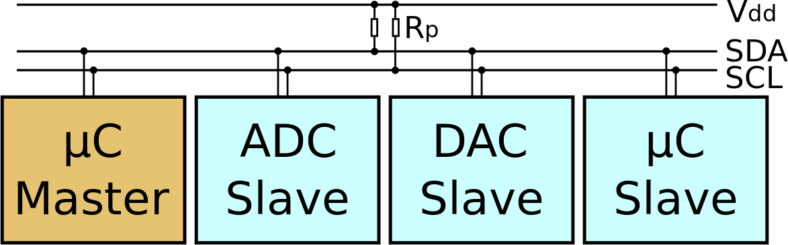

## 23.2 Sériová sběrnice I2C {#23-2-s-riov-sb-rnice-i2c}

I2C je z anglického _Inter-Integrated Circuit_ a mělo by se to správně číst _I squared C_, nesprávně _I two C_. V našich luzích a hájích běžně uslyšíte „í-dva-cé“ („ájsquérdsí“ ani „í-na-druhou-cé“ se moc neuchytilo). Navíc je I2C ochranná známka společnosti Philips, která tento standard vyvinula, takže mnozí výrobci sice používají naprosto stejný typ sběrnice, se stejnými parametry a stejným ovládáním, ale cudně ji označují jinak, aby se vyhnuli použití chráněné značky. Kupříkladu Atmel označuje ve svých dokumentech tuto sběrnici jako TWI – Two Wire Interface.

Na první pohled vypadá I2C velmi podobně jako SPI, jen má míň vodičů. Kromě země si vystačí s pouhými dvěma vodiči, datovým SDA a hodinovým SCL.

Opět platí, že máme jeden „master“ obvod (může jich být i víc, ale nejčastěji je jeden) a k němu připojené periferní obvody. Každý periferní obvod má, na rozdíl od SPI, vlastní sedmibitovou adresu, tedy v rozsahu 0 až 127\. Adresy nejsou úplně libovolné, většinou jsou pevně dané výrobcem – či alespoň jejich část. Pokud chceme zapojit dva obvody stejného typu naráz, musí podporovat možnost zapojit je na různé adresy. Jak vidno, sedm bitů není příliš mnoho, navíc některé kombinace jsou vyhrazené pro speciální použití, a tak se pomalu prosazuje novější standard s desetibitovými adresami.

Ve všech zařízeních jsou vývody SDA a SCL navrženy „s otevřeným kolektorem“. Už jsme se s tím setkali, vzpomeňte si: takový výstup je buď ve stavu 0, nebo ve stavu „odpojeno“. Výhodou je, že můžeme takové vývody spojovat dohromady, nevýhoda je, že potřebuje pull-up rezistor, aby mohla být na vedení za klidového stavu logická 1\. Další výhoda takového zapojení je, že vývod může být zároveň výstup i vstup. Pokud funguje jako výstup, je buď 0, nebo „odpojen“. Pokud má fungovat jako vstup, nechává se „odpojen“, a obvod „naslouchá“, jestli je na vedení 0, nebo 1.

Komunikaci opět zahajuje master, a to tím, že na vývod SDA pošle logickou 0 (říkáme, že vývod „stáhne k zemi“), a poté (to je důležité!) stáhne i hodinovou linku SCL. Tím vytvoří takzvaný „startovní signál“ (Start Condition). Následně master začne vysílat hodiny, a zároveň nastavuje na vodič SDA data (postupně od nejvyššího bitu k nejnižšímu – zde je rozdíl proti SPI).

Přenos dat vždy začíná tím, že je přenesena sedmibitová adresa (A6 – A0) a bit R/W, který říká, zda bude následovat čtení ze zařízení (1), nebo zápis do zařízení (0). Během té doby všechna zařízení naslouchají a čtou adresu. Pokud je adresa jiná, než jejich, opět se odpojí a čekají na STOP signál (stop condition), kdy se při SCL=1 změní SDA z 0 na 1\. Pokud je adresa stejná, zařízení se připraví na přenos dat.

Poté nechá master datovou sběrnici odpojenou, začne naslouchat a pošle ještě jeden hodinový puls. Zařízení, které rozpoznalo svou adresu, stáhne SDA k zemi, tedy vyšle log. 0, a tím potvrdí připravenost komunikovat (říkáme tomu puls ACK – z Acknowledge, neboli potvrzení). Master tento bit sleduje, a pokud přijme 0, ví, že je vše OK. Pokud ale během devátého hodinového pulsu najde na SDA hodnotu 1, znamená to, že žádné zařízení nerozpoznalo svou adresu.

Po této výměně následuje vlastní přenos dat, a to buď z masteru do periferie, nebo opačným směrem. V obou případech ale časování řídí master. Když je přeneseno vše, co přeneseno mělo být, uvolní master sběrnici tím, že nejprve „pustí“ SCL (a pullup rezistor jej vytáhne k log. 1), a poté uvolní i SDA. Tím všechna zařízení na sběrnici poznají, že nastal konec přenosu.

Sběrnice I2C umožňuje i některé zajímavé činnosti, například poslat desetibitovou adresu, pokud ji zařízení podporují. Master nemusí přenos ukončovat „stop stavem“, ale může znovu zahájit vysílání dalším startem a opětovným vysláním adresy. Existuje i možnost „natažení času“ – pokud je periferní zařízení příliš pomalé a trvá mu delší dobu, než má k dispozici data, udělá takový trik: samo stáhne hodinový signál k 0, čímž naznačí masteru, že má chvíli počkat. Když je pak připravené, tak opět hodinovou linku uvolní, master zjistí, že je volno, a pokračuje v přenosu.

Přenos dat probíhá po této sběrnici základní rychlostí 100 kHz, tedy 100 kbit / sec. Většina zařízení umí pracovat i s rychlostí 400 kHz. Zařízení standardu High Speed mohou komunikovat s frekvencí 3,4 MHz. Nejnovější ultra fast zařízení používají, stejně jako SPI, vedení bez pull-up rezistorů, ovšem komunikují pouze jednosměrně.

| **Vlastnost** | **SPI** | **I**2**C** |
| --- | --- | --- |
| Rychlost | Závisí na zařízení, teoreticky neomezená, prakticky omezená fyzikálními limity (délka vedení, jeho kvalita apod.) | 100 kbit/s 400 kbit/s 3,4 Mbit/s (pouze nové obvody) |
| Počet vodičů | 1 × hodinový signál 2 × datový signál 1 řídicí vodič pro každé zařízení Společná zem | 1x hodinový signál 1x datový signál Společná zem |
| Počet připojených zařízení | Teoreticky neomezený, prakticky omezený potřebou mít pro každé zařízení jeden řídicí signál | Teoreticky neomezený, prakticky omezený adresováním zařízení. V případě připojení více obvodů stejného typu je třeba vyřešit, aby každý měl svou adresu. Pokud to obvod neumožňuje, nelze jich připojit víc. |
