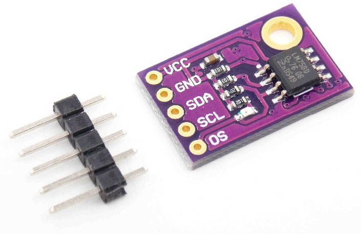

## 23.3 Prakticky… {#23-3-prakticky}

Pojďte si zase něco připojit! Jako první si připojíme k Arduinu nějaký senzor – třeba digitální teploměr LM75A. Používá sběrnici I2C. Nemusíme nějak složitě řešit přenosový protokol, protože naštěstí Arduino, respektive použitý jednočip ATmega, má specializované obvody, které se  postarají o správný přenos dat, posílání start / stop signálů i hodin.

Zásadní otázka je: Kde LM75A sehnat? Trochu hloupé je, že tento obvod máme k dispozici pouze v pouzdrech pro povrchovou montáž. Ale naštěstí některé e-shopy nabízejí takzvaný „breakout board“ (hledejte „LM75 Breakout“). Vlastně jde o miniaturní destičku, kde je připájený tento obvod, a jsou zde vývody vyvedené tak, aby je bylo možné připojit k nepájivému kontaktnímu poli či propojovacím vodičům.

Všimněte si popisků: VCC a GND je napájení, GND zem, tedy záporný pól, VCC kladný pól. SDA a SCL jsou signály sběrnice I2C. Na destičce jsou připojené i pullup rezistory mezi VCC a SDA / VCC a SCL. Což je dobré, nemusíte se o ně starat. Poslední vývod je OS. Co to je?

Podíváme se do datasheetu, kde najdeme nejen odpověď na tuto otázku (je to signál „Overtemperature Shutdown“ – signál, který je aktivní, pokud teplota překročí nastavenou mez), ale i jiné důležité věci.

Například že obvod lze napájet pěti volty, že v rozsahu - 20 °C až + 100 °C je jeho přesnost +/- 2 °C, a že jeho sedmibitová adresa je „1001xxx“. Přesněji 1 – 0 – 0 – 1 – A2 – A1 – A0\. Hodnoty A2, A1 a A0 záleží na to, jako jsou zapojené tři vstupy se stejným označením (piny 7, 6 a 5). U většiny breakoutů budou připojené k 0, ale ještě si to ověřte u svého kousku. Pokud je tomu opravdu tak, je adresa 1001000, neboli 0x48 hexadecimálně.

Zároveň se dozvíme, jak do zařízení zapisovat a jak z něj číst. Tady je dobré poznamenat, že většina zařízení se sběrnicí I2C se tváří jako svého druhu „paměť“ – jako by byly uvnitř rozdělené na paměťové buňky, ke kterým se přistupuje, čte se z nich a zapisuje do nich.

Obvod LM75 má čtyři registry, kterými se nastavuje jeho funkce, a ve kterých jsou připravená data ke čtení. Adresy jsou následující:

| Adresa | Jméno | R/W | Funkce |
| --- | --- | --- | --- |
| 0 | Temp | Pouze pro čtení | Naměřená teplota (16 bitů) |
| 1 | Conf | Čtení i zápis | Konfigurace obvodu (8 bitů) |
| 2 | Thyst | Čtení i zápis | Hystereze pro teplotní poplach (Overtemperature Shutdown) (16 bitů) |
| 3 | Tos | Čtení i zápis | Teplota pro teplotní poplach (16 bitů) |

Zápis dat probíhá tak, že master vyšle START, poté adresu obvodu (0x48), poté číslo registru, se kterým chce komunikovat, a pak už následují data pro zápis. Při čtení se postupuje o něco složitěji: master vyšle start, pak adresu obvodu 0x48, pak číslo registru, ze kterého chce číst, nato následuje opět start, adresa obvodu (ale s nastaveným příznakem „čtení“), a pak master naslouchá a obvod posílá data.

V Arduinu je vyvedená sběrnice I2C přímo na konektorech, buď nahoře u dat, nebo se používají vývody A4 (SDA) a A5 (SCL) u Arduina Uno. U Arduina Mega to jsou vývody 20 (SDA) a 21 (SCL). Zkontrolujte si, pokud máte jiné Arduino, jak je tomu u vás.

Propojte čtyřmi vodiči breakout modul s Arduinem – vývody GND, Vcc (na + 5 V), SDA a SCL.

Arduino má pro sběrnici I2C speciální knihovnu, která se jmenuje Wire. V dokumentaci naleznete přesný popis, zde jen odkážu: [www.arduino.cc/en/reference/wire](https://www.arduino.cc/en/reference/wire)

Základní funkce jsou begin(), která připraví celý subsystém TWI. Komunikace začíná zavoláním funkce beginTransmission(addr) – vlastně jde o vyslání signálu Start a adresy – a ukončuje se endTransmission(). Pokud požadujete data, používá se funkce requestFrom(addr).

Pro zápis se používá následující sekvence:

<pre class="kod">Wire.begin();</pre>

<pre class="kod">…</pre>

<pre class="kod">Wire.beginTransmission(adresa);</pre>

<pre class="kod">Wire.write(číslo registru);</pre>

<pre class="kod">Wire.write(data);</pre>

<pre class="kod">…</pre>

<pre class="kod">Wire.endTransmission();</pre>

Pro čtení se používá modifikovaná sekvence:

<pre class="kod">Wire.begin();</pre>

<pre class="kod">…</pre>

<pre class="kod">Wire.beginTransmission(adresa);</pre>

<pre class="kod">Wire.write(číslo registru);</pre>

<pre class="kod">Wire.endTransmission();</pre>

<pre class="kod">Wire.requestFrom(adresa, počet bajtů které budeme číst);</pre>

<pre class="kod">data = Wire.read();</pre>

<pre class="kod">…</pre>

Pro práci se senzorem LM75 najdete několik knihoven pro Arduino, ale doporučuju, abyste si zkusili nejprve jak vypadá samotná komunikace. Zkuste třeba přečíst dva bajty z registru 0, tedy aktuální teplotu. V datasheetu najdete, jak se posílá informace o teplotě, v jakých jednotkách a s jakou přesností.

Schéma a zdrojový kód najdete na [eknh.cz/lm75](https://eknh.cz/lm75)
