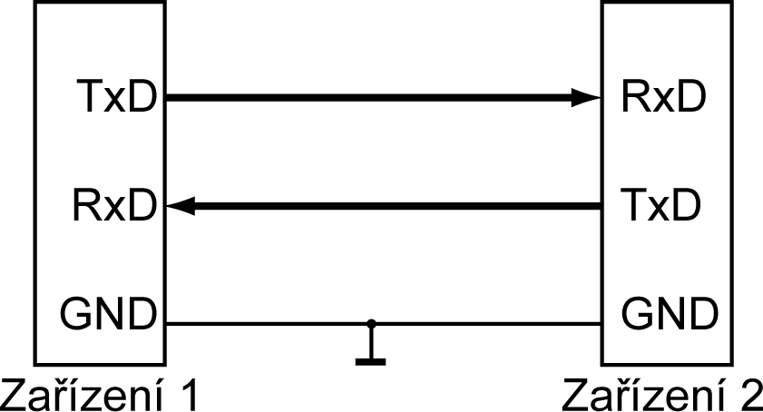
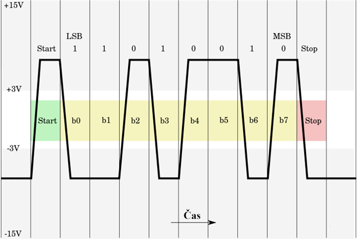

## 23.5 RS-232, UART, Serial… {#23-5-rs-232-uart-serial}

Před mnoha lety jsem psal do jednoho časopisu článek, kde jsem zmínil tento standard pouze v souvislosti s formátem posílaných dat. Dostal jsem velmi rozhořčený mail od jednoho čtenáře, který mě plísnil za terminologickou nedbalost, protože RS-232 zahrnuje mnohem víc věcí, než jen formát dat, a že třeba takový hnusný novotvar, jako je „RS-232 TTL“ je naprostý terminologický nesmysl. „Ať se ti pisálci, kteří to takto používají, podívají do normy, aby viděli, že jen matou lidi!“

Já vám tedy na úvod hlásím, že nic takového, jako „RS-232 TTL“ de iure ani „de technická norma“ neexistuje, ale _pisálci nám to drze ignorují a používají to_, a proto vás seznámím s existencí podobných pojmů a při té příležitosti zopakuju, že se můžete, až budete hledat něco na webu, dočíst leccos – a nebude to vždy podle norem.

RS-232 je starý standard sériového přenosu dat, používaný už v 60\. letech (poslední varianta RS-232C pochází z roku 1969). Oproti výše zmíněným sběrnicím spolu mohou komunikovat vždy pouze dvě rovnocenná zařízení (žádné není master a komunikaci může zahájit libovolné z nich). Dříve se toto rozhraní hojně používalo i v počítačích, po roce 2000 ustoupilo výkonnějšímu USB. V průmyslu se s ním ale setkáte nadále, navíc stejný princip přenosu se používá dodnes, i když v modifikované variantě, i v číslicové technice. Třeba ve vašem smartfonu je zařízení, které se jmenuje GSM modem, a s ním si, věřte nebo ne, interně procesor povídá přesně tímto způsobem.

Principiálně šlo o obousměrnou komunikaci po dvou vodičích. Na každém zařízení byl vývod RxD (pro příjem, receive) a TxD (pro vysílání dat, transmit). Výstup TxD jednoho zařízení se propojuje se vstupem RxD druhého zařízení, a opačně. Třetím nutným vodičem byla, jako všude, zem (GND).

Kromě těchto datových vodičů se používaly i řídicí vodiče, pomocí nichž signalizovalo jedno zařízení druhému, že požaduje data, nebo že je připraveno vysílat data. Šlo o signály RTS (Request to Send – počítač oznamuje, že bude posílat data), CTS (Clear to Send – zařízení potvrzuje, že počítač může poslat data), DSR (Data Set Ready – zařízení je připraveno), DTR (Data Terminal Ready – počítač je připraven), RI (Ring Indicator) a DCD (Data Carrier Detected). Poslední dva se používaly především u telefonních modemů, kde signalizovaly příchozí spojení a navázání komunikace. Dnes se tyto signály používají převážně u některých zařízení v průmyslu; většina komunikace se odehrává jen po datových vodičích. Někdy jsou řídicí signály používané k úplně jiným účelům (například u Arduina je signál DTR použit ke vzdálenému RESETu).

Standard RS-232 definoval nejen to, jak má komunikace vypadat, ale i jakému napětí odpovídá jaká hodnota. Vězte, že pro datové signály platilo, že logická 0 představuje napětí + 3 až + 15 voltů proti zemi, logická 1 bylo napětí - 3 až - 15 voltů. Pro řídicí signály platily údaje přesně opačné.

U počítačů se používaly hodnoty + 12 V a - 12 V, především proto, že toto napětí bývá k dispozici. Firma Maxim vyráběla (a vyrábí) převodníky RS-232 na úrovně TTL (tedy 0 a 5 V), kde jsou zabudované nábojové pumpy a invertory, které si vyrábějí z 5 V napájecího napětí potřebné hodnoty 10 V a -10 V.

RS-232 může pracovat buď v synchronním, nebo v asynchronním módu. U synchronních se posílají i hodinové pulsy, u asynchronních, což bývá nejčastější případ, musí být obě zařízení nastavena tak, aby používala stejnou rychlost. Datový přenos pak vypadá tak, že vysílací zařízení pošle bit 0 (START bit), pak osm datových bitů od nejnižšího k nejvyššímu, a pak bit 1 (STOP). Linka je v klidu v log. 1.

Jenže nic není tak snadné a jednoduché. RS-232 může používat kromě osmi datových bitů i sedm. Může, a nemusí, používat paritní bit, který doplní počet jedniček v přeneseném bajtu na sudý počet. Nebo na lichý. Někdy se mohou poslat dva STOP bity (oba log. 1). A teď otázka za sto bodů: Jak přijímač pozná, jestli vysílač posílá paritu, jaká to je, kolik bitů se přenáší a kolik STOP bitů bude?

Schválně, tipnete si?

Správně: Nijak! Tyto parametry musí být nastavené předem. Proto třeba v dokumentaci zařízení naleznete, že komunikuje rychlostí 9600 Bd formátem 8-N-1\. 8 znamená 8 datových bitů, N značí No parity (tedy neposílá se paritní bit) a 1 je STOP bit.

Rychlost udává, s jakou frekvencí se posílají jednotlivé bity. Teoreticky může být libovolná, ale v praxi se používají dodnes násobky čísla 150\. Tedy 150, 300, 600, 1200, 2400, 4800, 9600, 19200, 38400, 57600 a 115200\. Rychlost 150 znamená, že se přenášelo 150 bitů za sekundu, tedy maximální frekvence signálu (pokud se vysílalo „10101010“) odpovídala 150 Hz. Počet bitů za sekundu (bps, bits per second) tedy odpovídá takzvané modulační rychlosti, která se udává v baudech (Bd). Mluvíme proto o přenosu rychlostí (např.) 9600 Bd.

Ovšem pozor, neznamená to, že se za sekundu přenese 9600/8 = 1200 bytů! Nezapomeňte, že na 8 datových bitů připadá jeden START bit (0) a alespoň jeden STOP bit (1), takže maximální přenosová rychlost je ve skutečnosti 9600/10 = 960 bytů za sekundu.

Dnes se v praxi používají rychlosti od 2400 výše. Nejčastěji to bývá 9600 u pomalých zařízení, kde nedává smysl vysoká přenosová rychlost. U rychlejších se setkáme nejčastěji s rychlostmi 19200 a 115200.

V mezititulku jsem zmínil i zkratku UART. Je to zkratka z Universal Asynchronous Receiver / Transmitter, což bylo označení součástek, které v počítačových systémech měly na starosti sériovou komunikaci po rozhraní RS-232\. Dokázaly poslat a přijmout data, a procesor je mohl nakonfigurovat podle potřeby na různou délku dat, na různou paritu i na různou rychlost. Existovaly i součástky USART (Universal Synchronous / Asynchronous Receiver / Transmitter), které dokázaly používat i synchronní přenos, tj. s hodinovým signálem. Nám dodneška zůstalo toto označení, které se významově rozšířilo a označuje obecně výše popsaný způsob komunikace.

Uvnitř systémů by se nevyplácelo měnit 0 – 5 voltů na - 12 / + 12 voltů, a proto se používá standardní TTL konvence (0-5). Tomuto způsobu se někdy říká UART TTL, popřípadě nesprávně RS-232 TTL. Není to nic víc ani míň, než výše popsaný způsob komunikace, ovšem upravený tak, že 0 je 0 V a 1 je 5 V.

Kde se tato komunikace používá? No, na to, jak je stará, tak je stále při síle a hodně častá. Výhodou je její jednoduchost a nenáročnost. Hodně pomohlo i to, že USB definuje standard CDC, kde je možné tento způsob přenosu dat „zabalit“ do USB. Pokud USB zařízení implementuje tento standard, vidí ho počítač jako „virtuální sériový port“.

Známé jsou USB převodníky od firmy FTDI, např. FT232\. Podobný obvod je použitý i v Arduinu, je připojen na piny 0 a 1 (všimněte si nápisů RX a TX) a slouží k programování Arduina přes Arduino IDE.

Po tomto sériovém rozhraní komunikují například GPS jednotky, komunikují takto GSM modemy, některé WiFi moduly, Ethernetová rozhraní nebo třeba moduly pro síť Sigfox používají právě tento protokol… Proto má většina mikrokontrolérů zabudovaný obvod UART. Ostatně pokaždé, když v Arduinu napíšete Serial.write, tak na pozadí proběhne výše popsaný proces, z jednočipu po vývodu TxD odejdou data, přijdou na vstup RxD u převodníku UART/USB a jsou poslána po USB do počítače.
