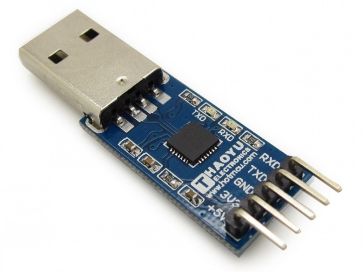
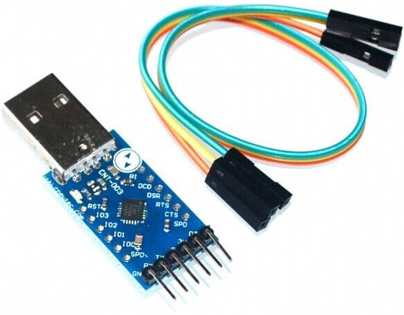

## 23.6 Převodník USB na sériové rozhraní {#23-6-p-evodn-k-usb-na-s-riov-rozhran}

Mimochodem, když už jsem to nakousnul – takové převodníky USB na sériové rozhraní jsou velmi užitečná věc, a klidně si jeden, dva pořiďte. Samozřejmě, nejlepší jsou ty s originálními obvody FTDI a s vyvedenými signály DTR a RTS, ovšem jejich cena nebývá moc příznivá. Naštěstí existují levnější alternativy s čipy Silabs CP210x nebo Prolific PL2303.

V nejjednodušší podobě má takový převodník vyvedenou zem, napětí 5 V (z USB) a 3,3 V (stabilizovaných), a vývody TxD a RxD.

Já ale doporučuju dát si trochu víc práce a najít takový, který má vyvedené i další signály. Bude třeba o dolar dražší, ale využijete ho například pro programování některých zařízení, které potřebují signál RESET. Klíčová slova: _USB to TTL converter DTR_.

