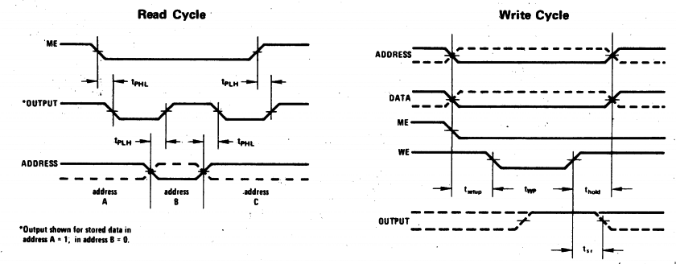
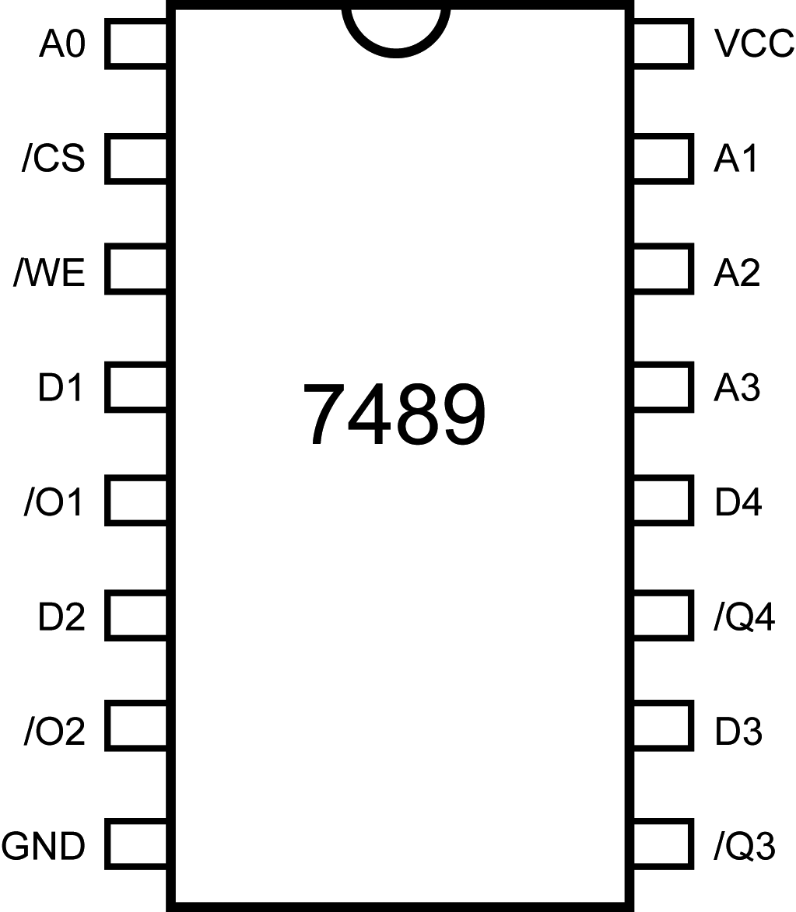

## 24.1 7489 – 64 bitů RAM {#24-1-7489-64-bit-ram}

Šestnáctipinové pouzdro ukrývá statickou paměť RAM s kapacitou 64 bitů, uspořádanou do 16 slov po 4 bitech (říkáme, že je organizovaná „16 × 4“). To znamená, že bude mít čtyři datové vstupy, čtyři výstupy (podobně jako náš obvod na předchozích stránkách), čtyři adresové vstupy (A0-A3, dohromady dokážou adresovat 16 pozic), vstup /CS (Chip Select) a /WE (Write Enable). /CS povoluje práci s pamětí – pokud je neaktivní, tedy log. 1, pamatuje si paměť zapsaná data, ale má odpojené výstupy a ignoruje datové i adresové vstupy. Pokud je /CS aktivní (=0), je na výstupech hodnota, zapsaná v paměti na adrese, dané kombinací adresových vstupů A0-A3\. _Tady je rozdíl proti našemu zapojení – výstupy jsou negované, takže pokud zapíšete na adresu 0 hodnotu 0011, přečtete 1100._

Zápis probíhá tak, že na adresové vstupy přivedeme požadovanou adresu, na datových vstupech nastavíme požadovaná data, povolíme práci s pamětí nastavením /CS do aktivního stavu, a pak pošleme puls na vstup /WE – povolení zápisu.

Tyto informace jsem si nevymyslel ani mi je neprozradili staří mudrci při tajném rituálu – jsou napsané v datasheetu, dokonce graficky, aby to bylo úplně jasné. Pojďte se podívat (výrobce značí vstup CS jako ME – Memory Enable):

Vlevo vidíme čtení, vpravo zápis, graficky vyjádřené, co a jak se mění, a navíc najdete vyznačené i některé časy. Například jak dlouho to trvá od změny adresy do okamžiku, kdy jsou na výstupu data. U typu 7489 to trvá maximálně 60 nanosekund (tPHL, tPLH). Dozvíte se třeba to, za jakou dobu po CS (respektive ME) můžete posílat zapisovací puls (tSETUP – 10 nanosekund min.) a jak dlouhý ten puls musí být (tWP – 20 nanosekund).

Obvod 7489 se používal v různých řadičích s mikroprogramem apod. V prvních osmibitových počítačích se využívala statická paměť 2114 s organizací 1024 × 4 – tedy dvě takové paměti vedle sebe měly kapacitu 1 kilobajt (1024 × 8bit). Byla podobná předchozím obvodům, ale měla jednu významnou změnu: Datové vývody byly zároveň vstupy i výstupy.
