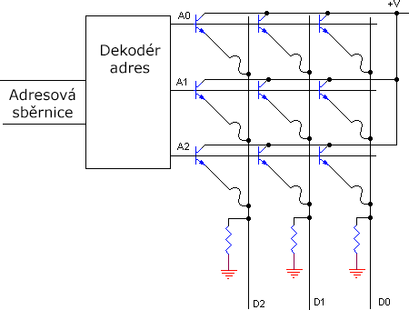
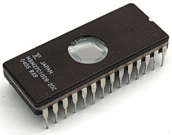

## 24.3 ROM, PROM a další {#24-3-rom-prom-a-dal}

Občas je zapotřebí mít paměť, která udržuje nějaká pevně daná data. Může to být tabulka konstant, může to být i nějaký napevno zadaný program. Takové paměti se říká ROM, z anglického Read Only Memory, neboli _paměť pouze pro čtení_.

Úplně nejjednodušší paměť ROM dostanete, když v tom výše uvedeném schématu nahradíte klopné obvody, které si pamatují data, prostými propojkami, buď na log. 1, nebo na log. 0\. Zbytek, tedy adresový dekodér a budiče výstupu, zůstane stejný. Signál pro zápis a datové vstupy ale budou zbytečné.

Logická otázka je: Jak se tam ta data zapíšou? Ne, vážně: kde se tam vezmou ty propojky? Odpověď zní: Udělá je tam výrobce při výrobě. Pokud si takový obvod chcete objednat, musíte dát výrobci data, jaká tam má nahrát. Samozřejmě se s tím výrobce nebude mazat, když po něm budete chtít dva obvody. Ale pokud jich budete chtít desetitisícové série, jistě se dohodnete.

Proto se paměti ROM moc neprodávaly – každý chtěl jiná data atd. Snad jediná výjimka byly paměti ROM, které obsahovaly ASCII znaky v matici 5 × 7, a používaly se v alfanumerických displejích.

Později výrobci nabídli paměti, které nazývali PROM – Programmable ROM. Ty obsahovaly jemné drátové propojky, které bylo možné určitým postupem a za použití vyššího napětí (většinou 12 voltů) přepálit, a tím naprogramovat jejich obsah. Jednou naprogramovaná paměť PROM už tedy nešla smazat a přeprogramovat znovu. (Funkce je tedy obdobná, jako u zapisovatelných CD a někdy se označuje jako paměť WORM – Write Once, Read Many.)

Paměť PROM byla velmi populární nejen pro ukládání řídicích programů, ale i pro vytváření logických kombinačních obvodů. Nevěříte? Sledujte!

Velmi populární paměť PROM měla označení 74188 a byla organizovaná jako 32 × 8 (32 byte). Má pět adresových vstupů a osm adresových výstupů. Představte si, že jste potřebovali navrhnout složitější logickou funkci. Buď jste mohli kombinovat hradla, anebo – v případě, že kombinační obvod využíval max. 5 vstupů a max. 8 výstupů – jste vzali tuto paměť, a prostě jste všechny možné kombinace do takové paměti zapsali, „vypálili“, a pak jste ji použili jako náhradu klidně desítky hradel.

Tato technika se používala až do doby, než přišly specializované obvody – programovatelná logická pole. Ty umí o něco sofistikovanější operace, můžete je i přeprogramovat (typ GAL), a postupně přišly velmi komplikované obvody typu CPLD a FPGA – v nich můžete vytvořit velmi složité obvody, doslova celé systémy na čipu (SoC – System on a Chip).

PROM tedy koupíte prázdnou a naprogramujete si ji sami. Bohužel jen jednou. Jakmile je naprogramovaná, už s ní nehnete, protože jednou přepálenou propojku už nescelíte. Tuto nevýhodu odstranily až paměti EPROM (Erasable PROM), což jsou paměti, které bylo možno nejen naprogramovat, jako PROM, ale poté i smazat pomocí ultrafialového záření a naprogramovat znovu. K tomu, aby bylo možné tyto paměti mazat, byly vybaveny skleněným okénkem nad čipem.

Po pamětech EPROM přišly EEPROM, tedy „Electrically Erasable PROM“. Technicky obdoba EPROM, ale obsah nebylo nutné mazat ultrafialovým světlem. Pomocí speciální sekvence se nastaví, jaká oblast má být smazána, a obsah se smaže přímo za chodu zařízení, není potřeba paměti vyjímat a mazat pod UV lampou.

Další generaci po EEPROM známe jako FLASH. Technologie FLASH dále vylepšuje EEPROM – jsou rychlejší, mají menší spotřebu, vyšší kapacitu, ale nevýhodou je, že po určitém počtu zápisů, řádově nižším než u EEPROM, ztrácí svou funkci. Navíc nelze zapisovat úplně libovolně; při zápisu je vždy smazán celistvý blok paměti.

Nevýhodou mazatelných PROM (EPROM, EEPROM, FLASH) je i to, že časem zapomínají. Ten čas se měří sice na roky a desítky let, ale i tak – když dnes dostanete do ruky třeba starý počítač z 80\. let minulého století, ve kterém byly použity méně kvalitní paměti EPROM, může se stát, že jejich obsah už bude poškozený. Za nějaký čas to čeká i dnešní FLASH.
