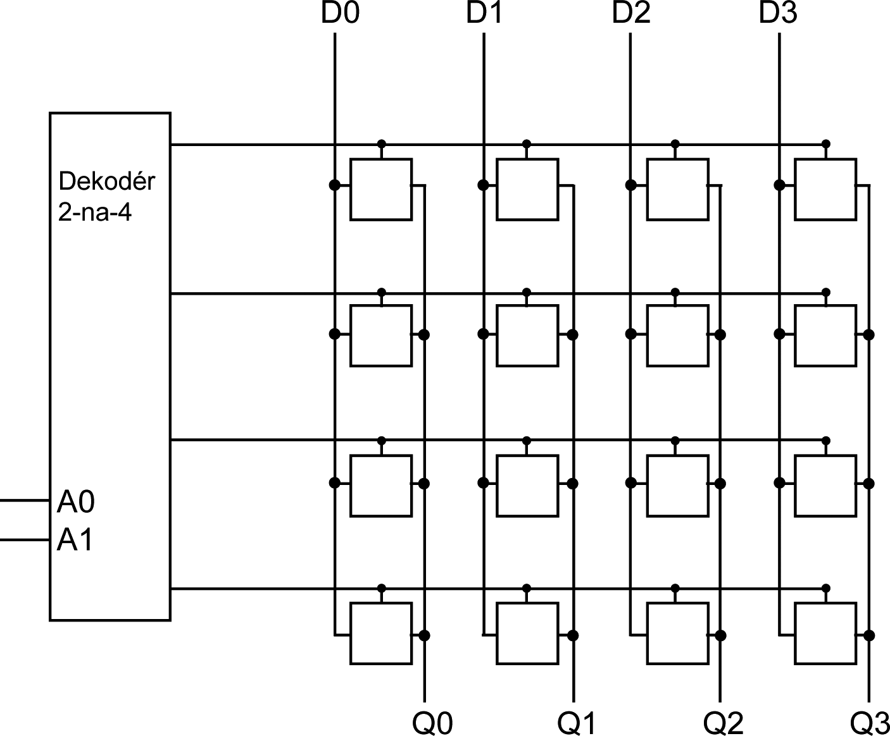
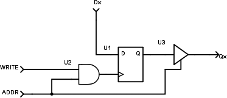

# 24 Paměti {#24-pam-ti}

Od komunikačních technologií se zase na chvíli vrátíme k součástkám. Vzpomínáte na klopný obvod D? Klopný obvod D umožňuje dělat spoustu zajímavých věcí. Už jsme ho viděli jako dělič kmitočtu, viděli jsme ho jako posuvný registr i jako čítač, no a jeho další funkci si řekneme právě teď.

Víme, že si klopný obvod D pamatuje poslední zapsanou hodnotu a drží ji na svém výstupu až do chvíle, než vzestupná hrana na hodinovém vstupu nezmění vnitřní stav.

Představme si, že takových obvodů zapojíme šestnáct do matice 4 × 4\. Nějak takhle:

Nahoře jsou čtyři datové vstupy D0-D3, dole jsou čtyři datové výstupy Q0-Q3, a vlevo je velký dekodér (demultiplexer) 2-na-4 (nebo 1-z-4, jak chcete). Každá buňka je zapojená takto:

Podle kombinace na vstupech A0, A1 je vybrán jeden z adresních řádků Y0, Y1, Y2, Y3\. Tyto řádky jsou připojené na vstup ADDR každé buňky v řádku. Vstup ADDR řídí třístavový budič U3 na výstupu. V řádku, který má nastavený ADDR na 1, se tak výstup Q každého klopného obvodu připojí na odpovídající vývod Qx (výstupy v ostatních řádcích budou odpojené). Na vývodech Q0-Q3 tak bude k dispozici kombinace z příslušných klopných obvodů. Říkáme, že tím „čteme z paměti“.

Pokud přivedeme na vstup WRITE puls, tak se na vybraném řádku (ADDR = 1) dostane přes hradlo AND na hodinový vstup registru D. Do tohoto obvodu se tedy zapíše stav na příslušném vstupu Dx. Říkáme, že tím „zapisujeme do paměti“.

To, co jsme teď stvořili, se jmenuje „statická paměť RAM“.

Dovolte mi malé opáčko: Paměti dělíme v zásadě na dva druhy: RAM (Random Access Memory, což je historický a nepřesný název, přesněji jde o RWM – Read Write Memory), tedy paměti, ze kterých lze číst a do kterých lze i zapisovat, a ROM (Read Only Memory), tedy paměti, ze kterých lze jen číst. Ta první zhruba odpovídá pracovní paměti ve vašem počítači, ta druhá svou funkcí připomíná třeba vylisovaná datová CD.

Paměti ROM udržují informaci i poté, co je obvod vypnutý, na rozdíl od (většiny) pamětí RAM. Paměti RAM obvykle o svůj obsah přijdou ve chvíli, kdy je odpojeno napájecí napětí.

Z klopných obvodů a dekodérů můžeme stvořit paměť RAM, která si pamatuje, co je do ní zapsáno, ale jen dokud je přivedené napájecí napětí. Jakmile se vypne a znovu zapne, bude stav náhodný.

V řadě TTL se vyráběly obvody 7481 a 7484, které fungovaly plus mínus stejně, jako to výše popsané zapojení. Dokázaly uložit 16 bitů, ale moc se s nimi nesetkáte. Častěji se používal například obvod 7489.
