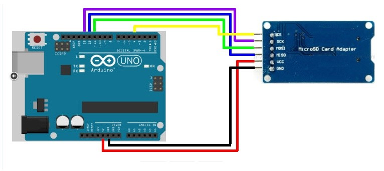
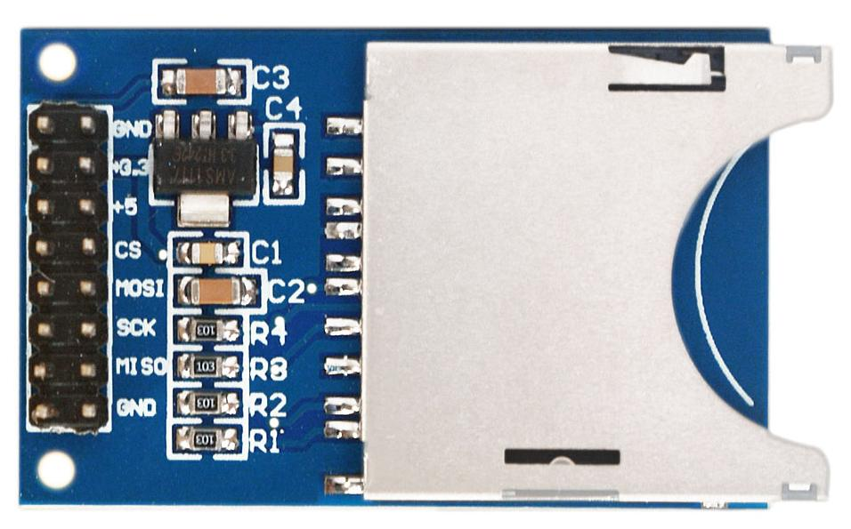

# 27 Paměťové karty {#27-pam-ov-karty}

Arduino se často používá jako takzvaný _data logger_, tedy zařízení, které někde leží, sbírá data ze senzorů a zaznamenává si je pro další zpracování.

Otázka je: Kam si je zaznamenává?

Samozřejmě, může si je zaznamenávat do vnitřní paměti, ale tam se jich moc nevejde. Druhá možnost je použít externí paměť EEPROM. No a třetí možnost je využít standardní paměťovou kartu typu SD, naformátovanou na souborový systém FAT (FAT16 / FAT32).

Taková paměťová karta se k Arduinu připojujue jako zařízení na sběrnici SPI – používá tedy signály MOSI, MISO, SCK a Slave Select. MOSI, MISO a SCK mají v Arduinu pevná místa, SS připojte třeba na pin 4 – to je častý způsob.

Mimochodem – SD karty vyžadují napájení 3,3 voltu, ale naštěstí různé adaptéry „SD Card for Arduino“ obsahují převodníky úrovní a stabilizátor:

Pro Arduino existuje knihovna SD, která výrazně zjednodušuje práci s těmito kartami. Při inicializaci stačí zavolat metodu SD.begin(cs), kde cs je číslo pinu, kam jste připojili Slave Select pro SD kartu.

Pomocí metody SD.open pak otevřete soubor pro zápis nebo čtení, stejně jako u normálního PC, a pomocí funkcí print, println, read a write zapisujete a čtete data.

Pokud bude vaše zařízení intenzivně zapisovat na SD kartu, tak se souborovému systému FAT vyhněte (při každé změně zapisuje do několika málo sektorů) a použijte kvalitní karty „průmyslového typu“ (které mají garantovaný vyšší počet zápisových cyklů, ovšem také výrazně vyšší cenu). S „obyčejnými“ SD kartami při nevhodně vyřešeném zápisu např. každou sekundu narazíte na limit bezpečně po několika dnech.

Schéma a zdrojový kód najdete na [eknh.cz/sdcard](https://eknh.cz/sdcard)

##### 28 Logický analyzátor, logická sonda {#28-logick-analyz-tor-logick-sonda}
