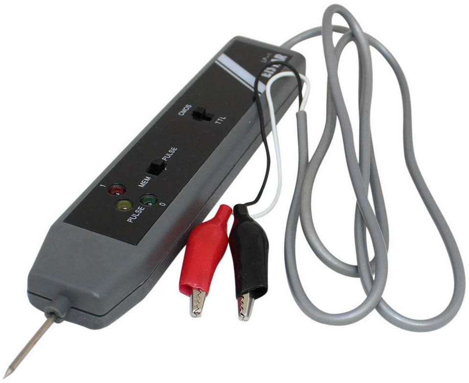
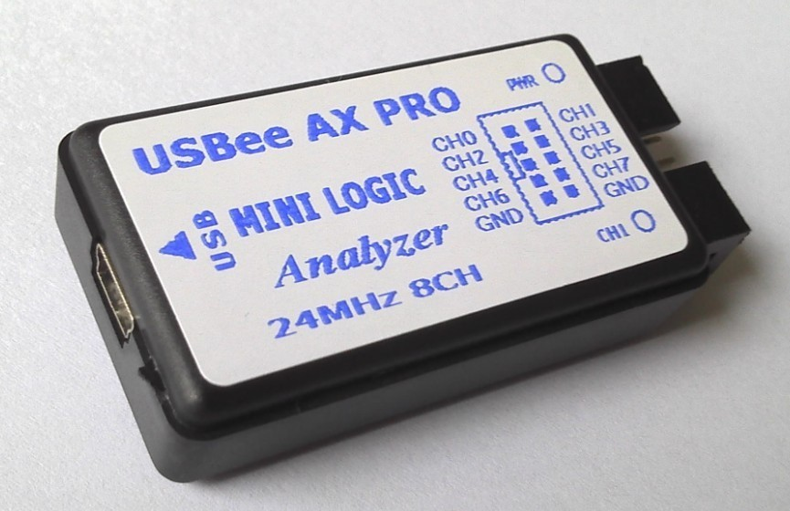
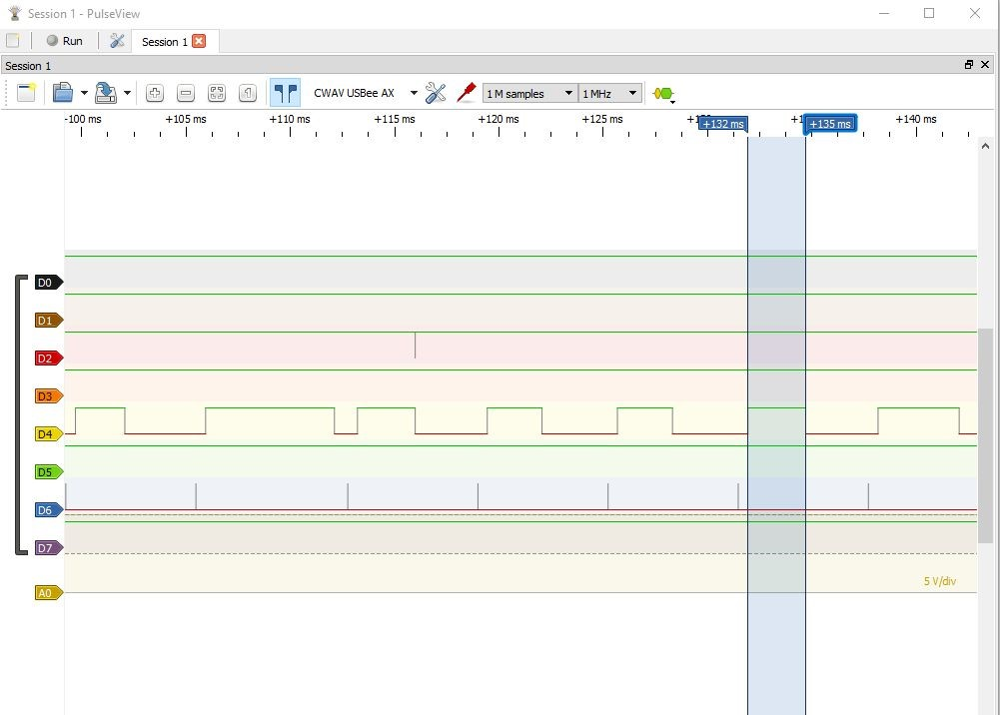

# 28 Logický analyzátor, logická sonda {#28-logick-analyz-tor-logick-sonda}

V této knize nechci jen ukazovat zapojení a vysvětlovat, jak fungují, ale také dát pár tipů na zajímavé součástky a nástroje, které se vám budou hodit.

Jedním takovým nástrojem je logická sonda (_logical probe_). Můžete ji sehnat za cenu okolo 200 Kč. Vypadá zhruba takto:

Červený a černý přívod zapojíte na napájení zkoumaného obvodu (černý je zem), a pomocí hrotu se můžete dotýkat různých míst v obvodu a zjišťovat, jestli je v tom kterém místě logická 0, nebo logická 1\. Sonda dokáže rozpoznat i to, že se napětí mění, tedy že se pravděpodobně dotýkáte místa, kde probíhají nějaké hodinové pulsy nebo signál. Složitější logické sondy mají i akustickou signalizaci, přepínání mezi TTL a CMOS nebo detekci náběžných a sestupných hran.

Druhý nástroj, který se může hodit, je logický analyzátor. Můžete ho sehnat za mnoho desítek tisíc jako samostatné zařízení s displejem a spoustou funkcí, ale pro běžné použití naleznete i jednoduchou verzi, připojenou přes USB k počítači – vypadá jako na následujícím obrázku:

Takový analyzátor stojí zhruba sto korun. Připojíte jej k počítači přes USB. K ovládání můžete použít například open source programy Sigrok / PulseView (je potřeba správně nastavit ovladače, viz dokumentace).

Pro vlastní měření propojte zem analyzátoru se zemí měřeného obvodu. Můžete měřit až osm signálů najednou (CH0 až CH7). Připojte vývody do míst, která chcete měřit, a spuštěním měření (Capture) logický analyzátor začne sledovat průběhy v těchto bodech.

Logický analyzátor je velmi užitečná pomůcka pro zkoumání, zda v obvodu funguje vše jak má, popřípadě proč to nefunguje. Na displeji vidíte průběhy signálů v čase. Můžete si například změřit šířku pulsů, podívat se, zda následují po sobě tak, jak mají, lepší software umí například pracovat se sběrnicemi I2C nebo SPI a rovnou ukázat, jaká data po jakém vodiči šla…

##### 29 Elektronika a svět kolem nás {#29-elektronika-a-sv-t-kolem-n-s}
