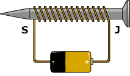
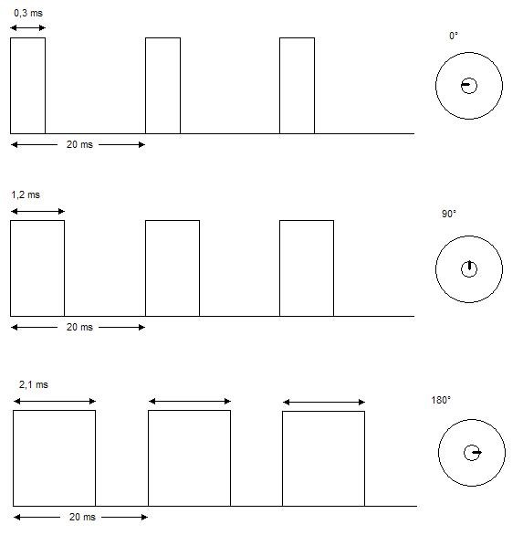

## 29.1 Ovládáme přírodu elektronikou {#29-1-ovl-d-me-p-rodu-elektronikou}

Do této podkapitoly patří situace, kdy potřebujeme elektronikou nějak působit na svět okolo sebe, ať už mechanicky, nebo jinak.

### 29.1.1 Elektromagnety {#29-1-1-elektromagnety}

Elektromagnet vznikne tím, že cívce dáme jádro z magneticky měkkého kovu. Princip je jednoduchý: Prochází-li proud, je okolo cívky magnetické pole. Když proud vypneme, pole zaniká. Elektromagnetem lze ovládat kovové mechanické části, různé závory, zámky, ventily atd.

Pro elektromagnety platí vše, co jsem výše napsal o elektromotorech: připojujeme je vždy přes budič a s ochrannou diodou.

Nemáte elektromagnet? Snadná pomoc, stačí kousek izolovaného drátu a hřebík. Omotejte drát okolo hřebíku, a na jeho konce připojte napětí. Hřebík začne fungovat jako magnet.

Když celou tuhle sestavu postavíte na výšku tak, že hřebík bude zasunutý třebas jen do třetiny cívky a zapnete proud, cívka vtáhne hřebík dovnitř. Pokud má malou sílu, znásobte počet závitů (třeba naviňte druhou vrstvu přes první.

Mimochodem, pokud máte k dispozici silný neodymový magnet – bývají to takové malé kovové válečky – můžete si pomocí hřebíku (nebo šroubu), monočlánku a kousku drátu udělat jednoduchý motor. Viz obrázek.

Jak to funguje? Procházející proud vyvolá magnetické pole, které se bude, obrazně řečeno, „přetlačovat“ s magnetickým polem magnetu. A protože je celá konstrukce lehká a má jen minimální tření, bude i malé magnetické pole stačit k tomu, aby se vše otáčelo.

### 29.1.2 Motory {#29-1-2-motory}

Pokud potřebujete něčím otočit nebo něco posunout, zvolíte nejspíš elektromotor. Elektromotorů je obrovská škála, od těch nejmenších modelářských až po obrovské elektromotory v lokomotivách.

Elektromotor se skládá ze dvou částí, ze statoru a rotoru. Jsou různé typy a různá uspořádání těchto dvou částí. Nejčastěji se používá uspořádání, v němž je pevná část (stator) tvořena permanentním magnetem a otáčivá část (rotor) cívkou. Proud, procházející cívkou, vytváří okolo této cívky také magnetické pole, které cívkou točí tak, aby její severní pól byl co nejblíž jižnímu pólu pevného magnetu. Pokud v tu chvíli změníme směr proudu, tekoucího cívkou, její magnetické pole se otočí, přepóluje, a pevný magnet ji odpuzuje. Cívka se tedy opět pootočí…

V praxi bývá na rotoru cívek víc, většinou tři nebo šest, ale může jich být i víc.

U stejnosměrného motoru se používá speciální část, nazvaná komutátor, která se stará právě o přepojování napětí tak, aby se pravidelně měnil proud cívkami. Rychlost otáčení takového motoru je úměrná velikosti proudu, který jím protéká.

Existují i motory bez této součásti (bezkomutátorové, brushless), u nichž musí vnější elektronika řídit proud jednotlivými cívkami, a podle frekvence přepínání těchto cívek lze přesně řídit rychlost motorku. S takovými motory se setkáme tam, kde je na závadu případné jiskření, které hrozí u komutátorů, popřípadě tam, kde je dobré mít možnost ovládání otáček – například ve větráčcích u počítačů.

Motor nemusí být jen stejnosměrný, může fungovat i na střídavý proud, ovšem pak bývá jinak zapojen. Může mít uspořádání obrácené, tj. stator složený z cívek a rotor s permanentním magnetem. Místo permanentního magnetu může být rovněž použita cívka… Typů je nepřeberné množství.

Pro nás je důležité, že motor je zařízení, které používá cívky. Cívka má tu vlastnost, že při odpojení proudu v ní zaniká magnetické pole, a zanikající magnetické pole v ní zpětně naindukuje proud opačného směru. Pokud bychom připojili cívku přímo k vývodu číslicového obvodu, tak při jejím vypnutí by tekl velký proud opačné polarity do vývodu číslicového obvodu, a tím by ho téměř jistě zničil.

Proto se motory (ale i další zařízení s cívkami) připojují k číslicovým obvodům zásadně s paralelně připojenou ochrannou diodou v závěrném směru. Navíc platí, že motory potřebují poměrně velké proudy, které číslicové obvody nejsou schopné poskytnout, takže se zapojují přes speciální budiče. A taky se snažte vyhnout tomu, abyste zapojovali motory přes nepájivá kontaktní pole. Ta nejsou stavěná pro velké proudy, a_ mohlo by dojít k poškození_, tak prosím opatrně.

Nejjednodušší budič je obyčejný tranzistor, o němž víme, že malým proudem dokáže spínat velký proud.

Další možnost je použít specializovaný obvod (například ULN2803), který obsahuje osm budičů a osm ochranných diod, takže můžete jedním takovým obvodem spínat až osm motorů.

Těmito způsoby můžete motor zapnout a vypnout. Pokud jej potřebujete ovládat sofistikovaněji, třeba zapínat v obou směrech otáčení, použijete takzvaný H můstek (H bridge).

Toto zapojení umožní připojit motor v obou směrech – buď kombinací S1 + S4, nebo kombinací S2 + S3\. Pokud jsou všechny spínače rozpojené, je motor navolno, pokud jsou sepnuté např. S2 a S4, je motor zabržděn.

Samozřejmě místo spínačů mohou být použité tranzistory, nebo opět specializovaná součástka – integrovaný H můstek. Můžete ho koupit už jako celou desku, i s konektory.

Na obrázku vidíte takový integrovaný H můstek, řídicí vstupy od elektroniky a výkonové konektory pro zapojení motorů. U těchto můstků je časté, že vlastní spínací element (integrovaný obvod nebo výkonový tranzistor) má zabudované chladiče.

### 29.1.3 Relé {#29-1-3-rel}

Relé je zase cívka, k níž je přes mechanismus připojena trojice vývodů. Když je cívka (1) bez proudu, jsou spojeny dva z nich (společný a NC). Když cívkou protéká proud, přitáhne k sobě mechanickou kotvu (2), a ta přepne vývody (3) tak, že jsou spojené jiné dva (společný a NO).

CC-BY-SA, autor Teslaton

Relé je velmi stará elektrická součástka, ale používá se dodnes. Umožňuje jednak spínat velké proudy i napětí, včetně střídavého (není problém pomocí 5 V relé spínat 230 V síťové napětí), a zároveň elektricky odděluje řídicí část od spínané. Pokud chcete elektronikou spínat například lampičku do zásuvky, použijte relé, protože tím fyzicky oddělíte vlastní elektroniku od silového napětí.

Vzhledem k tomu, že jde o součástku elektromechanickou, musíme počítat s tím, že přepnutí nějakou dobu trvá. K nějakému spínání vysokou frekvencí, v intervalech sekundových a kratších, není relé vhodné.

A protože řídicím elementem je opět cívka, tak při připojování k elektronice nesmíme co? No nesmíme ji připojit přímo, vždy přes budič a s ochrannou diodu. Viz výše.

### 29.1.4 Darlington, FET, Tyristor {#29-1-4-darlington-fet-tyristor}

Další spínací prvky, podobné relé, ovšem bez výhody elektrického oddělení obou zařízení, zato s výhodou přímého připojení na výstupy číslicových obvodů, jsou například výkonové tranzistory, tyristory a triaky.

Často používaným zapojením tranzistorů pro spínání velkých proudů je takzvané Darlingtonovo zapojení. Už jsme si jej představili, pro připomenutí schéma:

Takto zapojená dvojice tranzistorů se chová jako jeden tranzistor s mnohem větším proudovým zesilovacím činitelem, tedy dokáže velmi malými proudy spínat velmi velký proud. Výše zmíněný obvod ULN2803 používá vnitřně právě takovéto tranzistory v Darlingtonově zapojení.

Ke spínání velkých proudů můžeme použít i výkonové tranzistory MOSFET. U těchto tranzistorů se, jak víme, nespíná procházejícím proudem, ale přivedeným napětím. Spínací proud je v řádech mikroampérů, spínaný proud i několik ampérů.

Dřív se často používaly i spínací prvky tyristory a triaky. Principiálně jsou podobné tranzistorům, ale mají víc N-P přechodů. Dodneška se používají ve specializovaných oblastech, ale v amatérské mikroelektronice se častěji setkáte s výkonovým MOSFETem či relé.

### 29.1.5 Servo {#29-1-5-servo}

Servo je speciálně upravený elektromotor se zpětnou vazbou a soustavou převodů, které se otáčí v rozsahu 240° (někdy 180°, někdy i 360°). Často se s nimi potkáte v různých hobby robotech, kde pohybují rameny, popřípadě v modelech, kde nastavují například křidélka nebo kormidlo u lodi. Výhodou serva je možnost přesně nastavit natočení osy.

Servo mívá tři vstupy – zem, napájecí napětí a řídicí vstup. Serva se řídí pomocí PWM signálu, kde šířka pulsu určuje natočení osy:

K ovládání serv se používají specializované obvody, které mají rozhraní (např.) I2C a dokážou ovládat až 16 serv. Opět platí, že takové obvody často seženete jako hotové moduly i s konektory.

### 29.1.6 Krokový motor {#29-1-6-krokov-motor}

Krokový motor je vlastně obyčejný elektromotor, který má vyvedené jednotlivé cívky. Ovládací elektronika postupně spíná jednu po druhé a tím otáčí osou po malých krocích.

Ve skutečnosti mívají takové motory třeba 200 kroků na jednu otáčku. Krokové motory se používaly třeba v tiskárnách pro přesný posun vozíku. Dnes se používají ve 3D tiskárnách, kde zaručují totéž: přesný posun předmětu a trysky.

Krokový motor je opět zařízení s cívkou, takže zase platí: nepřipojovat napřímo, jsou na to speciální obvody. Hledejte „stepper motor driver“.

### 29.1.7 Světlo {#29-1-7-sv-tlo}

Jako zdroj světla jsme si dlouhá léta vystačili s žárovkou. V číslicové technice se žárovka moc nehodí, protože potřebuje poměrně velký proud, a to i když je maličká. Tam ji nahradily LED.

Když ale přesto budete potřebovat ovládat žárovku, použijte k tomu buď tranzistor (žárovky do 12 voltů), nebo relé (pro žárovky s velkým výkonem).

Dnes jsou dostupné i výkonové LED. Počítejte ale s tím, že takové LED potřebují vyšší napětí a přesně daný proud. Pro některé účely můžete použít i laserové LED – podobné těm, co jsou v laserových ukazovátkách. Ovšem u takových LED je potřeba dodržet proud i napětí; obyčejné připojení na 5 V je pravděpodobně zničí.

U výkonnějších zdrojů světla počítejte s nutností chlazení. I když jsou LED… Minimálně pasivním chladičem (což jsou různě žebrované hliníkové profily), pokud je to nedostatečné, budete muset použít ventilátor.

Zajímavá součástka, která je i v EduShieldu, je RGB dioda. Jde vlastně o tři barevné LED (červená, zelená, modrá) v jednom pouzdru, buď se společnou anodou, nebo se společnou katodou. Taková součástka může měnit barvu vyzařovaného světla v širokém rozmezí – například smícháním červeného a zeleného světla získáte světlo žluté apod. RGB LED se používají v různých barevných displejích nebo v osvětlovacích páskách.

V EduShieldu je použito zapojení se společnou anodou. Znamená to, že společný vývod je připojen k napájecímu napětí a k tomu, aby se dioda rozsvítila, je zapotřebí připojit vstupy R, G, B k zemi (logická úroveň 0).

### 29.1.8 Peltierův článek, topná spirála {#29-1-8-peltier-v-l-nek-topn-spir-la}

Zajímavá součástka je Peltierův článek. Ten využívá takzvaného Peltierova jevu: když prochází proud rozdílnými vodiči, zapojenými sériově, tak se jedna z jejich styčných ploch zahřívá, druhá ochlazuje. Peltierovy články se vyrábějí nejčastěji jako čtvercové keramické destičky s rozměry 10 × 10 až 60 × 60 milimetrů, většinou kolem 3 milimetrů silné, s dvěma vývody. Pokud skrz takový článek necháte procházet proud, např. z 12 V zdroje, jedna jeho plocha se zahřívá, druhá ochlazuje. Až to budete zkoušet, tak doporučuju nesahat na článek přímo – já držel dva články při testu v ruce, a byla to opravdu hloupost, protože ten rozdíl teplot mezi chladnou a teplou částí je i u malých článků třeba 40 °C, a navíc je téměř okamžitý po zapnutí napětí.

Když budete teplou část chladit větrákem, můžete na chladné snadno dosáhnout teplot pod bodem mrazu, a obráceně – když budete zahřívat chladnou část, dosáhnete na teplé snadno bodu varu. Peltierův článek se označuje též TEC – Thermoelectric Cooler.

Topit můžete ale i jinak. Většinou tam, kde to nepotřebujete a nechcete (integrované obvody, tranzistory, rezistory). Takové teplo ale není moc užitečné. Pokud potřebujete něco ohřívat, zvolte topnou spirálu. Ano, stejnou, jaká je v elektrických vařičích, rychlovarných konvicích a podobných spotřebičích. Topná spirála je obyčejný drát z kovové slitiny s daným odporem, stočený do spirály (někdy i vícenásobně) a izolovaný. Pokud tímto rezistorem prochází proud, mění se v teplo (vzpomeňte na Ohmův zákon a vzorec pro výpočet výkonu).

Pokud budete něco z toho ovládat číslicovými obvody, tak vždy přes relé.

### 29.1.9 Reproduktor {#29-1-9-reproduktor}

Reproduktor slouží k přeměně elektrického proudu na zvuk. Zvuk, jak asi víte, je mechanické vlnění, které se šíří hmotou, včetně vzduchu. K tomu, aby vznikl zvuk, je zapotřebí mechanického chvění nějakého předmětu – třeba struny, blány (u bubnu), jazýčku u pískacích hraček, popřípadě vzduchového sloupce (píšťaly). U reproduktoru se chvěje tenká papírová membrána. Chvění vzniká tak, že k membráně je připevněná cívka, která je umístěna mezi silné magnety. Když se mění proud cívkou, mění se její magnetické pole, cívka je více či méně zatahována do magnetu, a vzniká tak chvění, které se přenáší na membránu, a membránou do vzduchu.

CC-BY-SA, autor Iain

Můžete vynechat magnet, cívku udělat stabilní a membránu kovovou. Při vhodně zvolené pružnosti bude proud cívkou přitahovat membránu, a ta bude zase rozechvívat vzduch. Takto pracují sluchátka.

Zase platí: když chcete připojit sluchátko nebo reproduktor, musíte počítat s tím, že obsahují cívku, podobně jako u motorů a elektromagnetů. Reproduktory navíc mají malý odpor, takže potřebují velké proudy. Sluchátka mají odpor větší, ale i tak je dobrý zvyk zapojit je přes tranzistor a ještě odfiltrovat stejnosměrné napětí kondenzátorem. Jde to i bez toho, ale výsledný zvuk je pak zkreslený.

Funguje to i obráceně? Funguje. Když budete mluvit do sluchátka nebo reproduktoru, bude se v cívce indukovat napětí, které můžete zpracovat a převést na digitální informaci. Toto je princip elektromagnetického mikrofonu. Existují i jiné typy – uhlíkový mikrofon mění svůj odpor, kondenzátorový mění svou kapacitu, piezoelektrický generuje napětí mechanickou deformací krystalů…
