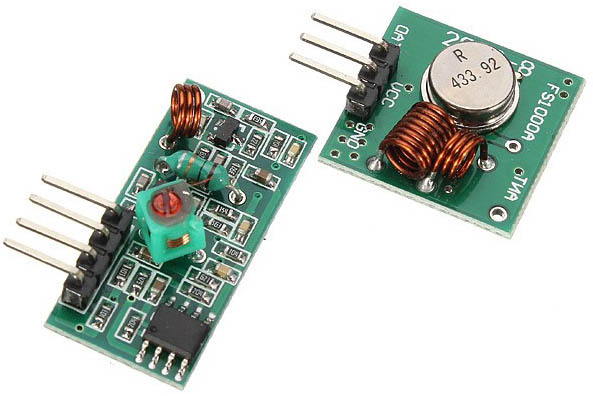
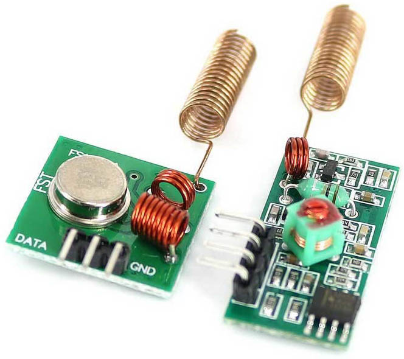

## 31.1 Vysílání na 433 MHz {#31-1-vys-l-n-na-433-mhz}

A teď do toho přispějete i vy. Dvojice modulů vysílač-přijímač na 433 MHz za pár korun vypadá takto:

Vlevo přijímač (4 piny), vpravo vysílač (3 piny). Ještě k nim doporučím připojit anténu – bez ní bude spojení velmi špatné a dosah jen několik centimetrů. Staré radioamatérské přísloví říká, že dobrá anténa je lepší než sebesilnější vysílač – a je to tak.

Anténu si můžete buď vyrobit z kusu drátu (měla by mít délku 17,3 centimetrů, nebo 34,6 centimetrů – čtvrtina, respektive polovina vlnové délky), anebo ji můžete koupit. Popřípadě rovnou shánějte moduly i s anténou.

Oba moduly mají klasické napájecí piny GND a Vcc, a jeden datový (u přijímače jsou to ty dva prostřední piny – jsou uvnitř spojené, takže jako by to byl jeden).

V ideálním případě by to vše mělo fungovat tak, že když přivedete na vstup DATA vysílače logickou 1, vysílač začne vysílat radiové vlny 433 MHz. Přijímač je přijme a pošle na svůj datový výstup taky 1\. Tak tedy zní teorie. V praxi to funguje tak, že přijímač chytá spoustu signálů na stejné frekvenci, je velmi zarušený, a vy v tom šumu musíte najít svoje data. Dražší a lepší přijímače spoustu té černé práce odvedou za vás; bez nich vám nezbývá nic jiného, než navrhnout dobře přenosový protokol, tak, aby minimalizoval chyby. Tedy se synchronizačními pulsy, s kontrolními součty, po malých dávkách atd.

Můžete si zkusit takový protokol navrhnout a otestovat. Nebo můžete zkusit použít nějaký existující a ověřený – doporučím LightWaveRF, pro který jsou knihovny pro Arduino… Ale pravděpodobně zvolíte třetí cestu…

Schéma a zdrojový kód najdete na [eknh.cz/433](https://eknh.cz/433)
