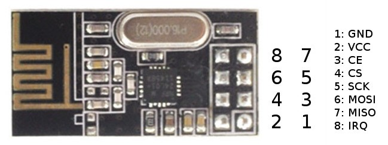
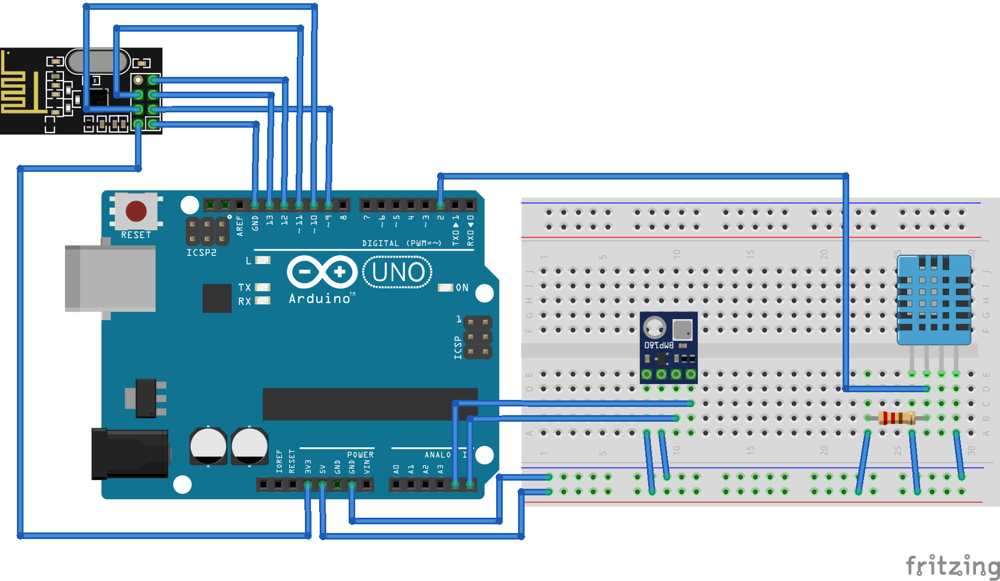
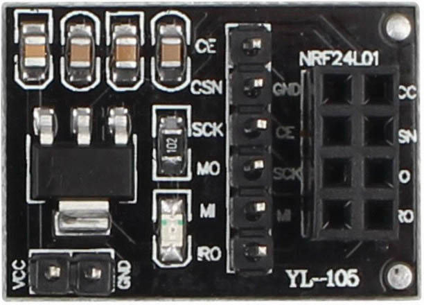

## 31.2 nRF24L01+ {#31-2-nrf24l01}

Kryptická zkratka označuje čip od Nordic Semiconductor, který v sobě integruje radiovou část na 2,4 GHz a základní logiku řízení síťového provozu. Připojuje se k řídicímu procesoru (například k Arduinu) přes sběrnici SPI a funguje jako transceiver. Toto slovo je složeno ze dvou slov: transmitter (vysílač) a receiver (přijímač). _Ani nechci vymýšlet český překlad – vysjímač?_ Zkrátka umí data posílat i přijímat.

Opět existuje celá řada čínských klonů, které obsahují jiný čip – nejen s mnohdy horšími parametry, ale především i s jiným komunikačním protokolem. Naštěstí existují spousty knihoven, které tyto starosti vyřeší za vás (doporučím RF24). Jen asi nebudou fungovat dohromady dva různé klony, popřípadě klon a originál. Proto doporučím si připlatit za originál.

Každý modul může mít v jeden čas otevřeno až šest komunikačních kanálů (rour – „pipes“) a komunikovat s šesti dalšími moduly. Každá roura má svoje jméno – to má 5 bajtů. Všechny roury v jednom modulu musí mít jména, která se v prvních čtyřech bajtech shodují. Tedy například 0xDEADBEEF00, 0xDEADBEEF01 atd. Na jméno roury můžeme hledět jako na adresu spojení mezi dvěma moduly. K této adrese se odkazujete při volání vysílacích funkcí apod.

Při komunikaci si v jednom modulu otevřete rouru pro zápis se jménem (třeba) 0xDEADBEEF01, v druhém modulu (s druhým Arduinem, samozřejmě) si otevřete rouru pro čtení se stejným jménem. Na přijímači použijete funkci startListening(). Funkce isAvailable() vám řekne, jestli jsou dostupná data, a pokud ano, přečtete je metodou read(). Na vysílači použijete funkci write(). Pokud nenastavíte menší hodnotu, můžete jedním vysíláním přenést až 32 bajtů dat.

Což je dobrá zpráva. Meteostanice s dvaatřiceti bajty dat udělá nemálo parády, tam se vejde velké množství informací. Vlastně stačí přidat jen nRF24L01+ k našemu „meteoArduinu“…

Připojení je trošku nepřehledné, tak si pamatujte:

| CE (3) | Pin 9 |
| --- | --- |
| CS (4) | Pin 10 |
| SCK (5) | Pin 13 |
| MOSI (6) | Pin 11 |
| MISO (7) | Pin 12 |

Tip: Pro nRF24L01 se prodává malý adaptér, na němž je stabilizátor 3,3 V a omezovací rezistory pro datové signály. Doporučuju jej použít, pokud připojujete modul k Arduinu.

Na protější straně může být další Arduino a nRF24L01, které bude data číst a posílat po sériové lince do PC. Můžete použít klidně i Raspberry Pi nebo Turris Omnia, nRF24L01 připojit k němu a data rovnou zpracovávat. Později, v kapitole o displejích, si ukážeme zapojení jednoduchého grafického displeje k Arduinu – pokud připojíte i nRF24L01, získáte tak docela slušný displej pro meteostanici.

Schéma a zdrojový kód najdete na [eknh.cz/rf24](https://eknh.cz/rf24)

##### 32 Procesory, počítače, mikrořadiče {#32-procesory-po-ta-e-mikro-adi-e}
