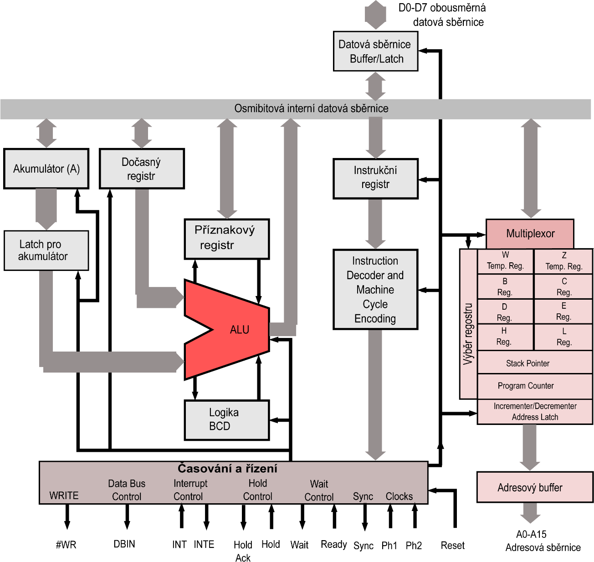

## 32.1 Mikroprocesor 8080A {#32-1-mikroprocesor-8080a}

Původní 8080 byl záhy nahrazen vylepšeným typem 8080A, který byl rychlejší. Jeho vnitřní uspořádání ukazuje následující schéma:

CC-BY-SA, autor Appaloosa

Uprostřed vidíte aritmeticko-logickou jednotku (ALU). Nalevo od ní (samozřejmě že je řeč o tom schematickém náčrtku) je pracovní registr – akumulátor a registr pro ukládání mezivýsledků. Nad ALU je blok příznakových bitů (Flag Flip Flops), pod ní kombinační logika pro převod mezi binárními a decimálními hodnotami. Napravo je registr pro instrukci a instrukční dekodér. Pravá část schématu obsahuje blok pracovních registrů, čítač instrukcí PC a další registry. Kromě těchto částí obsahuje procesor ještě obvody pro řízení datové sběrnice, pro řízení adresové sběrnice a obvody časování a řízení běhu procesoru.

Procesor je osmibitový, to znamená, že pracuje s údaji o šířce 8 bitů. Navenek komunikuje obousměrnou datovou sběrnicí D0-D7\. Směr komunikace určuje procesor podle toho, jestli potřebuje číst data, nebo je zapisovat. Procesor dokáže adresovat 64 kB paměti (k tomu sloužila adresová sběrnice s šestnácti signály A0-A15).

Z hlediska programátora jsou zajímavé právě pracovní registry B, C, D, E, H a L, registr A (zvaný akumulátor, to protože se v něm „akumulují“ výsledky), ve kterém se provádějí všechny aritmetické i logické instrukce, ukazatel zásobníku a registr příznaků, který říká, jak dopadla poslední operace, a který slouží k podmíněným skokům (například „skoč, pokud výsledkem předchozí operace je 0“).

Obvod 8080A se nejčastěji používal s dvojicí podpůrných obvodů 8224 a 8228\. První jmenovaný se staral o správné vytváření hodinových pulsů (8080A vyžaduje dva nepřekrývající se hodinové pulsy) a synchronizaci signálů, druhý jmenovaný se staral o řízení sběrnice a vytváření základních řídicích signálů /MEMR, /MEMW, /IOR a /IOW.

Signály /MEMR a /MEMW říkají, že procesor chce číst z paměti (MEMory Read) nebo do ní zapisovat (MEMory Write). Signály IOR a IOW oznamují, že procesor chce číst nebo zapisovat do obvodů pro vstup a výstup. Takovéto rozdělení umožňovalo využít celý prostor 64 kB pro paměť, a další prostor 256 adres pro různé periferie (k nim se ještě dostaneme).

Po spuštění procesoru se většinou vnější obvody postaraly, aby ze všeho nejdřív přišel signál RESET. Tento signál uvedl procesor do výchozího stavu, což technicky znamenalo především nastavit čítač instrukcí (PC) do stavu 0x0000\. Pak začal procesor provádět instrukce.

První hodinový puls se nazýval FETCH a jeho úkolem bylo vyzvednout kód instrukce z paměti. Řídicí logika v tomto cyklu přepne datovou sběrnici na vstup, na adresovou sběrnici pustí hodnotu čítače instrukcí PC a aktivuje signál /MEMR – čtení z paměti. Kdesi venku, mimo procesor, musí být připojená paměť, většinou EPROM nebo RAM, a v ní uložený program. Paměť je připojena na adresovou i datovou sběrnici, a povolovací vstup /CE je připojen právě na /MEMR. Když procesor tento signál aktivuje, paměť na výstup vystaví hodnotu, kterou má uloženou na dané adrese – v tomto případě na adrese 0000\. Technicky je to prostě jen osmibitová hodnota, například 0xD3 – binárně 11010011.

Procesor tuto hodnotu vidí na datových vstupech a uloží si ho do registru instrukcí. To je zase náš známý osmibitový klopný obvod typu D. Na jeho výstupu je připojen velmi složitý kombinační obvod, který z těchto osmi bitů pozná, co má udělat, a podle toho v dalších cyklech aktivuje jednotlivé vnitřní komponenty. Například na vstupy ALU připojí akumulátor a některý z pracovních registrů, na řídicí vstup ALU nastaví operaci „sečti“, a v dalším kroku uloží výsledek opět do akumulátoru. U některých instrukcí si může vyžádat další čtení z paměti nebo zápis do ní. Když vykoná procesor vše, co daná instrukce předepisuje, zvýší hodnotu PC o 1 a celý cyklus se opakuje. U některých instrukcí (skoky) se PC nezvyšuje, místo toho je do tohoto registru zapsána nová hodnota.

### 32.1.1 Ready / Wait {#32-1-1-ready-wait}

Některé periferie, popřípadě pomalé paměti, vyžadují, aby procesor chvilku počkal, protože nemají požadovaná data hned. V takovém případě uvedou vstup READY – tedy „připraveno“ – do 0\. Procesor z toho pozná, že data nejsou připravena, a čeká. Čeká do té doby, než bude signál READY zase 1\. Během čekání uvede svůj výstup WAIT do 1, a tím oznamuje, že čeká na data. Jakmile má periferie data připravená, pošle je na datovou sběrnici a uvolní signál READY zpět do log. 1\. Procesor tím vystoupí z čekací smyčky, přečte data a pokračuje dál v provádění instrukce.

### 32.1.2 Hold (DMA) {#32-1-2-hold-dma}

Procesor umožňuje některým periferním obvodům, aby převzaly kontrolu nad sběrnicí. Slouží k tomu signál HOLD. Jakmile je aktivovaný, dokončí procesor aktuálně prováděný cyklus a vstoupí do stavu HOLD. V tomto stavu se odpojí od adresové i datové sběrnice a aktivuje výstup HLDA (HOLD Acknowledge). Jakmile je HLDA aktivní, může periferní obvod přebrat řízení sběrnice.

Nejčastější scénář použití stavu HOLD je při takzvaném přímém přístupu do paměti (Direct Memory Access, DMA). Používá se ve chvíli, kdy některá rychlá periferie (nejčastěji to bývaly disky, zvukové obvody nebo videoobvody) potřebuje zapisovat nebo číst data. Speciální obvod (DMA Controller) obdržel např. informaci o tom, že periferie, například disk, má připravená data k přenosu. Požádal procesor o přístup na sběrnici (HOLD), a jakmile procesor potvrdil, že je odpojen, začal tento obvod číst data z periferie a zapisovat je do paměti mnohem větší rychlostí, než by to dokázal samotný procesor.

Práce s takovým obvodem pak pro programátora vypadala tak, že do DMA Controlleru nastavil adresu, kam se budou data zapisovat nebo odkud se budou číst, řekl kolik dat očekává, a oznámil periferii, že požaduje např. data z nějakého diskového sektoru. Pak pokračoval v práci. Ve chvíli, kdy periferie měla data připravená, přenesl je výše popsaným způsobem DMA Controller do paměti, a pak dal procesoru vědět, že je hotovo.

Jakým způsobem? Třeba přerušením!
