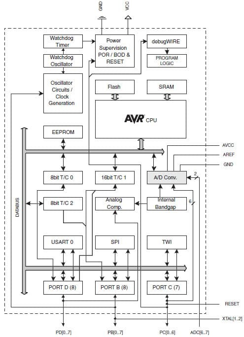

## 32.6 Atmel AVR {#32-6-atmel-avr}

Mikrokontrolér ATmega328 patří do rodiny mikrokontrolérů ATmega výrobce Atmel (v době psaní knihy už Microchip). Spolu s mikrokontroléry ATtiny, kde jsou mikrokontroléry s menší pamětí, patří do velké rodiny, označované AVR.

### 32.6.1 RISC {#32-6-1-risc}

Jen pokud byste nevěděli – RISC znamená „Reduced Instruction Set Computing“, a vychází z poznatku, že většina programů využívá jen část bohaté instrukční sady standardních procesorů (CISC – Complex Instruction Set Computers). RISC proto redukují velké množství instrukcí, ponechávají jen ty základní, a snaží se je provádět co nejrychleji. RISCové stroje zpravidla ani nemívají některé registry vyhrazené pro konkrétní operace, ale bývají ortogonální, tj. jakákoli instrukce může použít jakýkoli registr.

AVR jsou osmibitové procesory s RISCovými rysy – mají omezenou 16bitovou instrukční sadu, 32 osmibitových registrů, s nimiž instrukce pracují, a většina instrukcí se provádí velmi rychle.

Když se podíváme konkrétně na typ, který je použit v Arduinu UNO: kromě procesoru AVR má 32 kilobyte FLASH, 2 kilobyte RAM a spoustu periferií, které se ovšem neadresují speciálním způsobem, ale tváří se, jako by to byly paměťové buňky.

### 32.6.2 Vnitřní uspořádání ATmega328 {#32-6-2-vnit-n-uspo-d-n-atmega328}

Zdroj: Atmel

Na schématu vidíte vnitřní uspořádání čipu ATmega328\. Uprostřed je samotný mikroprocesor AVR, spolu s pamětí FLASH a statickou RAM. Ve spodní polovině schématu jsou nakreslené periferie: tři porty (PD, PB a PC), obvod pro sériovou komunikaci USART, obvod, který komunikuje po sběrnici SPI a obvod TWI (Two-Wire Interface), který ovládá sběrnici I2C (toto označení se nepoužívá, kvůli tomu, že jde o registrovanou známku jiného výrobce). Všechny tyto periferie jsou nám už známé.

Nad nimi se nachází tři čítače / časovače (Timer / Counter), které může programátor využít k nejrůznějším účelům, od počítání událostí po úlohy typu „vyvolej přerušení za X časových pulsů“. Dále je zde připojena malá paměť EEPROM, určená pro ukládání údajů, které mají být k dispozici i po případném výpadku napájení. Sadu periferií uzavírá analogově-digitální převodník, což je komponenta, která umí převést vstupní napětí v určitém rozsahu na desetibitové číslo.

V horní části se nachází obvody Watchdog a BOD. Obvod Watchdog slouží k tomu, aby se jednočip nedostal do nekonečné smyčky, ze které by neměl úniku. Programátor může tento obvod zapnout, a pak musí na různá místa programu dát instrukce, které řeknou watchdogu, že program běží, jak má. Pokud po určený čas nepřijme watchdog takové potvrzení, má se zato, že program zhavaroval, a vyvolá se reset.

BOD (někde zvaný i BOR) je obvod, který hlídá takzvaný Brown-Out stav (Brown Out Detection / Brown Out Reset). Pokud napájecí napětí klesne pod určitou mez, výrobce nezaručí, že obvod bude fungovat správně. Proto obvod BOD takový stav hlídá, a pokud klesne napájecí napětí pod výrobcem stanovenou bezpečnou mez, procesor vynuluje. Zároveň se stará o reset po zapnutí napájecího napětí.

Poslední částí mikrokontroléru ATmega328 je debugWIRE – je to rozhraní, které umožňuje pomocí SPI a signálu RESET uvést procesor do speciálního stavu, kdy je možné zapisovat do interní FLASH. K tomu je potřeba externí obvod – programátor.

U Arduina tento obvod není. Místo toho je využita schopnost zapisovat do FLASH programově. Od výrobce Arduina je v paměti FLASH nahraný krátký program, zvaný bootloader. Tento program se spustí po každém resetu, a jeho úkol je prostý: čeká, jestli po sériovém portu nepřicházejí nějaká data. Pokud během určeného časového intervalu nepřijdou, předá řízení nahranému programu. Pokud data začnou chodit, zapisuje je do vnitřní FLASH, a tím vlastně obvod přeprogramuje.
