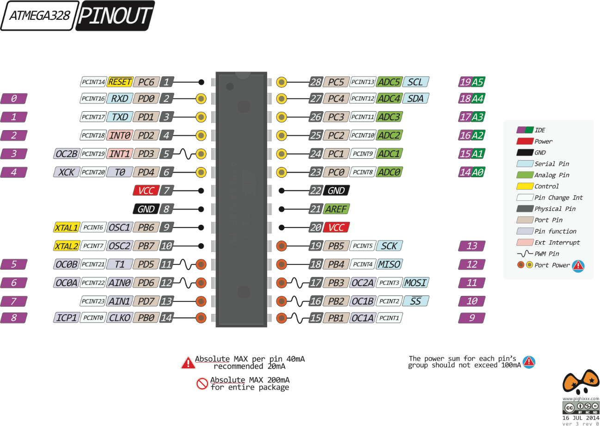

## 32.8 Tak málo nožiček… {#32-8-tak-m-lo-no-i-ek}

a přitom tolik funkcí, že? Když se díváte na Arduino, tak si říkáte: Převodníky, tři porty, sériové rozhraní, kde to má všechno vývody?

Téměř všechny mikrokontroléry totiž používají jeden trik: jejich vývody mají většinou několik funkcí, a programátor spolu s návrhářem vybírají, jaké funkce použijí. Obvykle platí, že periferie typu sériové rozhraní mají pevně dané vývody, a pokud nejsou použité, tak jejich vývody fungují jako normální I/O porty.

Příkladem mohou být piny 27 a 28 u ATmega328\. Na Arduinu jsou připojeny jako analogové vstupy 4 a 5, ale zároveň mohou sloužit jako komunikační piny SCL a SDA pro sběrnici I2C. Pokud ale nepoužíváme I2C a zrovna neměříme napětí na analogových pinech, fungují tyto dva vývody jako datové vývody portu PC, konkrétně PC4 a PC5\. Podobné to je s piny 2 a 3 – buď po nich probíhá komunikace přes UART (TxD, RxD), nebo fungují jako piny PD0 a PD1 portu PD.

Obyčejné datové piny mohou pracovat v několika režimech – výstup, vstup, a protože spousta obvodů pracuje s otevřeným kolektorem, kdy je potřeba zapojit pull-up, tak bývá tento rezistor zapojený už přímo v jednočipu a lze ho volitelně zapnout (input pullup).

