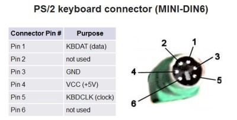
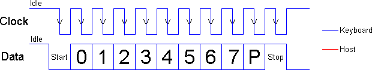
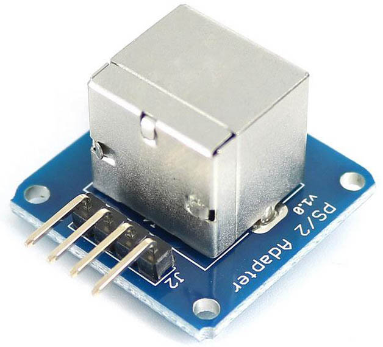

## 34.2 Připojujeme klávesnici od PC {#34-2-p-ipojujeme-kl-vesnici-od-pc}

Dnes už se setkáváme převážně s klávesnicemi, připojenými přes USB, ale dají se koupit i starší typy, které používaly rozhraní PS/2\. Tyto klávesnice jsou vhodné i pro amatérské použití s jednočipy, protože mají jednoduchý komunikační protokol: po sériové lince klávesnice posílá kódy stisknutých a puštěných kláves. Jde v podstatě o synchronní sériový přenos s paritním bitem. Používá k tomu dva signály – hodiny a data (oba jsou s otevřeným kolektorem, takže jsou nutné pull-upy). Trochu nepraktické je, že hodinové pulsy generuje sama klávesnice, takže obsluhující procesor nemá pod kontrolou, kdy se přenáší data. Pokud mikrokontrolér neumí pracovat se synchronním sériovým rozhraním s paritou (USART), což pravděpodobně nebude umět, musíte klávesnici zapojit tak, aby její hodinový výstup KBDCLK dokázal vyvolat přerušení, v jeho obsluze přečíst stav na datovém pinu a poskládat si jednotlivé bity zpět do celých bajtů.

Až budete připojovat PS/2 klávesnici k mikrokontroléru, bude se vám hodit podobný adaptér – jde jen o PS/2 konektor s vyvedenými vývody.

Schéma a zdrojový kód najdete na [eknh.cz/ps2.](https://eknh.cz/ps2.)
