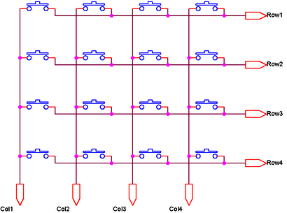
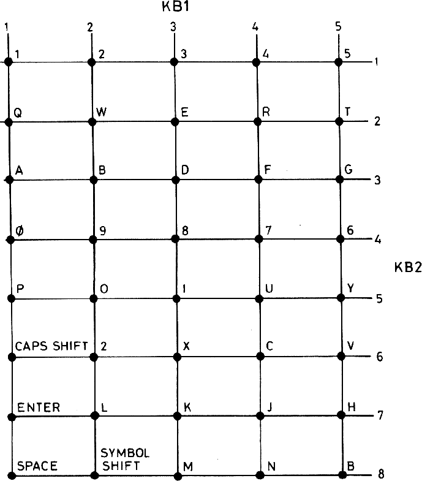
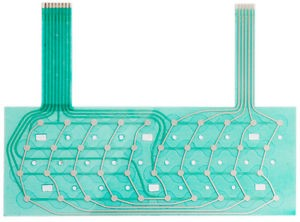
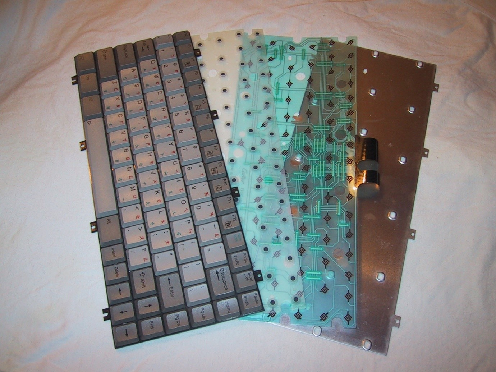

# 34 Klávesnice {#34-kl-vesnice}

Pojďme se podívat zase na jedno praktičtější téma.

Už víme, jak jednočip naprogramovat, aby něco dělal. Už jsme si i různé informace četli a zobrazovali. Ale co když chceme, aby ho někdo ovládal?

Možností je několik. Pokud vám postačí tři základní pokyny (nahoru, dolů, potvrdit), můžete použít rotační enkodér (už jsme si ho představovali).

Ovšem sázka takříkajíc „na jistotu“ je tlačítko. Pokud je potřeba víc pokynů, pak tedy víc tlačítek, respektive rovnou celou klávesnici.

Za chvíli vám ukážu různé způsoby připojení více tlačítek, ale teď probereme ten nejrozšířenější způsob zapojení – „do matice“. Používal se u domácích počítačů, používal se u osobních kalkulaček a používá se dodnes i v klávesnicích pro PC.

Představme si, že máme N vodičů svisle a M vodičů vodorovně. Třeba v matici 4 × 4 budeme mít čtyři sloupce (Col1-Col4) a čtyři řádky (Row1 – Row4), nějak takto:

Do míst, kde se sloupce a řádky kříží, připojíme tlačítka. A dál?

Jednotlivé řádky a sloupce připojíme na osm pinů mikrokontroléru. Dejme tomu, že řádky (Row) zapojíme jako vstupy s pull-up rezistory, sloupce (Col) jako výstupy. Klidový stav je takový, že na všech výstupech Col jsou log. 1, tlačítka jsou rozpojená a na vstupech Row je také log. 1 (díky pull-upu). Procesor či jednočip musí takovou klávesnici pravidelně „scannovat“ tím, že postupně jeden sloupec po druhém nastavuje do logické 0 a čte stav na vstupech Row. Pokud je to 1111, znamená to, že v daném sloupci žádné tlačítko není stisknuté. Pokud bude některé stisknuté, objeví se na příslušném řádkovém vstupu taky logická 0\. Díky tomu program přesně zjistí, která tlačítka jsou stisknutá.

Pro 16 tlačítek potřebujeme 8 vodičů. To možná nevypadá jako velká výhra, ale třeba u počítače ZX Spectrum, které mělo 40 tlačítek, stačilo k jejich obsluze pouhých 13 vodičů (8 řádků × 5 sloupců, ovšem fyzicky uspořádané jako 4 × 10).

Výhoda takového uspořádání je i ta, že nemusíte na každý bod dávat mechanické tlačítko, které je poměrně drahé. Můžete použít dvě membrány, na nichž jsou nakreslené vodivé spoje, křížené v místech tlačítek, a mezi nimi je distanční vložka, která drží v klidu obě vrstvy kousek od sebe. Teprve když v místě křížení zatlačíme, spojí se obě cesty…

Tomuto typu klávesnice se říká membránová. I když třeba v ZX Spectru byl na ní položený gumový hmatník, byla to uvnitř jen a pouze membrána. Dokonce i většina levnějších PC klávesnic má uvnitř membránu. Nevěříte?

Pouze ty dražší mají v sobě opravdová tlačítka.
