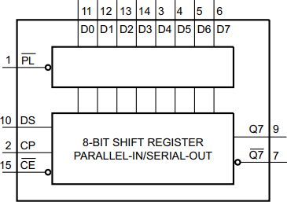
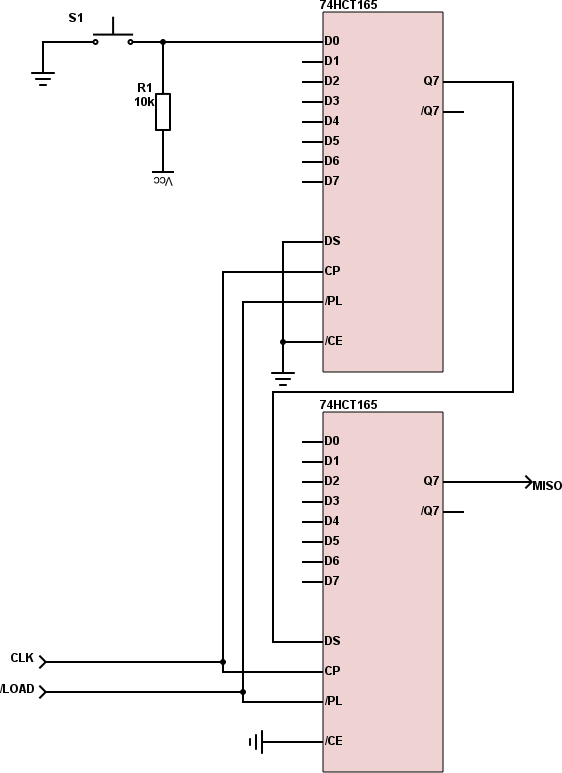

## 35.2 PISO a SPI {#35-2-piso-a-spi}

V kapitole o posuvných registrech jsme si představili obvody PISO – jde o posuvné registry s paralelním vstupem a sériovým výstupem. Jako příklad si vezměme obvod 74HCT165\. Jde o osmibitový posuvný registr PISO.

Datové vstupy jsou označené D0 až D7\. Vstup /PL nahraje do registru aktuální stav na těchto datových vstupech. Výstup Q7 odpovídá nejvyššímu bitu posuvného registru (tedy po nahrání D7), /Q7 je, nepřekvapivě, jeho negace. Náběžná hrana na vstupu CP (Clock Pulse) posune obsah registrů ve směru 0-&gt;1-&gt;2-&gt;3-&gt;4-&gt;5-&gt;6-&gt;7, nejvyšší bit je tedy zahozen, na jeho místo přichází nižší… (Programátorsky řečeno: jde o posun doleva.)

Vstup /CE povoluje hodinový vstup (Clock Enable). Pokud je aktivní, tedy log. 0, tak vše funguje tak, jak jsem popsal, pokud je neaktivní (log. 1), tak jsou hodinové pulsy CP ignorované.

Konečně poslední vstup, DS (Data Serial input) slouží k sériovému zápisu do registru. Díky tomu můžete tyto obvody snadno řetězit – výstup Q7 jednoho obvodu připojíte na vstup DS druhého…

Když potřebujete obsloužit například 16 tlačítek, zřetězíte dva obvody 74HCT165 a na datové vstupy připojíte tlačítka s pull-upy, třeba takto (nakreslil jsem jen jedno tlačítko…)

Stačí pouhé tři vodiče. Signálem /LOAD načtete stav tlačítek do registrů. Na výstupu MISO je k dispozici stav tlačítka 7 u spodního obvodu, postupnými pulsy na vstupu CLK se na výstup MISO dostávají další tlačítka…

Nevýhodou je, že každé tlačítko potřebuje vlastní pull-up rezistor a že načítání nějakou dobu trvá.

Co myslíte – jde to dotáhnout ještě do většího extrému?
