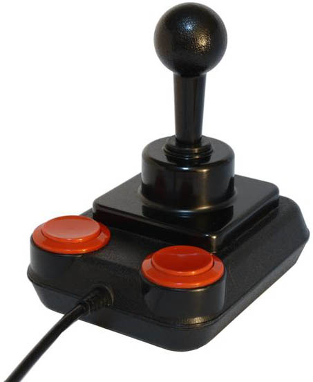
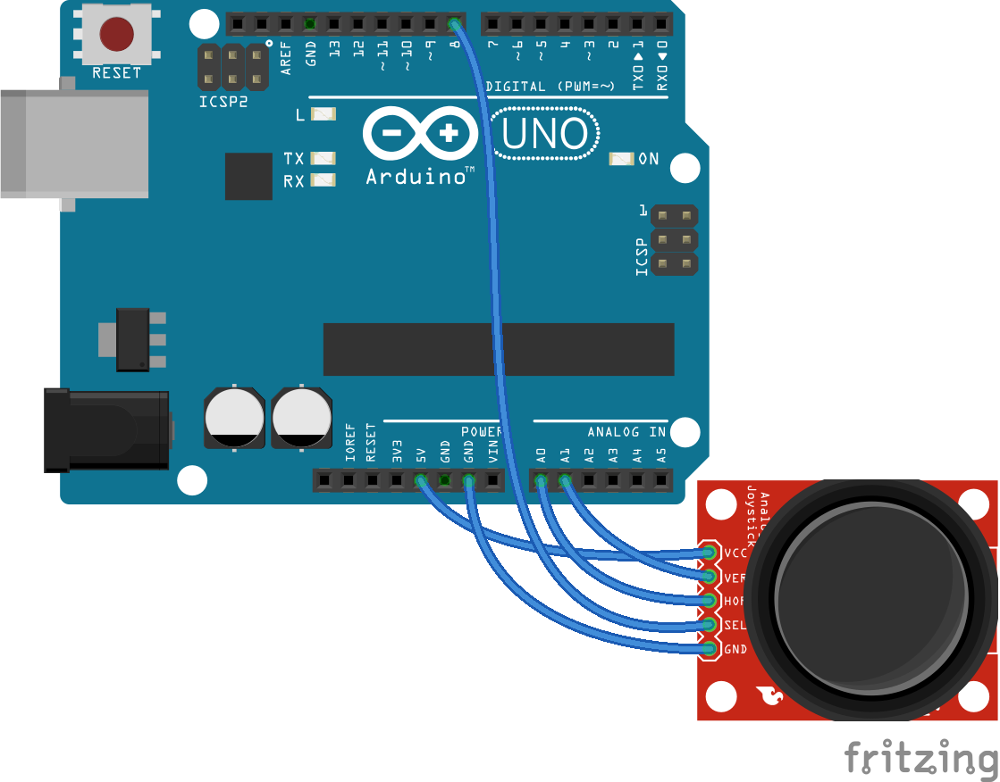
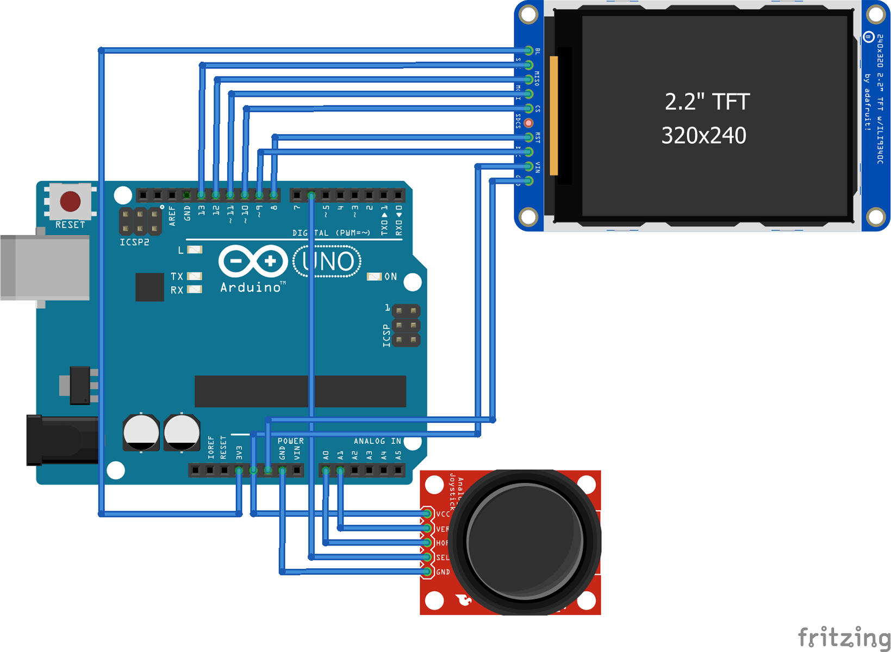

# 36 Joystick {#36-joystick}

V dobách osmibitových počítačů byl joystick velmi důležitou periferií, bez níž se neobešel žádný hráč. Technicky jde o rukojeť, k níž jsou připojena čtyři tlačítka do kříže, a jedno, dvě či tři „akční“ tlačítka.

CC-BY-SA, autor Kshade

Při pohybu rukojetí se spínaly jednotlivé spínače pro směry nahoru, dolů, doleva a doprava. Při šikmých pohybech se sepnuly dva najednou. Při puštění vrátil systém pružinek rukojeť do středové polohy. Práce s takovým joystickem byla extrémně jednoduchá – stačilo jen číst stav pěti, šesti či sedmi spínačů, a podle toho programem reagovat.

Modernější joysticky neobsahují spínače, ale dvojici potenciometrů. Jeden snímá naklonění páky v ose X, druhý v ose Y. Výstup tedy není digitální (nahoru / dolů), ale analogový – lze změřit velikost odchylky od středové pozice.

Tyto joysticky znáte například z ovladačů pro herní konzole. Dají se ale sehnat i v podobě malých modulů – jen destička a joystick. Takové moduly pak mívají pět vývodů: vstupy GND a Vcc pro připojení země a napájecího napětí, analogové výstupy X a Y, které jsou připojené k jednotlivým potenciometrům, a digitální výstup SW, který je připojen k tlačítku uvnitř joysticku (klobouček lze totiž zmáčknout, a tím vyvolat nějakou funkci).

Připojení k Arduinu je opět prosté – analogové výstupy připojíme k analogovým vstupům, tlačítko k některému digitálnímu vstupu… Před použitím je dobré změřit, jaké hodnoty Arduino přečte na pinech A0 a A1 při maximální výchylce všemi směry, a jaká hodnota je pro joystick v klidu, a podle toho přepočítat naměřená data na použitelné hodnoty (říká se tomu _kalibrace joysticku_).

Zkuste si spojit toto zapojení třeba s už dříve uvedeným grafickým displejem. Pomocí pohybu joysticku můžete kreslit po displeji, případně ovládat kurzor. Ovšem naprogramování už nechám na vás…

Jen pro jistotu připomínám, že tlačítko je jen obyčejný spínač, který spíná k zemi, a že je nezbytně nutné mít tedy co? Ano, je nezbytně nutné mít pull-up rezistor! Buď externí, přímo připojený, nebo povolit interní pull-up rezistory v Arduinu.

Schéma a zdrojový kód najdete na [eknh.cz/joydis](https://eknh.cz/joydis)

##### 37 ESP8266 WiFi {#37-esp8266-wifi}