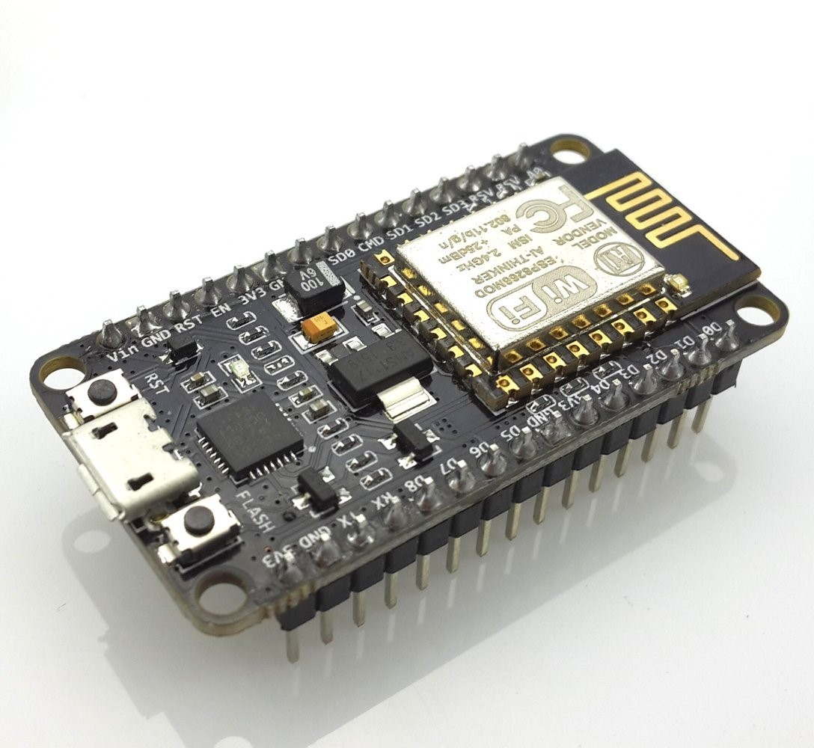
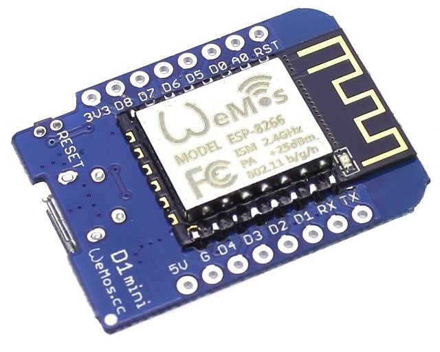
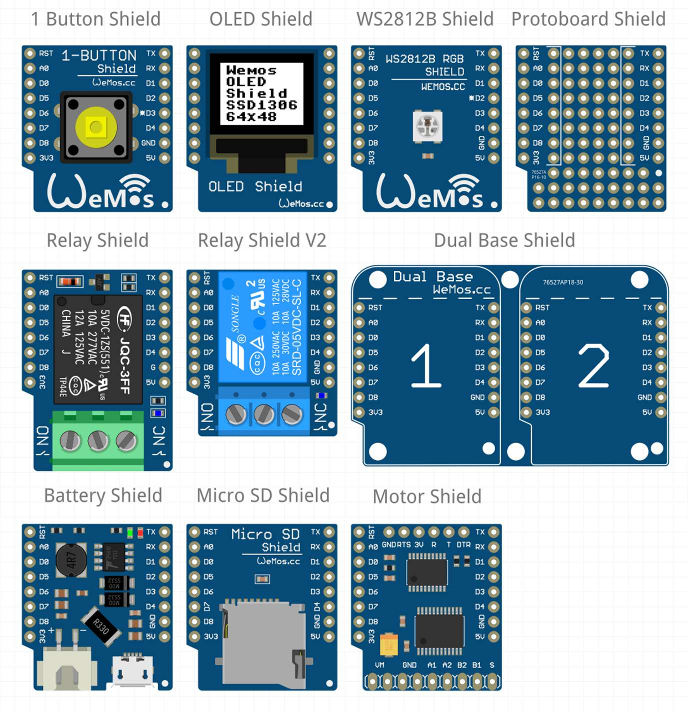

## 37.3 WeMos D1 Mini, NodeMCU {#37-3-wemos-d1-mini-nodemcu}

Samotný procesor ESP8266 je poměrně výkonný a nabízí i několik datových pinů. Logicky se tedy nabízí možnost použít přímo tento modul místo Arduina. Jde to, s drobnými omezeními (např. ESP8266 má pouze jeden A/D převodník).

Asi nejlepší pro takovou práci jsou moduly NodeMCU a WeMos D1 Mini.

Oba tyto moduly obsahují základní modul ESP8266 a několik součástek, které slouží pro připojení k počítači přes USB. K těmto modulům existuje široká škála nástrojů a doplňků – například pro modul WeMos D1 Mini existují shieldy s displejem OLED, s barevlou LED, s teploměrem, pro SD kartu, shield s relé, s obvody pro napájení z baterií, pro ovládání motorů a další…

Výhoda je, že nejste odkázáni jen na Arduino – na webu naleznete návody, jak do těchto modulů nahrát například firmware pro Python nebo jazyk Lua. Vytvoření nějakého toho „internetu věcí“ je pak otázka doslova pár minut.
