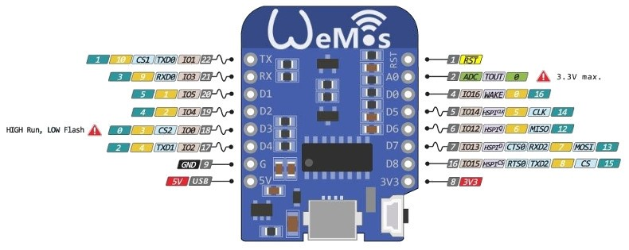
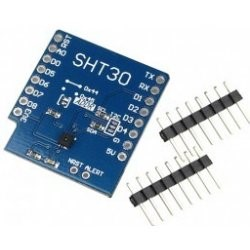
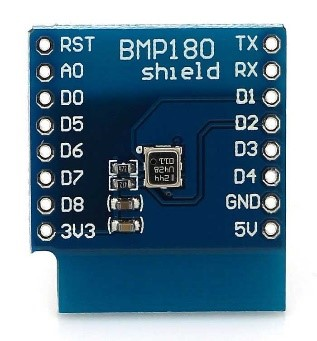

## 37.4 Bezdrátový teploměr s WiFi {#37-4-bezdr-tov-teplom-r-s-wifi}

Tentokrát opustíme bezpečný svět Arduina UNO a použijeme výše zmíněný modul WeMos D1 Mini spolu s moduly BMP180 (ten už známe) a SHT30 – tento modul měří teplotu a relativní vlhkost a připojuje se přes sběrnici I2C. Modul SHT30 je o něco přesnější než DHT11/DHT22, ale především používá standardní sběrnici I2C.

Poskládání takového teploměru je otázka několika minut, napsání softwaru také. Naštěstí existuje způsob, jak takovouto sestavu přímo programovat přes Arduino. Dovolte odbočku:
