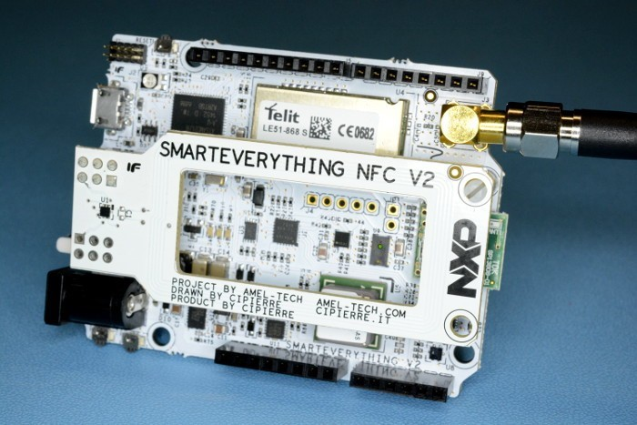
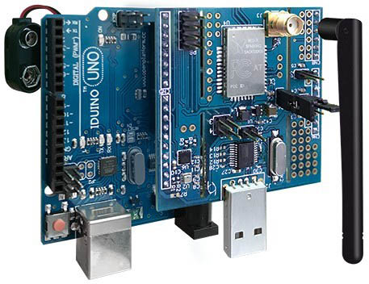

## 39.2 Cloudový teploměr se Sigfoxem {#39-2-cloudov-teplom-r-se-sigfoxem}

Pojďme tu vaši meteostanici posunout o další úroveň výš. Udělejme z ní meteostanici, připojenou do sítě Sigfox.

Můžete k tomu zvolit hned několik postupů. Můžete použít třeba desku SmartEverything ([www.smarteverything.it/](https://www.smarteverything.it/)), která je vybavená snímačem teploty, tlaku, vlhkosti, osvětlení i modulem pro Sigfox. (Kromě toho má třeba i akcelerometry, gyroskop, Bluetooth nebo NFC, ale to nebudeme potřebovat).

K desce je dostupná celkem slušná dokumentace, a co je nejdůležitější – podpora pro Arduino IDE a spousta příkladů.

Začněte tím nejjednodušším příkladem, a tím je poslání obligátního Hello přes Sigfox. Jenže než to uděláte, je potřeba zaregistrovat vaše zařízení v rozhraní Sigfox ([backend.sigfox.com](http://backend.sigfox.com)). Postup není úplně přímočarý, naštěstí existují manuály a postupy (pokusím se jeden udržovat na webu [elektrokniha.cz](http://elektrokniha.cz)).

Po registraci na backendu Sigfox můžete zkusit poslat testovací zprávu, obligátní „Hello, world“ – a nezapomeňte, že jedna zpráva Sigfox je dlouhá 12 bajtů, takže žádné velké vypisování se nekoná.

12 bajtů představuje 96 bitů informace, a je tedy jasné, že je na místě přemýšlet nad nějakou vhodnou kompresí dat. Posílat třeba teplotu jako posloupnost znaků „-25.3°C“ znamená velkou neefektivitu.

Pro Sigfox je potřeba množství přenášených dat osekat na co nejmenší počet bitů. Ideálně převést na celá čísla a snížit možný rozsah. Například u tlaku – pokud budete posílat tlak v hPa, tak můžete buď posílat celá čísla v rozsahu 970 až 1060, což zabere 11 bitů, nebo můžete naměřenou hodnotu snížit např. o 950, čímž dostanete rozsah 20 až 110, s nímž se vejdete do sedmi bitů.

Kde jsem vzal čísla 970 a 1060? To jsou minimální a maximální hodnoty tlaku, naměřené na území Česka a Slovenska za celou dobu měření.

Totéž platí pro další veličiny. Například u teploty je rozumné zaokrouhlit ji na desetiny (a i tak pravděpodobně budete mimo garantovanou přesnost), tedy vynásobit hodnotu deseti a zahodit desetinnou část. A opět se hodí buď prostý posun, třeba udělat + 60, čímž se hodnota 0 stane teplotou - 60 °C. Další možnost je ušetřit ještě pár bitů a udělat kompresi adaptivní, například pro rozsahy 0 až 30 s přesností na jedno desetinné místo, pro teploty mimo tento rozsah třeba s přesností ± 2 °C – ale vždy záleží na konkrétní aplikaci a na tom, co můžete zanedbat a co je naopak nutné přenést.

Po přenesení naměřených hodnot nezapomeňte procesor i desku uspat pomocí příslušných funkcí – nemá smysl, aby celý systém běžel v době, kdy se neměří. Vzhledem k tomu, že se Sigfoxem můžete poslat jednu zprávu každých 10 minut, tak desku klidně uspěte na celých deset minut, po probuzení změřte všechny hodnoty, odešlete, a zase nechte desku spát.

Další možnost, místo poměrně drahé desky SmartEverything, je použít třeba devkit od Thinxtra:

Tento devkit můžete připojit k různým kitům, nejen k Arduinu, a dokonce i přímo k PC přes USB. Pokud ho připojíte ke své meteostanici na Arduinu (pamatujete? DHT22 a BMP180), můžete snadno místo Serial.println() posílat data via Sigfox na server k dalšímu zpracování. Ale nezapomeňte opět na dlouhý a vydatný spánek, alespoň těch 10 minut.

Sigfox jako takový umí být opravdu low power. Pokud minimalizujete množství energie, které se propálí zbytečně, například ve stabilizátorech nebo v LED, pokud budete uspávat tak, jak máte, a probouzet jen na nezbytně nutnou dobu, získáte zařízení, schopné práce na baterii po dobu několika desítek měsíců.
