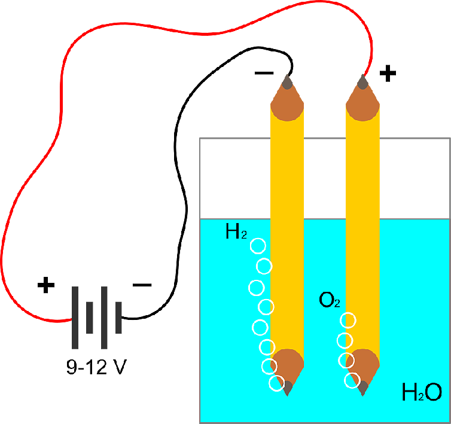

## 3.12 Pro lepší představu {#3-12-pro-lep-p-edstavu}

Pro mnoho začátečníků jsou jednotky příliš abstraktní, těžko si pod nimi něco představí. Jeden ampér – kolik to je? Je to hodně, nebo málo? No, jak se to vezme…

Pokud se budeme pohybovat v oblasti číslicové techniky, které je tato kniha primárně věnována, budeme pracovat nejčastěji s napětím 5 voltů, někdy i mírně vyšším – třeba 12 voltů. Proudy, které našimi obvody potečou, se budou měřit na miliampéry. 200 miliampérů (0,2 A) už pro nás bude poměrně velký proud. Třeba skrz LED budeme pouštět maximálně 20 mA (větší proud by ji pravděpodobně zničil).

Rozvodná a přenosová soustava pracuje s vyšším napětím – doma v zásuvkách máme 230 voltů, ale v „páteřní síti“ se pracuje s napětím 400 kV, 220 kV či 110 kV.

Rezistory budeme používat v řádech stovek ohmů až desítek tisíc ohmů. Měděný vodič má odpor blízký nule. Záleží na jeho délce, průřezu a na teplotě. Suchý vzduch je považován za izolant, ale není ideální. Vakuum je téměř ideální izolant. U vody záleží na složení – tvrdá voda s velkým množstvím solí vede elektrický proud docela dobře, měkká voda, třeba dešťová, hůř. Destilovaná voda bez jakýchkoli příměsí proud nevede skoro vůbec. Ovšem od určité meze dochází ve vodě k jejímu rozkladu (elektrolýze) na vodík a kyslík, a pak proud protéká.

Nevěříte?

Vezměte si prosím dvě tuhy z tužky. Třeba náhradní náplně do verzatilky, ať nemusíte zbytečně ničit dřevěné tužky. Ideálně tak 10 centimetrů dlouhé. K jedné připojte kladný pól, ke druhé záporný pól zdroje. Do sklenice nalijte vodu a obě uhlíkové elektrody do ní ponořte tak, aby se nedotýkaly. Zapněte napájení a změřte protékající proud. V závislosti na čistotě a „měkkosti“ vody naměříte nějaký malý procházející proud. Platí, že čím měkčí voda, tím menší proud.

Stále měřte, a zkuste do vody přidat třeba lžičku soli, nebo octa.

Proud začne procházet, a u elektrod se budou tvořit bublinky plynů. U záporné je to vodík, u kladné kyslík – ale to určitě znáte ze školy.

Pro člověka není nebezpečné ani tak napětí, jako proud, který prochází tělem. Navíc lidská kůže má tu vlastnost, že její odpor není konstantní, mění se v závislosti na napětí. Nízkému napětí klade vyšší odpor, jak napětí roste, tak se odpor snižuje. Za bezpečné bývá považované napětí do 24 voltů, které člověka sice zabrní, ale neuškodí. Napětí 230 voltů, které je v zásuvkách, už může být za jistých okolností smrtící. Některé elektrické paralyzéry vytvářejí napětí v řádech tisíců voltů, ale s malým proudem, takže rána je velmi citelná, člověk je na chvíli ochromen, může upadnout do bezvědomí, ale díky malému proudu není takový zásah pro zdravého jedince smrtící.

