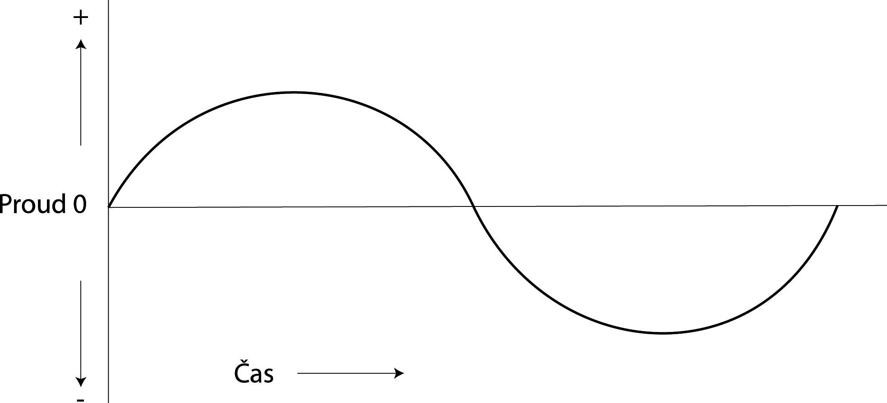

## 3.13 Střídavý proud {#3-13-st-dav-proud}

Až dosud jsme mlčky předpokládali, že zdroj napětí má svůj kladný a záporný pól, elektrony proudí od záporného ke kladnému, proud od kladného k zápornému, a tak to je a v čase se to nemění. Proud má stále stejný směr, proto se mu říká stejnosměrný. Anglicky Direct Current, neboli DC.

Kromě stejnosměrného proudu se v elektrotechnice využívá i proud střídavý. Takový proud mění svůj směr, chvíli teče jedním směrem, chvíli druhým. Takový proud má své výhody – lze jej velmi dobře transformovat v transformátorech, proto se používá k rozvodu elektrické energie. Střídání směrů si ale nepředstavujte jako přepínání „dopředu – dozadu“. Ve skutečnosti se směry plynule mění. Když si průběh takového proudu nakreslíme v čase, dostaneme hezkou sinusovku:

Samozřejmě že střídavý proud může mít i jiný průběh – obdélníkový, trojúhelníkový, pilový, nepravidelný apod. To uvádím jen pro úplnost. Nejčastěji se pod pojmem „střídavý proud“ myslí právě takovýto sinusový.

A teď otázka pro chytré hlavy: Jak u zdroje střídavého proudu poznáme, kde je plus a kde mínus? No, nepoznáme. U zdrojů střídavého proudu nemá takové dělení smysl. Proto se používá označení jiné: jeden z vývodů se bere jako neutrální – říká se mu nulový (též nulák), druhý vývod je fáze. Napětí mezi fází a nulovým vodičem se v čase mění, chvíli je kladné, chvíli záporné.

V zásuvkách máme 230 voltů (možná vás učili hodnotu 220, ale to už od 90\. let minulého století neplatí). To ale neznamená, že maximální napětí (když je sinusovka v maximu nebo v minimu) je 230 voltů. To číslo označuje takzvané „efektivní napětí“. Maximální je skoro jedenapůlkrát vyšší (asi 325 voltů) – přesněji je to _(odmocnina ze dvou) krát_ (cca 1,4142). Efektivní napětí násobené proudem udává skutečný výkon střídavého proudu, proto se používá právě tato hodnota.

Směr proudu v rozvodné síti se změní padesátkrát za sekundu – tedy u nás. Třeba v USA je to jinak, tam je frekvence o něco vyšší – 60 změn za sekundu (kmitočet se udává v jednotkách „změn za sekundu“, jednotka je Hertz, zkratka Hz, to jen pro pořádek). Navíc v USA nepoužívají 230 voltů, ale 120 voltů…

Rozdíl ve frekvencích nezpůsobuje jen potíže při dovozu elektroniky z USA (pokud není uzpůsobený napájecí obvod). Způsobil například i to, že evropské systémy televizí PAL / SECAM používaly obnovovací frekvenci 25 Hz, americký NTSC používal ~ 30 Hz (polovina síťového). Ačkoli dnes se už z frekvence sítě pracovní kmitočty neodvozují, tyto rozdíly zůstaly… Tak až si někdy všimnete při konvertování videa otázky na FPS (Frames Per Second) a budete přemýšlet, proč 25, 30 a 29,970… Těch 29,970 je proto, že při 30 docházelo k interferencím s nosným kmitočtem barvy, proto byla frekvence obrazu o něco snížena – ale jedovatá přezdívka NTSC jako „Never The Same Color“ zůstala.
