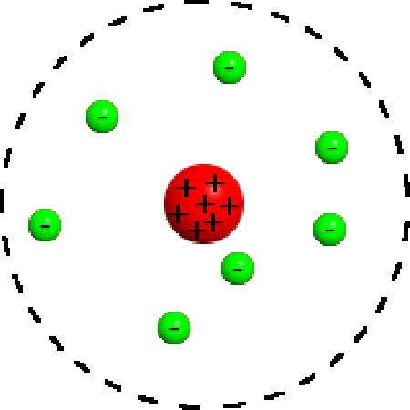
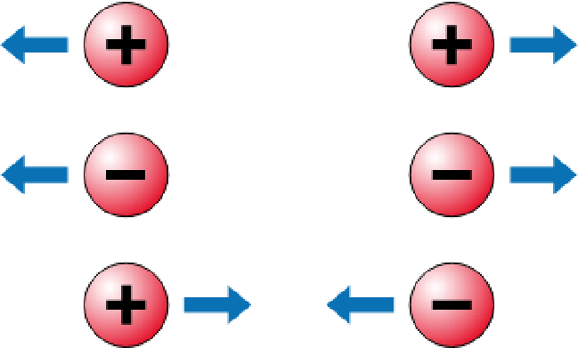
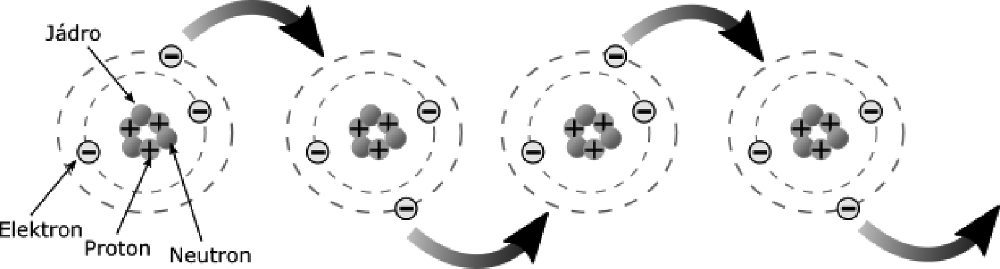

## 3.1 „Nemá to něco společného s atomy?“ {#3-1-nem-to-n-co-spole-n-ho-s-atomy}

S elektřinou je to podobné, jako s gravitací. Jen místo gravitační síly fungují síly elektrické. Nositelem elektrické energie jsou subatomární částice, elektrony a protony. To si určitě pamatujete ze středoškolské fyziky: každá látka je složena z atomů, a v těchto atomech je jádro, sestávající z protonů a neutronů, a kolem jádra jsou elektrony. Když jsem já chodil do školy, tak se pro zjednodušení používal „planetární model“, v němž elektrony vypadaly jako malé kuličky, co létají okolo jádra po různých drahách, podobně jako planety. Dnešní fyzikální výklad je mnohem subtilnější, ale pro pochopení elektrické energie nám stačí ten model planetární.

Elektrony i protony nesou malý náboj. Elektrony záporný, protony kladný – a v obou případech je stejně velký. Za ideálního stavu (_ideální stav je ten, který pozorujeme pouze na obrázcích v učebnicích středoškolské fyziky_) je v atomu přesně tolik elektronů, kolik je v něm protonů, jejich elektrické náboje jsou tedy stejně velké, a navenek má tedy atom nulový náboj.

Věci s kladným nábojem a věci se záporným nábojem se navzájem přitahují – podobně jako gravitace způsobuje, že se k sobě přitahují předměty. U gravitace ale nepozorujeme, že by fungovala obráceně. U elektřiny (a magnetismu) tomu tak je: stejně nabité částice se odpuzují.

_Jak je tedy možné, že se kladně nabité protony mačkají spolu v jádru, a nerozletí se od sebe? Drží je u sebe jiná fyzikální síla, zvaná silná interakce – tento jev ale působí pouze na velmi malé vzdálenosti, takže s ním nemáme každodenní zkušenost._

__

Ve skutečnosti se atomy nevyskytují samy. Ve hmotě je jich spousta vedle sebe. Stává se, že elektrony, které jsou od jádra atomu nejdál, se vzdálí od toho svého jádra a bloumají meziatomárním prostorem. V původním atomu se tím poruší rovnováha, atom získá kladný náboj (protože v něm bude víc protonů než elektronů), a bloumající elektron ponese zase záporný náboj. Po čase tento volný elektron najde nějaký atom, kde elektron chybí, a stane se jeho elektronem – a toto se děje v hmotě neustále. Neustále se od atomů uvolňují elektrony a chytají se k jiným atomům. Některé látky, třeba kovy, mají atomy s velmi promiskuitními elektrony, které rády cestují prostorem – v každé chvíli je k dispozici velké množství volných elektronů. Jiné látky, třeba sklo, mají takových volných elektronů málo.

Elektrony přeskakují z jednoho atomu do druhého
