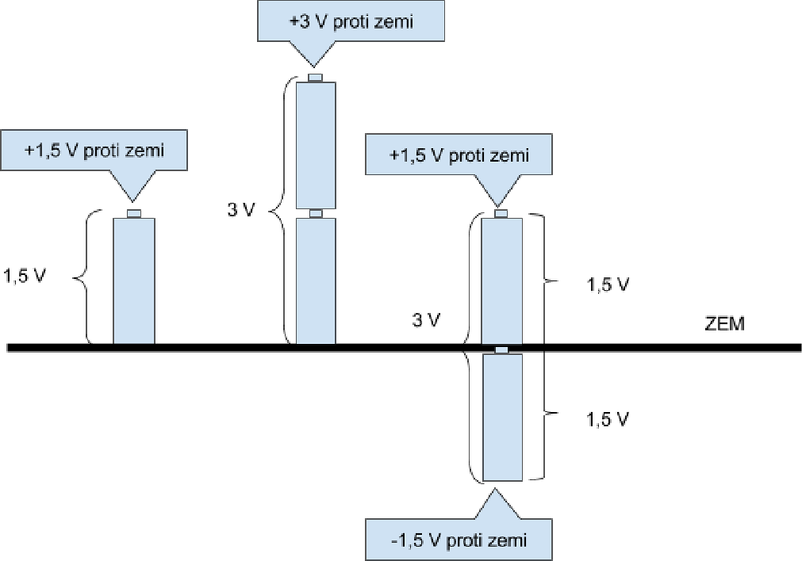

## 3.2 Napětí {#3-2-nap-t}

Určitě si vzpomínáte na ten školní pokus, kdy fyzikář třel ebonitovou tyč liščím ohonem a tvořil tak statickou elektřinu, kterou pak nechával vybít za působivého jiskření. Vzpomenete si na to vždycky, když se v oblečení z umělých vláken posadíte na křeslo z podobného materiálu, a při vstávání dostanete ránu, až vás zabrní ruka. „Jojo, statická elektřina,“ řeknete si. Ale jak vlastně vznikla?

Když se o sebe třou dva předměty z nevodivé látky, tak za určitých okolností přejdou volné elektrony z povrchových atomů jednoho předmětu na povrch druhého předmětu. Počet takto přešlých elektronů závisí na spoustě faktorů, od složení látek přes rychlost vzájemného tření až po vzdušnou vlhkost. Předmět, který elektrony získal, má teď elektronů víc než ten, který je ztratil. Ten, který elektrony přijal, má vůči tomu druhému záporný náboj (elektrony nosí záporný náboj), předmět, který elektrony ztratil, má stejně velký kladný náboj.

Takovýto elektrický náboj můžeme přirovnat k výše zmíněné potenciální energii. Čím větší je rozdíl v náboji, tím větší „potenciální energie“ mezi předměty vznikla. Říkáme, že tyto předměty mají rozdílný elektrický potenciál. Velikost toho rozdílu se označuje elektrické napětí, označuje se U (v anglické literatuře někdy V jako Voltage) a měří se ve voltech (značka V).

Elektrické napětí je tedy rozdíl potenciálů mezi dvěma body. Jeden, ten, kde je elektronů méně, označujeme za kladný, ten, kde je elektronů víc, označujeme za záporný. Když se podíváte na obyčejnou baterii, najdete záporný a kladný pól. Všude v elektronice je záporný a kladný pól, a napětí je udávané mezi těmito dvěma póly. (A platí to i pro střídavé napětí, ačkoli tam se, jak si za chvíli řekneme, oba póly neustále prohazují, střídají.)

Aby se to celé nepletlo, tak se zavedl koncept nulového potenciálu, a dohoda zní, že tímto tělesem je Země. To je naše „vztažná soustava“, to je bod 0.

Vrátím se na chvíli ke svému říkadlu a stvořím analogii: Hlava je u mne 200 centimetrů nad zemí, rozdíl „potenciálů“ je tedy 200 (centimetrů). Koleno je 60 centimetrů nad zemí, rozdíl potenciálů koleno-zem je tedy 60 cm. Rozdíl hlava-koleno je tedy 140 centimetrů. Pokud budeme brát směr „nad zem“ jako kladný, tak koleno má + 60, hlava + 200\. Teď si představte, že mám zem měkkou jako těsto a zabořím se do ní až po kolena. Co se stane? Hlava bude mít proti zemi potenciál + 140, kolena budou ve stejné výšce jako Země, takže jejich potenciál bude 0, a paty budou mít potenciál - 60 (budou pod povrchem).

Proč o tom mluvím? Protože stejný princip platí i pro napětí. Představte si, že vezmu obyčejný tužkový monočlánek – typu AA, 1,5 V – a postavím ho na zem záporným pólem (to je ten plochý. Na kladném, to je ten s tím hrbolkem, by nestála, to dá rozum). Tím vznikne spojení mezi zemí a záporným pólem baterie. Kladný pól tedy bude mít potenciál 1,5 voltu proti zemi. Když vezmu druhou baterii stejného typu a postavím ji na tu první, tak potenciál jejího kladného pólu bude + 3 volty proti zemi. Kdybych to celé postavil obráceně, bude mít volný pól potenciál - 3 volty.

[eknh.cz/tribat](https://eknh.cz/tribat)
