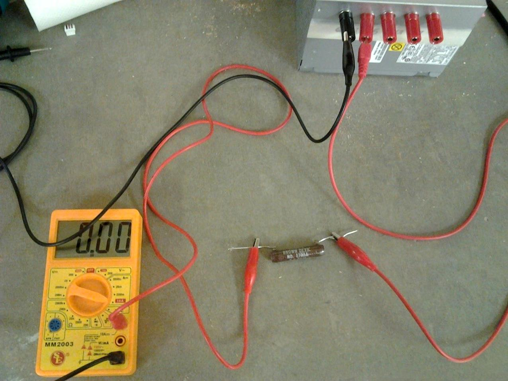

## 3.6 Měření, měření! {#3-6-m-en-m-en}

Máte ještě na nepájivém kontaktním poli ten blikač? Tak ho zase rozpojte, vytáhněte integrovaný obvod, vytáhněte kondenzátor, rezistory, odpojte všechny propojky, nechte jen napájení. Máte?

Tak, a teď vezměte multimetr, přepněte ho na měření napětí, zvolte rozsah 20 V a připojte jej na napájecí napětí. Černý kablík na záporný pól, červený na kladný. Pokud používáte zdroj a stabilizátor a držíte se návodu, budete tam mít 5 voltů. Plus mínus… Zapište si někam naměřenou hodnotu.

Přepněte multimetr na rozsah 20 mA. Vezměte rezistor s odporem 10 000 ohmů (10 kΩ, značeno jako 10K) a zapojte ho jedním vývodem ke kladnému napětí. Ke druhému vývodu přiložte červený hrot multimetru. Černý připojte na záporný pól napájecího zdroje. Na displeji uvidíte hodnotu, která se bude pohybovat někde okolo 0,5\. Výsledek je v miliampérech, tedy 0,5 miliampéru, tedy 0,0005 ampéru.

Zkuste si pokus opakovat s jiným rezistorem, u kterého si změříte jeho odpor. Naměřené údaje si zapište do tabulky:

POZOR!!! Nikdy nepřipojujte multimetr v režimu „měření proudu“ (tedy rozsahy 2 mA, 20 mA, 200 mA a podobně) přímo na napájecí zdroj! Vždy jen přes rezistor!

| Napětí (V) | Odpor (Ω) | Proud (A) |
| --- | --- | --- |
| 5 | 10K (10000) | 0,0005 |
| 5 |  |  |
| 5 |  |  |

[eknh.cz/ohms](https://eknh.cz/ohms)
