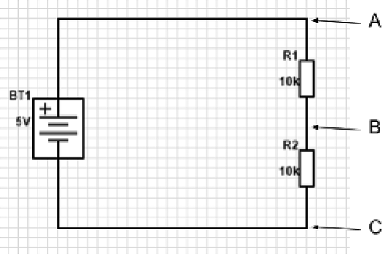

## 5.2 Sériové zapojení {#5-2-s-riov-zapojen}

Zkuste udělat následující obvod:

Vidíte dva rezistory, zapojené „za sebou“ – tedy sériově. Proud teče od kladného pólu baterie (taková je konvence, vzpomeňte si) horním vodičem do rezistoru R1, skrz něj do rezistoru R2, a z něj spodním vodičem k zápornému pólu baterie.

Když si takové zařízení postavíte na kontaktním poli, nebude nijak zajímavé. Nebude blikat, svítit, bzučet – jen bude vybíjet baterii, tak jej prosím nenechte zapojený dlouho! Elektřina z baterie se zbůhdarma mění v rezistorech na teplo. Ale přeci jen si ho zapojte – ne proto, abyste viděli, jak se vybíjí baterie, ale abyste si změřili pár údajů.

Začneme napětím, a změříme si nejprve napětí mezi body A a C. Pokud zanedbáme odpor vedení, a ten se většinou zanedbává, tak je situace stejná, jako bychom měřili přímo na baterii. Tedy měli bychom naměřit 5 voltů, popřípadě míň, podle zdroje, jaký používáte. Já používám stabilizovaný zdroj 5 V, takže jsem naměřil 4,997 V – a to je plně v toleranci.

Teď je otázka: jak to bude s napětím v bodu B? Jaké bude napětí vůči bodu A a jaké vůči bodu C? Nebudu nic prozrazovat, změřte si to.

Máte? A vyšlo vám pokaždé totéž? Mělo by, pokud jste použili rezistory se stejnou hodnotou odporu, tedy 10 kiloohmů. Napětí mezi body A-B (říká se taky „napětí na rezistoru R1“) a B-C („na rezistoru R2“) je pokaždé 2,5 V, tedy polovina napájecího napětí. Samozřejmě počítejte s nepřesností součástek a měření, ale princip je, myslím, jasný. Ale ještě si to ověřte – zkuste zapojit třetí rezistor stejné velikosti R3 za rezistor R2, a změřit napětí na jednotlivých rezistorech teď. Mělo by být zhruba 1,6 voltů, tedy třetina napájecího napětí.

Jako by na každém rezistoru ubyla část napájecího napětí. A ono to tak opravdu je. Proto někdy hovoříme o takzvaném _úbytku napětí_ na rezistoru (nebo obecně na jakémkoli spotřebiči). Tento úbytek napětí se promění na jinou energii – v případě rezistoru na teplo.

Dalo by se z toho odvodit, jaký je výsledný odpor dvou (nebo obecně několika) rezistorů za sebou? Zatím ještě ne, na to potřebujeme (vzpomeňte si na Ohmův zákon) znát proud, který obvodem protéká.

Změřte tedy proud v bodech A, B a C. Nezapomeňte, že při měření proudu musíte obvod rozpojit a ampérmetr zapojit do cesty proudu. Máte?

Tentokrát se, překvapivě, nic nedělí, a ve všech třech bodech je proud stejný. Nevím jak u vás, ale u mne to s rezistory 10K a napájecím napětím 5 voltů bylo 0,25 mA. Což by znamenalo, že výsledný odpor je 20 kΩ, tedy vlastně R1 + R2.

Prověřte to. Zkuste si místo jednoho rezistoru 10K dát třeba rezistor 4K7, nebo 1K. Zkuste si zapojit za sebe tři rezistory a měřte vždy protékající proud. Z něj spočítáte velikost celkového odporu. A mělo by vám vyjít, že výsledný odpor R sériově zapojených rezistorů R+, R2, ... je roven součtu všech odporů R1 + R2 + … + Rn

[eknh.cz/delnap](https://eknh.cz/delnap)
