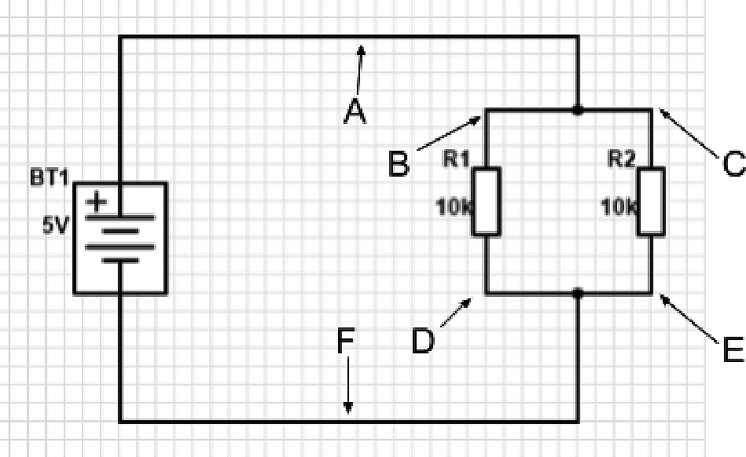

## 5.4 Paralelní zapojení {#5-4-paraleln-zapojen}

Uděláme jen drobnou změnu. Místo „za sebou“ zapojíme rezistory „vedle sebe“ – tedy místo sériového zapojení zvolíme paralelní. Takto.

Na takové zapojení můžeme opět pohlížet jako na zapojení jednoho rezistoru s celkovým odporem Rx. Jaká bude jeho velikost? Schválně, zkuste hádat:

a. Bude stejná jako u sériového zapojení

b. Bude jiná

Logická úvaha: No, stejná asi nebude, to bych se na to neptal a nedělal s tím takové štráchy, že… Ale co když jen tak blufuju? Nebude lepší to zase změřit?

Tak jo, pojďme to změřit. Napájecí napětí je 5 V, napětí na rezistoru R1 (mezi body B-D) je… aha, a na rezistoru R2, tedy mezi body C-E…? Aha aha! Ono je to vlastně jasné – z hlediska měření napětí jsou si body A, B a C rovny – jsou spojeny vodičem, a ten má, jak jsme si řekli, pro nás zanedbatelný odpor. Totéž platí pro body D, E a F. Tedy je logické, že napětí mezi bodem A (nebo B, či C) a bodem F (nebo D, E) bude stále stejné. Tedy těch 5 voltů. Paralelní zapojení tedy nefunguje jako dělička napětí; na všech rezistorech je stejný úbytek napětí.

Úvaha: Bude na nich stejné napětí, i když bude mít jeden 10K a druhý jen 1K? Když se nad tím zamyslíte a uvědomíte si to, že jsou body A-B-C a D-E-F spojeny, tak by na nich mělo být stále stejné napětí. Mezi body B a C není nic, kde by mohlo dojít k úbytku, stejně tak mezi body D a E, takže není důvod, proč by se napětí B-D mělo lišit od C-E. Ale zkuste si to sami proměřit.

Než to změříte, tak jen připomenu, že vodiče samozřejmě svůj odpor mají, ovšem je tak nízký, že jej můžeme pro naše konstrukce zanedbat, a taky se to tak dělá. Pokud bychom ale přemýšleli nad vedením na velké vzdálenosti, musíme samozřejmě odpor vodičů započítat, protože už z jednotek ohmů naroste na vyšší hodnoty. Pro nás v elektronice jsou tyto hodnoty zanedbatelné, protože většina vodičů bude mít několik málo centimetrů. Ale kdyby vás napadlo, že zapojíte čidlo přes desetimetrový vodič, už se může snadno stát, že úbytek bude tak velký, že s ním je potřeba počítat.

Změřením ověřeno? Je to tak, jak jsem psal? Tak to se mi ulevilo. Pokud je tedy napětí na obou rezistorech stejné, jaké to bude s proudem? Při odpovědi můžete použít dva postupy. Buď změříte, nebo se zamyslíte. Já doporučuju zkombinovat obojí, tedy buď vymyslet a měřením ověřit, nebo změřit a úvahou podepřít naměřené.

[eknh.cz/delpro](https://eknh.cz/delpro)

Každopádně úvaha by se měla brát zhruba tudy: Když je na rezistoru Rn napětí U, tak víme, že skrz něj poteče proud In = U / Rn. Nějaký proud teče celým obvodem. Teď je otázka, jestli poteče oběma rezistory stejný proud, jako celým obvodem, nebo jestli se tam někde nahoře mezi body B a C rozdělí na dva, a pak zase spojí. Voda to tak dělá… Dělá to i proud?

Dělá! Odborně se tomu říká první Kirchhofův zákon a zní tak, že součet proudů do uzlu vstupojících je stejný jako součet proudů z uzlu vystupujících. Uzel zní hrozně odborně, ale pro nás je to prostě to místo vodivého spojení, tedy bod mezi body B a C, kam přichází proud z baterie a kde se dělí do dvou větví. Vstupuje do něj proud z baterie (I), a vystupují z něj dva proudy I1 (do rezistoru R1) a I2 (do rezistoru R2). Mělo by tedy platit, že I (vstupující) = I1 + I2 (součet vystupujících).

Stejná situace se odehrává mezi body D a E, v místě, kde se obě větve opět spojují do jedné. Tam zase proudy I1 a I2 vstupují, vystupuje proud I.

Teď to změříme. V bodě A a F bychom měli naměřit hodnotu proudu I (v obou stejnou), v bodech B a D proud I1, v bodech C a E proud I2\. Platí, že proud, který do rezistoru vstupuje, je stejný jako proud, který z něj vystupuje.

Pojďme zase na začátek úvah. Víme, jaký proud teče jakým rezistorem. Rezistor R1 pouští I1 = U / R1, rezistorem R2 prochází I2 = U / R2\. Celkový proud I by tedy měl být I1 + I2\. A ono to tak je. Pro napětí 5 V bude proud I1 a I2 roven 0,5 mA a celkový proud 1 mA. A pokud je celkový proud 1 mA, tak vychází, že celkový odpor bude 5 / 0,001 = 5000 ohmů, tedy 5k. Tedy poloviční.

Odvodíme si vzorec. Rx = U / I, kde I je celkový protékající proud. Ten je, jak víme, součtem obou proudů v obou větvích, tedy I1 + I2\. Po dosazení:

I = U / R1 + U / R2

Rx = U / (U / R1 + U / R2)

Rx = (R1 × R2) / (R1 + R2)

Nebo též 1 / Rx = 1 / R1 + 1 / R2

Tedy převrácená hodnota celkového odporu je rovna součtu převrácených hodnot jednotlivých odporů.

Dalo by se říct, že paralelní zapojení funguje jako „dělička proudu“. Při různých hodnotách dílčích odporů se dělí v různých poměrech, při stejných pak rovnoměrně 1:1\. Sice se říká, že „proud vždy teče cestou nejmenšího odporu“, ale není to tak úplně pravda. Správně bychom měli říct, že „oč je odpor menší, o to víc proudu jím protéká“.

Všimněte si, že u sériového zapojení je výsledný odpor vždy větší než největší z dílčích, při paralelním je celkový odpor vždy menší než nejmenší z nich.
