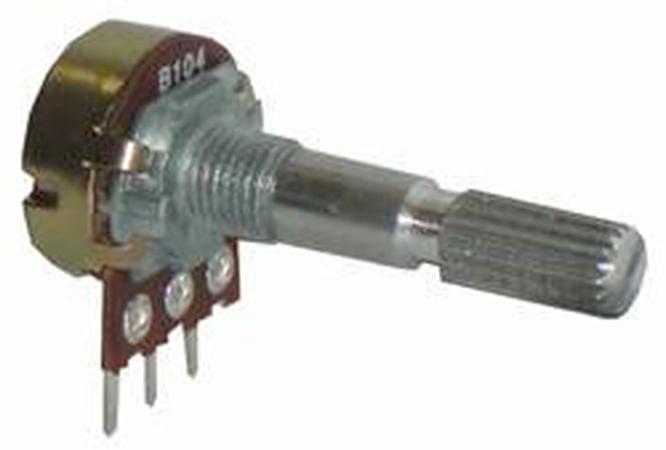
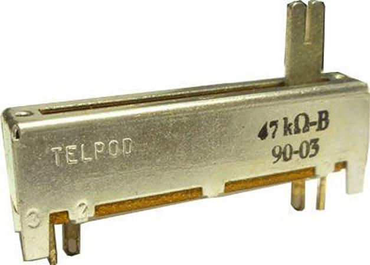
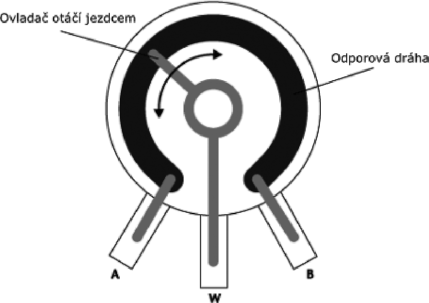
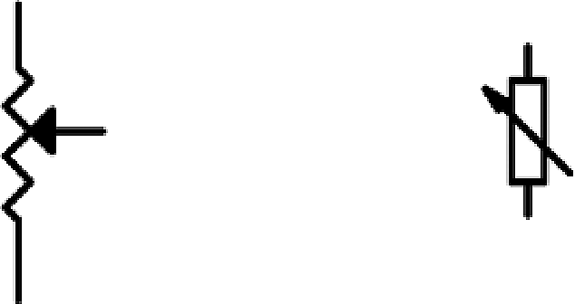

## 5.7 Potenciometr {#5-7-potenciometr}

Potrenciometr je vlastně proměnný dělič napětí v hmatatelné podobě. Součástka, kterou všichni známe z každodenní zkušenosti. Kdo z nás alespoň jednou nezesílil či nezeslabil rádio pomocí otočného knoflíku? Tak ta součástka uvnitř, která zařizuje, že vlevo to nehraje vůbec a vpravo nejvíc, se jmenuje právě potenciometr.

Nejčastější typ je otočný potenciometr:

Ale existují i jiné – třeba tahové

Potenciometr je vlastně rezistor určité velikosti, například 10k, ale proti obyčejnému rezistoru má vyvedený ještě třetí vývod, který je spojený právě s ovládacím mechanismem. Uvnitř se tento vývod („jezdec“) dotýká odporové dráhy. Tím, jak jej přibližujeme k jednomu či druhému krajnímu vývodu, se mění odpor mezi jezdcem a oběma vývody.

Dá se tedy říct, že jde vlastně o známé sériové zapojení dvou rezistorů, které má vyvedený prostřední vývod, a které má vždy celkový součet odporu stejný. Když je jezdec (W) otočený úplně doleva (k vývodu A), je odpor A-W (téměř) nulový, a odpor W-B je rovný celkovému odporu (A-B). Když je jezdec uprostřed, je odpor A-W poloviční proti odporu A-B (a stejný jako W-B). Když je jezdec ve čtvrtině dráhy, je odpor A-W roven jedné čtvrtině, W-B pak třem čtvrtinám celkového odporu...

Pozor – tak to je pouze u takzvaných lineárních potenciometrů. V audiotechnice, pro zesilování signálů a podobně se používá jiný typ, takzvaný logaritmický. Tam neplatí, že uprostřed je hodnota odporu poloviční.

Vlevo americký symbol, vpravo evropský.

Nám se potenciometr v číslicové technice moc nehodí, ale hodí se nám pro experimenty s elektřinou. Ukážeme si s ním jednoduchý pokus.
