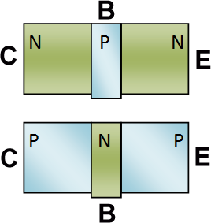

## 7.3 Tranzistor {#7-3-tranzistor}

Moje babička tohle slovo znala. Vždycky na mne volala: „Zeslab ten tranzistor, huláká to tu jak na lesy“ nebo „Vypni ten tranzistor a pojď jíst“! Nemyslela tím elektronickou součástku, ale tranzistorové rádio. To byl velký hit 60\. až 80\. let – radiopřijímač, kde se několik tranzistorů staralo o to, aby signál byl hezky hlasitý, a navíc to fungovalo na baterky, takže to bylo přenosné.

Tranzistor ale není radiopřijímač. Tranzistor je druhý typ polovodičové součástky, s nímž se seznámíme. Místo dvou elektrod, připojených na polovodiče P a N a jednoho P-N přechodu má hned tři elektrody a dva P-N přechody. Podle typu uspořádání rozlišujeme tranzistory NPN a PNP.

Elektrody se jmenují Kolektor (C), Báze (B) a Emitor (E). Tranzistor má tu vlastnost, že proud, tekoucí mezi bází a emitorem, zároveň otvírá cestu mnohem větším proudům, které tečou mezi kolektorem a emitorem. Proud mezi kolektorem a emitorem je úměrný proudu mezi bází a emitorem, a tak se tranzistor používá jako jednoduchý zesilovač. Nejdůležitější vlastnost tranzistoru se nazývá proudový zesilovací činitel (značí se h21e, někdy taky _beta_, β nebo hFE, a v anglických materiálech se setkáte s označením DC Current Gain) a udává, kolikrát je proud kolektorem vyšší než proud bází.

Ovšem audiotechnika, do níž zesilovače signálu patří, je sice krásná oblast elektroniky, ale mimo záběr této knihy, a proto se tu omezím pouze na konstatování, že tomu tak je. V číslicové technice, kde nezáleží ani tak na velikosti napětí a proudu, jako spíš na tom, jestli proud teče či neteče a jestli napětí je, nebo není, se tranzistory používají jiným způsobem – ne jako zesilovače, ale jako spínače.

Pokud připojíte na bázi kladné napětí vůči emitoru, tranzistor se otevře a vede proud z kolektoru do emitoru (u typu NPN; pro PNP platí totéž, ale obráceně – ovládá se záporným napětím a proud teče z emitoru do kolektoru). Když je na bázi napětí menší než 0,7 voltu (u křemíkových tranzistorů), tak je tranzistor zavřený a proud mezi kolektorem a emitorem neteče.

Ostatně je to vidět i na schematické značce – emitor je vždy označen šipkou, a ta udává směr proudu.

A opět mnemotechnické pravidlo: NPN (čtěte samozřejmě [en pé en]) – šipka ven!

Kromě těchto tranzistorů NPN a PNP, které jsou označovány jako bipolární, existují i tranzistory typu FET (tranzistory řízené polem – míněno elektrickým): JFET a MOSFET.

V číslicové technice se tranzistory používají nejčastěji jako budiče proudově náročných zařízení – relé, motorů, běžných žárovek atd. Číslicové integrované obvody totiž dávají na výstupu poměrně malý proud, který třeba pro LED stačí, ale pro sepnutí relé už je nedostatečný. Tranzistor nabízí jednoduchý způsob, jak tento výstup „posílit“. Ale o tom se pobavíme později.

Já vím, relé je opravdu stará součástka a ne každý ji pamatuje. Proto vězte, že relé je „elektromagnetický spínač“, kde je elektromagnet (cívka) a dva kovové kontakty. Když cívkou prochází proud, tvoří se okolo ní magnetické pole, a to přitáhne kontakty, které se tak spojí (nebo rozpojí, podle konstrukce). Tak lze nízkým napětím (5 V) spínat třeba síťových 230 voltů. Ale o relé ještě bude řeč.
