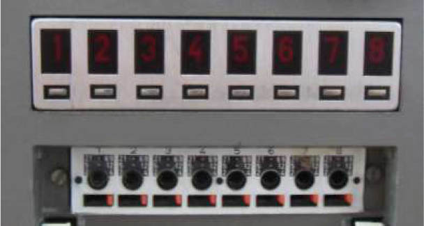
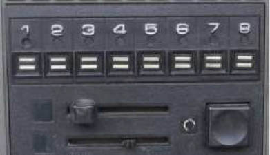
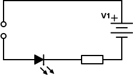
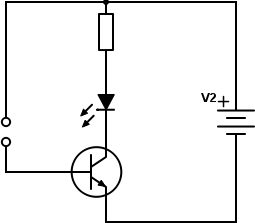
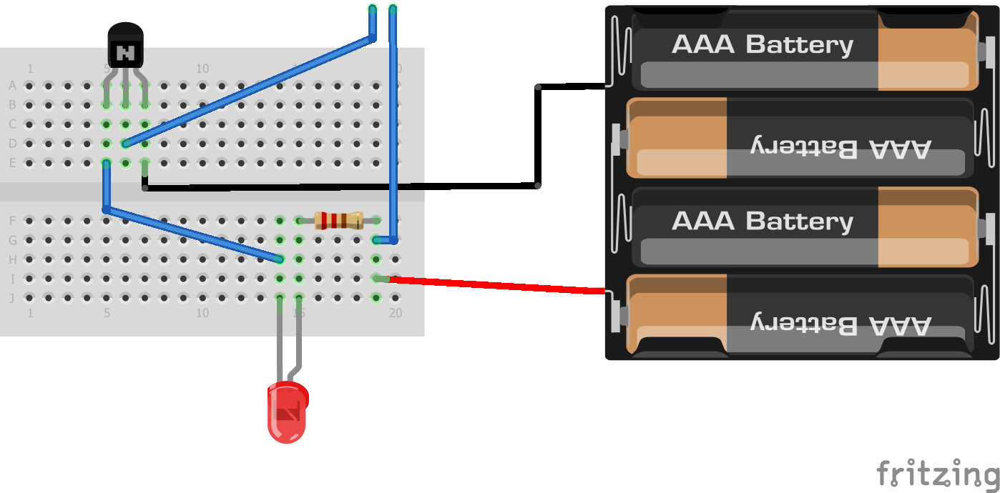
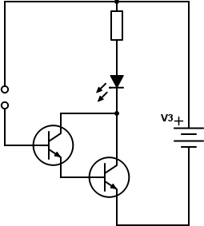

## 7.4 Rozsvítíme prstem LED! {#7-4-rozsv-t-me-prstem-led}

Pamatujete se na staré televize, které měly přepínání kanálů pomocí senzorů? Ne, teď nemyslím senzor jako že snímač, myslím senzor jako dotykové tlačítko. Vypadalo nějak takto:

Senzor v tehdejším pojetí byly dva plíšky, oddělené nevodivou mezerou. Když jste se těchto dvou plíšků dotknuli prstem, spojili jste je (kůže je trochu vodivá), a řídicí elektronika to vyhodnotila jako stisknutí tlačítka.

Pojďme si to zkusit zapojit. Žádné složitosti, jen senzor, klidně nasimulovaný dvěma dráty vedle sebe, a dotykem rozsvítíte LED.

Co třeba takhle?

Ty dvě kolečka vlevo symbolizují dvě dotykové plošky, které budeme prstem spojovat. Vzhledem k tomu, že kůže má poměrně velký odpor, je potřeba, aby byly co nejblíž u sebe, třeba milimetr, dva…

Zkuste se dotknout – a co? Nesvítí, že? A když ty plošky spojíte třeba hřebíkem, tak to funguje. Stvořili jsme dotykový senzor pro kyborgy s kovovými prsty, ovšem pro lidi nic moc.

V čem je problém? Prozradím vám to: lidská kůže má fakt hodně velký odpor, na těch dvou milimetrech vzdálenosti klidně několik megaohmů. _Ostatně zkuste si to sami změřit!_

Pokud baterie dává 5 voltů, tak z Ohmova zákona vyplývá, že skrz prst (ne, to není jazykolam) poteče nějakých pár µA. Jenže to je na LED málo… Můžete si zkusit prst naslinit, odpor klesne třeba desetkrát, ale to stále není žádná výhra.

_Kéž bychom měli součástku, která malým proudem dokáže sepnout velký, že?_

Nebudu vás napínat – právě jsem jinými slovy zopakoval to, co jste četli o několik stránek dřív: tranzistor malým proudem (mezi bází a emitorem) spíná velký proud (mezi kolektorem a emitorem).

Velký proud, to bude to, co poteče LEDkou, malý proud bude to, co teče senzorem. Co třeba takhle?

„Velký proud“ teče – pokud tedy teče! – z kladného pólu baterie přes rezistor a LED do kolektoru u tranzistoru, skrz tranzistor emitorem ven a do záporného pólu baterie. „Malý proud“ teče z kladného pólu téže baterie do senzoru, tam protéká vaším prstem, zpátky do druhého pólu senzoru, odtamtud do báze tranzistoru, a přes emitor ven a do baterie. Což samozřejmě platí pro situaci, kdy je prst přiložen. Když prst přiložen není, tak žádný malý proud neteče, a tím pádem neteče ani velký proud.

Jako tranzistor použijte třeba BC548C, ten má hodně velký proudový zesilovací činitel. Co je „hodně velký“? No, podle datasheetu je to nějakých 500 (čeho? Jablek? Voltů? Ohmů? Ničeho; zesilovací činitel je bezrozměrný, nemá jednotku) při proudu kolektorem 2 mA. Na takový proud stačí tedy 500 × menší proud bází – tedy 4 µA. To by mohlo fungovat, i když svit LED při dvou mA nebude nijak přehnaný…

### 7.4.1 Více světla! {#7-4-1-v-ce-sv-tla}

Co když i ten „velký proud“ je pro nás stále malý? Co kdybychom chtěli do LED pouštět víc, třeba 10 mA. Nebo kdybychom chtěli zapojit žárovku, co si bere desítky až stovky miliampérů? Nebo když máme obzvlášť suché prsty a „malý proud“ je příliš malý?

Prozradím vám trik zvaný _Darlingtonovo zapojení_. V něm použijeme dva tranzistory. První udělá z malého proudu střední, druhý ze středního velký.

