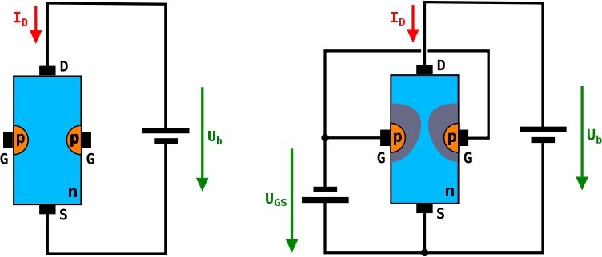
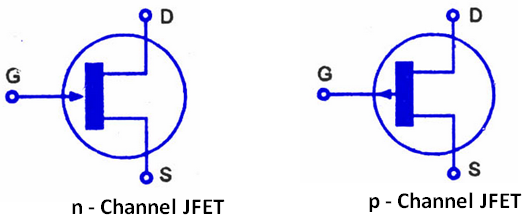

## 7.5 Tranzistor řízený polem (FET) {#7-5-tranzistor-zen-polem-fet}

Tranzistory NPN a PNP jsou historicky první polovodičové tranzistory. Velmi hezky zesilují signál, ale mají jednu drobnou nevýhodu: zesilují proud. I když tranzistor zesílí proud třeba stonásobně, znamená to, že pokud má na výstupu dát třeba 100 mA, musí do vstupu téct 1 mA, což není zanedbatelný proud. Když chcete na výstupu spínat proud třeba 2 A, musel by takový tranzistor na vstupu odebírat 20 mA. Řešením by bylo mít tranzistor s _vyšším proudovým zesilovacím činitelem_, popřípadě zapojit dva tranzistory za sebou v Darlingtonově zapojení – první zesílí z 0,2 mA na 20 mA, druhý z 20 mA na 2 A. Problém je, že se tím zvýší spotřeba, a tím i ztráty.

Existují ale i tranzistory, které na řídicí elektrodě nepotřebují téměř žádný proud a řídí se pouze napětím. Nazývají se _unipolární_, též _řízené polem_, v angličtině Field-Effect Transistor (FET). Nejjednodušší tranzistor FET je JFET (Junction FET).

Představte si dlouhý polovodič typu N („dlouhý“ na poměry elektronických součástek, v praxi řádově milimetry a menší), na jehož protilehlé konce jsou připojeny elektrody. Nazvěme je analogicky s emitorem (vysílač) a kolektorem (sběrač): Source (zdroj) a Drain (jímka). Polovodič typu N má dostatek volných elektronů, takže vede proud mezi elektrodami S a D. Zatím to moc zajímavé není.

Teď si ale představte, že tento kanál omezíte. Někde v polovině vytvoříte oblast s vodivostí typu P, a k ní připojíte další elektrodu. Pokud bude na této elektrodě menší napětí proti elektrodě S (bude tedy „zápornější“), vytvoří se okolo přechodu ochuzená oblast (vzpomeňte si na diodu…), která nevede proud. Díky tomu se zmenší průřez kanálu, a tím vzroste jeho odpor pro proud mezi S a D. Tato elektroda tedy řídí tok proudu, a proto se jí říká řídicí, anglicky Gate (G).

Když bude na G kladnější napětí než na S, tranzistor bude otevřený.

CC-BY-SA, autor Chautube, Wikimedia

Všimněte si, že se tranzistor řídí napětím v závěrném směru, tedy ve směru, kdy P-N přechodem mezi G a S neprochází proud. Proudy, tekoucí skrz Gate, jsou opravdu mizivé, v řádech nanoampérů.

Napětí, při kterém se tranzistor JFET zcela uzavře, bývá mezi - 0,5 V a - 10 V. Toto napětí velmi kolísá, nejen podle typu tranzistoru ale dokonce i u dvou tranzistorů stejného typu může být rozdílné.

Když zaměníte polovodiče P a N, stvoříte JFET typu P (dosud jsme si popisovali JFET-N). Jeho funkce bude stejná, jen logika obrácená: tranzistor se bude zavírat kladnějším napětím na elektrodě G.

Všimněte si, že z popisu funkce vyplývá, že vlastně není rozdíl mezi elektrodami S a D. A ono to tak je: když tranzistor zapojíte obráceně (prohodíte S a D), tak _teoreticky_ bude fungovat úplně stejně. U některých JFET to tak funguje doopravdy. V praxi ale mezi těmito elektrodami bývá rozdíl, například ve velikosti a tloušťce, ale některé typy mají opravdu S a D zaměnitelné.
