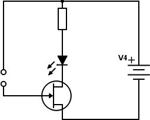
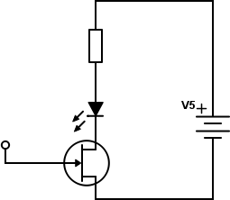

## 7.6 Šoupejte nožkou… {#7-6-oupejte-no-kou}

Sedíte? A máte koberec? A šoupete po něm mimoděk nohama? To nedělejte, to není dobře, tím se nabíjíte statickou elektřinou, ta putuje po vašem těle a nejen že můžete dostat ránu, když se dotknete něčeho uzemněného, ale můžete taky naprosto tiše a bez jakýchkoli vnějších projevů pouhým dotykem zničit drahou elektroniku.

O statické elektřině jsme si říkali, že má potenciál klidně v řádech kilovoltů, ale náboj není tak velký, aby dokázal vytvořit dostatečně nebezpečný proud. Když si to spojíte s těmi tranzistory: u bipolárních (NPN, PNP) potřebujete k jejich otevření proud; ty se statickou elektřinou neotevřou. JFET je řízený napětím, tam by to šlo…

Vezměte náš senzor s tranzistorem z předchozí kapitoly a tranzistor NPN nahraďte tranzistorem JFET – já použil třeba BF245\. V datasheetu jsem si našel zapojení vývodů (G-S-D), a zapojil jsem vše analogicky: G místo báze, S místo emitoru, D místo kolektoru.

Všimněte si, že tentokrát není potřeba se prstem dotýkat. Stačí ho přiblížit dostatečně blízko. Dokonce si, věřte nebo ne, vystačíme s jediným pólem:

Klidně použijte vodič s izolací, ani nemusí být „holý“. LED bude změnou jasu reagovat i na pouhé přiblížení ruky.
