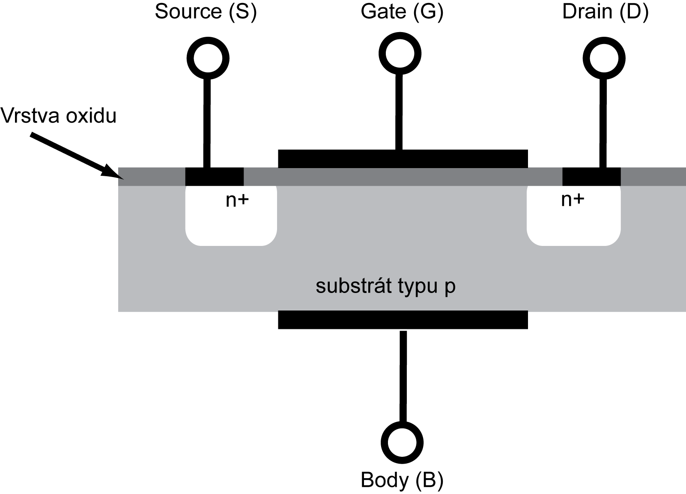
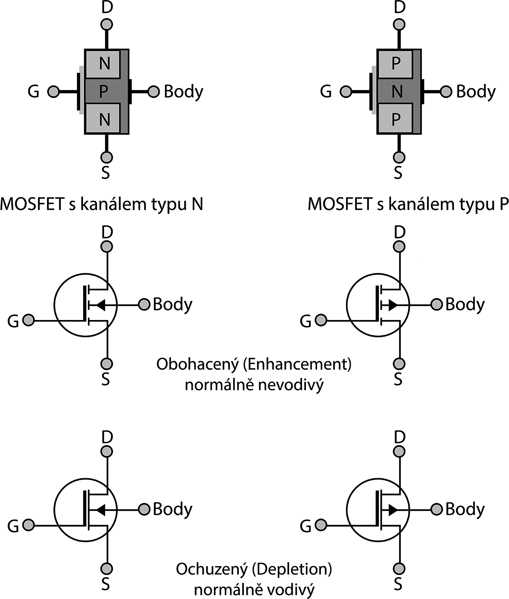

## 7.7 MOSFET {#7-7-mosfet}

U tranzistoru JFET je řídicí elektroda součástí P-N přechodu a v propustném směru jí může téct proud, stejně jako skrz jakoukoli diodu. Pokud ale řídicí elektrodu izolujete tenkou vrstvou nevodiče, například oxidu křemičitého, můžete vytvořit další typ tranzistoru, řízeného polem.

Elektrody S a D jsou připojené k polovodičům typu N, které jsou zapuštěné v bloku polovodiče P (substrát, též tělo – body). Řídicí elektroda G je kovová a od polovodiče je izolovaná nevodivou vrstvou oxidu. Z tohoto uspořádání pochází i označení MOS: Metal-Oxid-Semiconductor.

Za normálního stavu mezi S a D neteče žádný proud. Brání tomu dvojice přechodů N-P-N mezi elektrodami a substrátem. Pokud ale na řídicí elektrodu G přivedete kladné napětí, „odtlačí“ toto napětí volné díry v polovodiči typu P na druhou stranu, a pod ní vznikne úzký vodivý kanál, který se chová jako slabý polovodič typu N, a tranzistor začne vést proud.

Tranzistorů MOSFET je velké množství s nejrůznějšími typy struktur a vodivostí. Dva základní typy jsou NMOS (elektrody typu N, substrát typu P) a PMOS (elektrody P, substrát N). Oba typy mohou být vytvořené buď s indukovaným kanálem (enhanced – tento typ jsme si popsali), nebo se zabudovaným kanálem (depletion). U „depletion“ typů je vytvořen vodivý kanál z výroby pomocí ochuzeného polovodiče stejného typu, tranzistor tedy za normálního stavu vede, a záporné řídicí napětí naopak vodivost snižuje.

Tranzistory typu MOS mají několik vynikajících vlastností – téměř nulový proud řídicí elektrodou, velké proudy mezi Source a Drain, nízké ztráty apod., ale mají jednu výraznou nevýhodu: vrstvička izolantu mezi elektrodou G a substrátem je opravdu velmi tenká, takže ji lze prorazit i poměrně nízkým napětím, třeba okolo 20 voltů. V reálných systémech bývají proto tyto elektrody chráněny rychlými diodami před průrazem. Ovšem největší nebezpečí představuje pro tyto tranzistory statická elektřina. Proto se při manipulaci s tranzistory MOS a dalšími součástkami, v nichž je tato technologie použita, doporučuje zvýšená opatrnost, měli byste s nimi manipulovat vždy důkladně uzemněni (používají se například vodivé náramky), a dokud to je možné, tak by měly mít tyto součástky všechny své vývody vodivě propojené (používá se buď vodivá pěna, nebo například alobal). Toto vodivé spojení by mělo být odstraněné až po montáži součástky do obvodu.

### 7.7.1 Co je to CMOS? {#7-7-1-co-je-to-cmos}

Patří to sem? Ano, trochu ano. CMOS je technologie, která kombinuje NMOS a PMOS tak, že se oba tranzistory doplňují (proto CMOS – Complementary MOS). V současné době je to nejpoužívanější technologie pro výrobu integrovaných obvodů: je dostatečně rychlá, s velmi nízkou spotřebou…

Pamětníci si vzpomenou, že měli v počítačích PC něco, čemu se říkalo taky CMOS, a byla tam baterie. To byl čip, který fungoval jako paměť konfigurace (jak velký disk je použitý, jakou má strukturu, kolik paměti je nainstalováno). Byl vyráběn právě technologií CMOS a díky tomu byla jeho spotřeba velmi nízká a pokryla ji po mnoho let baterie. Když se pak baterie vybila, začala „cé moska“ zapomínat.

A možná znáte zkratku CMOS z recenzí různých fotoaparátů: „Typ snímacího čipu: CMOS“. Ano, jde zase o stejnou technologii. Vzpomeňte si, jak jste svítili na LED: polovodičový přechod je citlivý na světlo. A když poskládáte strukturu MOS tranzistorů tak, že je z nich matice, na kterou může světlo dopadat, bude vám je dopadající světlo zavírat a otvírat…
