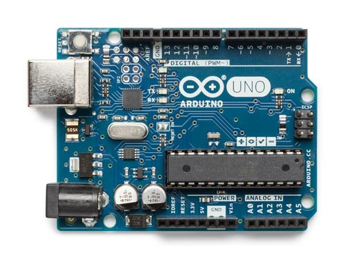
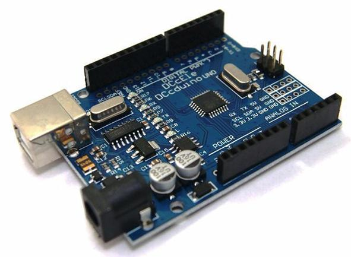
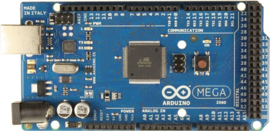
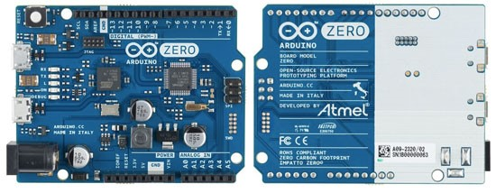
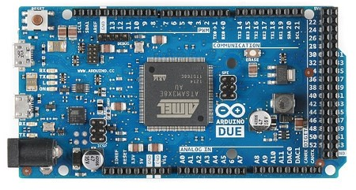
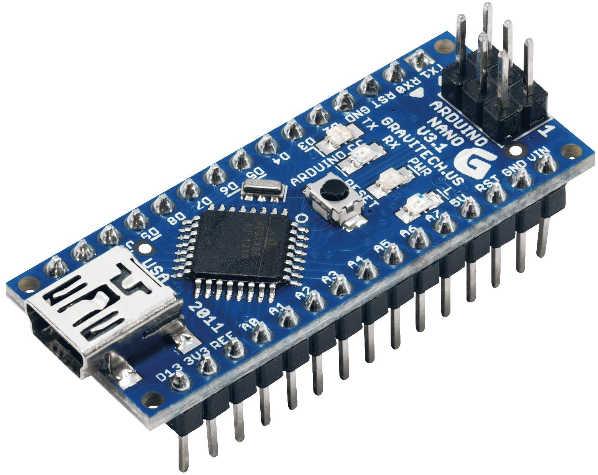
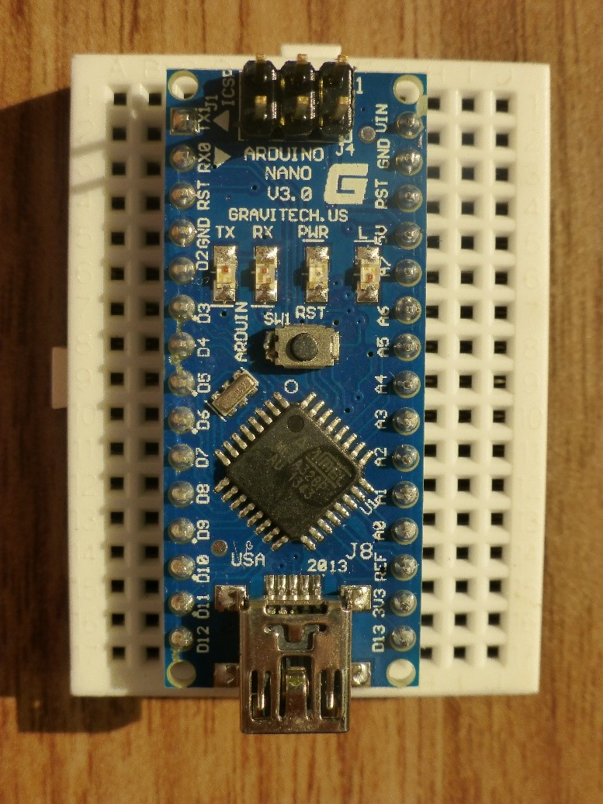

## 9.1 Když se řekne Arduino {#9-1-kdy-se-ekne-arduino}

tak „se“ má na mysli nejspíš Arduino Uno. Je to dnes nejrozšířenější typ, a díky tomu, že je open-source, tak mohlo vzniknout nepřeberně klonů, které jsou lépe vybavené, levnější, popřípadě obojí.

Originální Arduino obsahuje _jednočip_ ATmega328 – to je to velké černé vpravo dole s mnoha vývody. Tento obvod provádí program, který do něj nahrajete, a podle něj umí řídit jednotlivé výstupy (horní a dolní okraj). Dále obsahuje komunikační rozhraní pro sběrnici USB – kovový konektor vlevo nahoře a malý čtvercový obvod napravo od něj. Vlevo dole pak jsou součástky, které se starají o napájení toho všeho. A to je vše.

Neoriginální Arduino může vypadat třeba takhle:

Trénované oko vidí, že procesor je v jiném pouzdru (černý čtverec zhruba uprostřed), a že obvod pro řízení USB je jiný (obdélník místo čtverce).

Pokud Arduino ještě nemáte a přemýšlíte, jaké pořídit, tak mám jeden tip: pořiďte si v českém obchodě originální. Je sice dražší, ale máte mnohem vyšší naději, že bude v pořádku. A máte i záruční lhůtu na případnou opravu. Klon vás vyjde třeba na pětinovou cenu, nebo i nižší, ale může se vám stát, že budete pozorovat „podivné“ chyby v chování – protože třeba výrobce něco nepřipájel, nebo osadil ne zcela perfektní obvody. Mně se podobné chování objevilo asi tak u dvou procent Arduin, ale nikdy nevíte…

Kromě základní verze Uno existuje i Arduino Mega s mnohem větším procesorem (a taky s více vývody):

Vidíte, že zleva je to velmi podobné obyčejnému Arduinu, a vpravo je jaksi „navíc“ spousta dalších vývodů a konektorů.

A kromě těchto Arduin je i spousta dalších desek a kitů, které se jmenují všelijak – Seeduino, DCDuino, Funduino, … Společné mají to, že je lze programovat stejně jako základní Arduino, ale liší se ve schopnostech, někdy i v konektorech…

Existují i Arduina, která jsou osazena jiným procesorem, než je Atmel AVR – například procesorem z rodiny ARM:

Tato Arduina mají sice stejné vývody, ale vyžadují jiné napětí – ne 5 voltů, ale 3,3 voltu. Později si vysvětlíme, co to znamená, teď si pamatujte: pro začátek tato Arduina nepoužívejte, použijte Uno!

Zajímavá varianta Una je miniaturní Nano. Výhoda tohoto Arduina je, že ho lze zasunout do nepájivého kontaktního pole:

