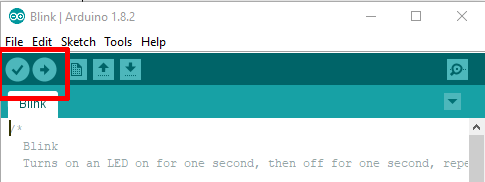

## 9.3 Blikání Arduinem {#9-3-blik-n-arduinem}

Vidíte kód, který je hodně jednoduchý, programátoři už určitě větří… Vidíte dvě funkce, setup() a loop(). První se provede po spuštění celého zařízení, a když doběhne, tak se donekonečna volá ta druhá. Nějak takhle – představte si, že tohle je funkce na pozadí:

<pre class="kod">void main() {</pre>

<pre class="kod">    setup();</pre>

<pre class="kod">    while(1) loop();</pre>

<pre class="kod">}</pre>

Zpátky k příkladu blink. Ve funkci setup() je volaná nějaké funkce pinMode(), která říká, že nějaký výstup má být OUTPUT, a v druhé se pak střídá digitalWrite HIGH a digitalWrite LOW, proložené zpožděním (delay). (Na konci knihy, v přílohách, najdete stručný přehled základních funkcí Arduina).

<pre class="kod">void setup() {</pre>

<pre class="kod">    pinMode(LED_BUILTIN, OUTPUT);</pre>

}  

<pre class="kod">void loop() {</pre>

<pre class="kod">    digitalWrite(LED_BUILTIN, HIGH);</pre>

<pre class="kod">    delay(1000);</pre>

<pre class="kod">    digitalWrite(LED_BUILTIN, LOW); </pre>

<pre class="kod">    delay(1000);</pre>

<pre class="kod">}</pre>

V horní liště, hned pod menu, je několik tlačítek. To úplně první vlevo zkontroluje, jestli jsou v kódu nějaké chyby. To druhé, vedle něj, s ikonkou šipky, spustí překlad, a po překladu se přeložený kód nahraje do Arduina po USB kabelu.

Předpokládám, že máte vše nastavené a propojené, na Arduinu svítí LED, která signalizuje napájení – pojďme na to! Klikněte směle na překlad a nahrání.

Bude to chvilku trvat, zhruba tak dlouho, jak budete číst tento odstavec, a až bude všechno přeloženo, tak se v tom zeleném pruhu pod editorem objeví nápis „Done upload“. V černém poli pod ním pak uvidíte buď lakonické sdělení o tom, kolik program zabírá paměti, nebo nějaké oranžové hlášky, které znamenají chybu.

Nejčastější chyba, věřte tomu nebo ne, je ta, že zapomenete vybrat port a typ desky. Viz výše.

Pokud to všechno proběhlo, tak si všimněte, že na desce bliká LEDka.

To bylo jednoduché, co? Žádný kondenzátor, žádný integrovaný obvod, žádná LED, žádný rezistor… Jenže takhle se nic nedozvíme a nenaučíme. Takže uděláme jeden krok…
