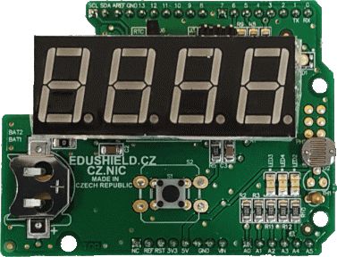

## 9.5 Arduino a EduShield {#9-5-arduino-a-edushield}

Arduino je skvělá věc k demonstrování základů číslicové techniky. Někteří vyučující postupují jako já v této knize: dají lidem do ruky hrst součástek a nechají je zapojovat a zkoumat. Což je fajn, když je dost času. Pokud ale děláte třeba půldenní workshop s dvaceti lidmi, tak brzy zjistíte, že někdo prohodí vodiče, otočí součástku, vytvoří zkrat, součástku tak zničí a pak se diví, že mu to nefunguje tak, jak mu od tabule vyprávíte…

Na kurzech Arduina jsme proto sáhli k jednoduchému řešení: vytvořili jsme destičku s několika základními součástkami, které jsou ozkoušené, zapojené a připravené k testům. Tuto destičku jsme nazvali EduShield. Vyrábí a dodává ji CZ.NIC. Podrobnosti, včetně příkladů a firmware naleznete na GitHubu:

[github.com/arduino-edushield](https://github.com/arduino-edushield)

EduShield můžete použít i vy k ověření některých zapojení.

EduShield obsahuje následující periferie:

• Tlačítko, připojené na pin 2,

• RGB LED, připojenou na piny 5 (zelená), 6 (modrá) a 9 (červená),

• Tři barevné LED: zelená (pin 13), červená (pin 16) a oranžová (pin 17),

• Fotorezistor na vstupu A0,

• Termistor na vstupu A1,

• Hodiny reálného času a displej, obojí připojené na sběrnici I2C.

Nebojte se, že zatím některým termínům nerozumíte. Během dalších kapitol pochopíte.

Já budu EduShield občas zmiňovat, když narazíme na nějaký příklad, který se na něm dá dobře demonstrovat. K pochopení výkladu ale není nezbytně nutné, abyste jej měli.

##### 10 Fotorezistor {#10-fotorezistor}
