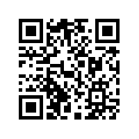
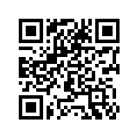
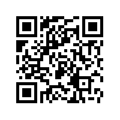
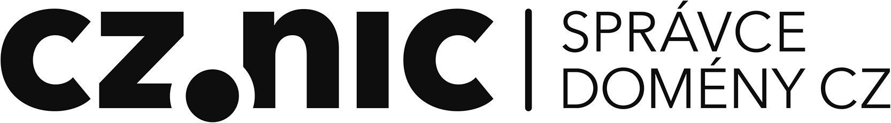

## HRADLA, VOLTY, JEDNOČIPY

### Úvod do bastlení

Martin Malý

Pro čtenáře, kteří jsou spokojeni s elektronickým vydáním tištěnou verzi nechtějí, a přesto by rádi autorovi přispěli, tu je několik možností:
					<ul>
						<li><a href="https://paypal.me/malycz">Poslat libovolnou částku přes PayPal</a></li>
						<li><a href="bitcoin:37QkzwNnP1F4PTVS337CcxhT26jvFwvehW">Příspěvek Bitcoin</a>
							 </li>
						<li><a href="litecoin:LccfBhSRC5RPwhvZTZSY5pG6xsJJUgoXek">Příspěvek Litecoin</a>
						 </li>
						<li><a href="bitcoincash:1DCtAfVad6kKw74zS3xyi3tP3JxDhEV3uh">Příspěvek Bitcoin Cash</a>
						 </li>
					</ul>

**Vydavatel**:

CZ.NIC, z. s. p. o.

Milešovská 5, 130 00 Praha 3

Edice CZ.NIC

www.nic.cz

1. vydání, Praha 2017

Kniha vyšla jako 16. publikace v Edici CZ.NIC.

ISBN 978-80-88168-24-9

© 2017 Martin Malý

Toto autorské dílo podléhá licenci Creative Commons \([creativecommons.org/licenses/by-nd/3.0/cz/](http://creativecommons.org/licenses/by-nd/3.0/cz/)\), a to za předpokladu, že zůstane zachováno označení autora díla a prvního vydavatele díla, sdružení CZ.NIC, z. s. p. o. Dílo může být překládáno a následně šířeno v písemné či elektronické formě na území kteréhokoliv státu.

# Obsah {#obsah}

Obsah

[Poděkování](podekovani.md)

[Předmluva vydavatele](predmluva_vydavatele.md)

[Předmluva mentora](predmluva_mentora.md)

[Výmluvy místo předmluvy](#v-mluvy-m-sto-p-edmluvy)

[1 Budu velkým elektronikem a budu stavět hrozně cool obvody!](#1-budu-velk-m-elektronikem-a-budu-stav-t-hrozn-cool-obvody)

[1.1 Blikač](1_budu_velkym_elektronikem_abudu_stav_et_hrozne_co/11_blikac.md)

[1.2 „Dílna“](1_budu_velkym_elektronikem_abudu_stav_et_hrozne_co/12_dilna.md)

[1.3 Kde nakoupit součástky?](1_budu_velkym_elektronikem_abudu_stav_et_hrozne_co/13_kde_nakoupit_soucastky.md)

[1.4 Nákupní seznam: Součástky pro blikač](1_budu_velkym_elektronikem_abudu_stav_et_hrozne_co/14_nakupni_seznam_soucastky_pro_blikac.md)

[1.4.1 LED](1_budu_velkym_elektronikem_abudu_stav_et_hrozne_co/14_nakupni_seznam_soucastky_pro_blikac.md#1-4-1-led)

[1.4.2 Rezistory](1_budu_velkym_elektronikem_abudu_stav_et_hrozne_co/14_nakupni_seznam_soucastky_pro_blikac.md#1-4-2-rezistory)

[1.4.3 Kondenzátory](1_budu_velkym_elektronikem_abudu_stav_et_hrozne_co/14_nakupni_seznam_soucastky_pro_blikac.md#1-4-3-kondenz-tory)

[1.4.4 Integrované obvody](1_budu_velkym_elektronikem_abudu_stav_et_hrozne_co/14_nakupni_seznam_soucastky_pro_blikac.md#1-4-4-integrovan-obvody)

[2 Postavte si blikač – teď už to snad půjde lépe](2_postavte_si_blikac__ted_uz_to_snad_pujde_lepe/README.md)

[2.1 Který rezistor je ten pravý?](2_postavte_si_blikac__ted_uz_to_snad_pujde_lepe/21_ktery_rezistor_je_ten_pravy.md)

[2.2 Měření multimetrem](2_postavte_si_blikac__ted_uz_to_snad_pujde_lepe/22_mereni_multimetrem.md)

[2.3 LED podrobněji](2_postavte_si_blikac__ted_uz_to_snad_pujde_lepe/23_led_podrobneji.md)

[3 Hlava, koleno, zem…](3_hlava,_koleno,_zem/README.md)

[3.1 „Nemá to něco společného s atomy?“](3_hlava,_koleno,_zem/31_nema_to_neco_spolecneho_satomy.md)

[3.2 Napětí](3_hlava,_koleno,_zem/32_napeti.md)

[3.3 Proud](3_hlava,_koleno,_zem/33_proud.md)

[3.4 Vodič a nevodič](3_hlava,_koleno,_zem/34_vodic_anevodi_c.md)

[3.5 Odpor](3_hlava,_koleno,_zem/35_odpor.md)

[3.6 Měření, měření!](3_hlava,_koleno,_zem/36_mereni,_mereni.md)

[3.7 Ohmův zákon](3_hlava,_koleno,_zem/37_ohmuv_zakon.md)

[3.8 Výkon](3_hlava,_koleno,_zem/38_vykon.md)

[3.9 … a malé opáčko](3_hlava,_koleno,_zem/39__amal_e_opacko.md)

[3.9.1 Násobky a podíly](3_hlava,_koleno,_zem/39__amal_e_opacko.md#3-9-1-n-sobky-a-pod-ly)

[3.10 Zkratky u značení](3_hlava,_koleno,_zem/310_zkratky_uzna_ceni.md)

[3.11 Vyvolená čísla](3_hlava,_koleno,_zem/311_vyvolena_cisla.md)

[3.12 Pro lepší představu](3_hlava,_koleno,_zem/312_pro_lepsi_predstavu.md)

[3.13 Střídavý proud](3_hlava,_koleno,_zem/313_stridavy_proud.md)

[3.14 Zkrat](3_hlava,_koleno,_zem/314_zkrat.md)

[3.15 Multimetr jako zkrat?](3_hlava,_koleno,_zem/315_multimetr_jako_zkrat.md)

[3.16 Elektromagnetická indukce](3_hlava,_koleno,_zem/316_elektromagneticka_indukce.md)

[3.17 Značky pro schémata](3_hlava,_koleno,_zem/317_znacky_pro_schemata.md)

[3.17.1 Kroužek, nebo ne?](3_hlava,_koleno,_zem/317_znacky_pro_schemata.md#3-17-1-krou-ek-nebo-ne)

[4 Zdroje napětí](4_zdroje_napeti/README.md)

[4.1 Společná zem](4_zdroje_napeti/41_spolecna_zem.md)

[5 Vedle sebe, za sebou](5_vedle_sebe,_za_sebou/README.md)

[5.1 Svítilna s LEDkou](5_vedle_sebe,_za_sebou/51_svitilna_sledkou.md)

[5.2 Sériové zapojení](5_vedle_sebe,_za_sebou/52_seriove_zapojeni.md)

[5.3 Dělič napětí](5_vedle_sebe,_za_sebou/53_delic_napeti.md)

[5.4 Paralelní zapojení](5_vedle_sebe,_za_sebou/54_paralelni_zapojeni.md)

[5.5 Kirchhof 2](5_vedle_sebe,_za_sebou/55_kirchhof_2.md)

[5.6 Baterie sériově – paralelně](5_vedle_sebe,_za_sebou/56_baterie_seriove__paralelne.md)

[5.7 Potenciometr](5_vedle_sebe,_za_sebou/57_potenciometr.md)

[5.8 Úbytek napětí na LED](5_vedle_sebe,_za_sebou/58_ubytek_napeti_na_led.md)

[5.9 Co jsou vlastně ty diody zač?](5_vedle_sebe,_za_sebou/59_co_jsou_vlastne_ty_diody_zac.md)

[5.10 Datasheet](5_vedle_sebe,_za_sebou/510_datasheet.md)

[6 Základní elektronické součástky](6_zakladni_elektronicke_soucastky/README.md)

[6.1 Rezistor](6_zakladni_elektronicke_soucastky/61_rezistor.md)

[6.2 Kondenzátor](6_zakladni_elektronicke_soucastky/62_kondenzator.md)

[6.3 Cívka](6_zakladni_elektronicke_soucastky/63_civka.md)

[6.4 Transformátor](6_zakladni_elektronicke_soucastky/64_transformator.md)

[6.4.1 DC měnič](6_zakladni_elektronicke_soucastky/64_transformator.md#6-4-1-dc-m-ni)

[6.4.2 Stabilizátor](6_zakladni_elektronicke_soucastky/64_transformator.md#6-4-2-stabiliz-tor)

[6.4.3 7805](6_zakladni_elektronicke_soucastky/64_transformator.md#6-4-3-7805)

[7 Polovodiče](7_polovodice/README.md)

[7.1 P-N přechod](7_polovodice/71_p-n_prechod.md)

[7.2 Dioda](7_polovodice/72_dioda.md)

[7.3 Tranzistor](7_polovodice/73_tranzistor.md)

[7.4 Rozsvítíme prstem LED!](7_polovodice/74_rozsvitime_prstem_led.md)

[7.4.1 Více světla!](7_polovodice/74_rozsvitime_prstem_led.md#7-4-1-v-ce-sv-tla)

[7.5 Tranzistor řízený polem (FET)](7_polovodice/75_tranzistor_rizeny_polem_fet.md)

[7.6 Šoupejte nožkou…](7_polovodice/76_soupejte_nozkou.md)

[7.7 MOSFET](7_polovodice/77_mosfet.md)

[7.7.1 Co je to CMOS?](7_polovodice/77_mosfet.md#7-7-1-co-je-to-cmos)

[7.8 A to je všechno s polovodiči?](7_polovodice/78_a_to_je_vsechno_spolovodi_ci.md)

[8 Pouzdra elektronických součástek](8_pouzdra_elektronickych_soucastek/README.md)

[8.1 Co je to SMT a THT](8_pouzdra_elektronickych_soucastek/81_co_je_to_smt_atht.md)

[8.2 DIP, DIL](8_pouzdra_elektronickych_soucastek/82_dip,_dil.md)

[8.3 Co s těmi ostatními?](8_pouzdra_elektronickych_soucastek/83_co_st_emi_ostatnimi.md)

[8.3.1 Praktické tipy](8_pouzdra_elektronickych_soucastek/83_co_st_emi_ostatnimi.md#8-3-1-praktick-tipy)

[9 Blikač s Arduinem](9_blikac_sarduinem/README.md)

[9.1 Když se řekne Arduino](9_blikac_sarduinem/91_kdyz_se_rekne_arduino.md)

[9.2 Programování Arduina](9_blikac_sarduinem/92_programovani_arduina.md)

[9.3 Blikání Arduinem](9_blikac_sarduinem/93_blikani_arduinem.md)

[9.4 Krok zpět k drátům](9_blikac_sarduinem/94_krok_zpet_kdr_atum.md)

[9.5 Arduino a EduShield](9_blikac_sarduinem/95_arduino_aedushield.md)

[10 Fotorezistor](10_fotorezistor/README.md)

[10.1 Obrácená logika](10_fotorezistor/101_obracena_logika.md)

[10.2 Trimry](10_fotorezistor/102_trimry.md)

[10.3 Lepší řešení detektoru tmy](10_fotorezistor/103_lepsi_reseni_detektoru_tmy.md)

[10.4 Fotorezistor a Arduino](10_fotorezistor/104_fotorezistor_aarduino.md)

[11 Termistor](11_termistor.md)

[12 LM35](12_lm35.md)

[13 „Jak naučit kámen počítat“](13_jak_naucit_kamen_pocitat/README.md)

[13.1 Stavebnice](13_jak_naucit_kamen_pocitat/131_stavebnice.md)

[13.2 Logické funkce](13_jak_naucit_kamen_pocitat/132_logicke_funkce.md)

[13.2.1 Digitální, nebo analogové?](13_jak_naucit_kamen_pocitat/132_logicke_funkce.md#13-2-1-digit-ln-nebo-analogov)

[13.2.2 Dvojková soustava](13_jak_naucit_kamen_pocitat/132_logicke_funkce.md#13-2-2-dvojkov-soustava)

[13.2.3 Šestnáctková soustava](13_jak_naucit_kamen_pocitat/132_logicke_funkce.md#13-2-3-estn-ctkov-soustava)

[13.2.4 Zpátky k technice](13_jak_naucit_kamen_pocitat/132_logicke_funkce.md#13-2-4-zp-tky-k-technice)

[13.3 TTL a CMOS](13_jak_naucit_kamen_pocitat/133_ttl_acmos.md)

[13.3.1 Propojení CMOS a TTL](13_jak_naucit_kamen_pocitat/133_ttl_acmos.md#13-3-1-propojen-cmos-a-ttl)

[13.4 Operace s bity](13_jak_naucit_kamen_pocitat/134_operace_sbity.md)

[13.5 Booleova algebra, výroková logika](13_jak_naucit_kamen_pocitat/135_booleova_algebra,_vyrokova_logika.md)

[13.6 Logika v číslicové technice](13_jak_naucit_kamen_pocitat/136_logika_vci_slicove_technice.md)

[13.7 U-káz-ka! U-káz-ka!](13_jak_naucit_kamen_pocitat/137_u-kaz-ka_u-kaz-ka.md)

[13.8 Tlačítko a přepínač](13_jak_naucit_kamen_pocitat/138_tlacitko_ap_repinac.md)

[13.9 Pull Up a Pull Down](13_jak_naucit_kamen_pocitat/139_pull_up_apulldown.md)

[13.10 Pomalé tlačítko](13_jak_naucit_kamen_pocitat/1310_pomale_tlacitko.md)

[13.11 Schmittův obvod](13_jak_naucit_kamen_pocitat/1311_schmittuv_obvod.md)

[13.12 Blokovací kondenzátor](13_jak_naucit_kamen_pocitat/1312_blokovaci_kondenzator.md)

[13.13 Buzení z Arduina](13_jak_naucit_kamen_pocitat/1313_buzeni_zarduina.md)

[14 Kombinační logika](14_kombinacni_logika/README.md)

[14.1 De Morganův zákon](14_kombinacni_logika/141_de_morganuv_zakon.md)

[14.2 XOR](14_kombinacni_logika/142_xor.md)

[14.3 Logické funkce dvou proměnných](14_kombinacni_logika/143_logicke_funkce_dvou_promennych.md)

[14.4 Vícevstupová hradla](14_kombinacni_logika/144_vicevstupova_hradla.md)

[14.5 Mimochodem, když máme NAND, co ty ostatní?](14_kombinacni_logika/145_mimochodem,_kdyz_mame_nand,_co_ty_ostatni.md)

[14.6 Zjednodušování logických výrazů](14_kombinacni_logika/146_zjednodusovani_logickych_vyrazu.md)

[14.7 AND-OR-INVERT](14_kombinacni_logika/147_and-or-invert.md)

[14.8 Multiplexor](14_kombinacni_logika/148_multiplexor.md)

[14.9 Proč slučujeme přes OR?](14_kombinacni_logika/149_proc_slucujeme_pres_or.md)

[14.10 Dekodér (demultiplexor) „1-z-N“](14_kombinacni_logika/1410_dekoder_demultiplexor_1-z-n.md)

[14.11 Vícebitové varianty](14_kombinacni_logika/1411_vicebitove_varianty.md)

[14.12 Otevřený kolektor, třetí stav, OE](14_kombinacni_logika/1412_otevreny_kolektor,_treti_stav,_oe.md)

[14.13 Dekodéry](14_kombinacni_logika/1413_dekodery.md)

[14.14 Pojďme, budeme už fakt něco počítat!](14_kombinacni_logika/1414_pojdme,_budeme_uz_fakt_neco_pocitat.md)

[14.15 Aritmeticko-logická jednotka (ALU)](14_kombinacni_logika/1415_aritmeticko-logicka_jednotka_alu.md)

[15 Sedmisegmentovky LED](15_sedmisegmentovky_led/README.md)

[15.1 Víc sedmisegmentovek…](15_sedmisegmentovky_led/151_vic_sedmisegmentovek.md)

[16 Jak vypadá hradlo uvnitř](16_jak_vypada_hradlo_uvnitr/README.md)

[16.1 Proč zapojovat blokovací kondenzátory k napájení](16_jak_vypada_hradlo_uvnitr/161_proc_zapojovat_blokovaci_kondenzatory_knap_aje.md)

[16.2 Negované signály](16_jak_vypada_hradlo_uvnitr/162_negovane_signaly.md)

[16.3 MOS, CMOS](16_jak_vypada_hradlo_uvnitr/163_mos,_cmos.md)

[17 „Plnou parou vzad!“ – „Ale jak daleko?“](17_plnou_parou_vzad__ale_jak_daleko/README.md)

[17.1 Ještě pípat!](17_plnou_parou_vzad__ale_jak_daleko/171_jeste_pipat.md)

[18 Zpětná vazba](18_zpetna_vazba/README.md)

[18.1 Astabi-cože?](18_zpetna_vazba/181_astabi-coze.md)

[18.2 Blikač](18_zpetna_vazba/182_blikac.md)

[18.3 Krystalový oscilátor DIL](18_zpetna_vazba/183_krystalovy_oscilator_dil.md)

[18.4 Monostabilní klopný obvod](18_zpetna_vazba/184_monostabilni_klopny_obvod.md)

[18.5 Detektor pohybu](18_zpetna_vazba/185_detektor_pohybu.md)

[18.6 Bistabilní klopný obvod R-S](18_zpetna_vazba/186_bistabilni_klopny_obvod_r-s.md)

[18.6.1 Klopný obvod s hradly NAND](18_zpetna_vazba/186_bistabilni_klopny_obvod_r-s.md#18-6-1-klopn-obvod-s-hradly-nand)

[18.7 Zakázané kombinace, zpětná vazba, …](18_zpetna_vazba/187_zakazane_kombinace,_zpetna_vazba,.md)

[18.8 Hodiny](18_zpetna_vazba/188_hodiny.md)

[18.9 Synchronní / Asynchronní](18_zpetna_vazba/189_synchronni__asynchronni.md)

[18.10 Symbol pro klopný obvod](18_zpetna_vazba/1810_symbol_pro_klopny_obvod.md)

[18.11 Reálný klopný obvod D: 7474](18_zpetna_vazba/1811_realny_klopny_obvod_d_7474.md)

[18.12 Reálný latch 7475](18_zpetna_vazba/1812_realny_latch_7475.md)

[19 Panna, nebo orel?](19_panna,_nebo_orel/README.md)

[19\. 1 Náhoda? Nemyslím si…](19_panna,_nebo_orel/19_1_nahoda_nemyslim_si.md)

[19.1.1 Jaké hodnoty RC zvolit, když vím jen to, že součin má být XYZ?](19_panna,_nebo_orel/19_1_nahoda_nemyslim_si.md#19-1-1-jak-hodnoty-rc-zvolit-kdy-v-m-jen-to-e-sou-in-m-b-t-xyz)

[19.2 Střída](19_panna,_nebo_orel/192_strida.md)

[19.3 PWM](19_panna,_nebo_orel/193_pwm.md)

[19.4 Dělení kmitočtů](19_panna,_nebo_orel/194_deleni_kmitoctu.md)

[19.4.1 Násobení kmitočtu?](19_panna,_nebo_orel/194_deleni_kmitoctu.md#19-4-1-n-soben-kmito-tu)

[19.5 Klopný obvod T](19_panna,_nebo_orel/195_klopny_obvod_t.md)

[19.6 Klopný obvod J-K](19_panna,_nebo_orel/196_klopny_obvod_j-k.md)

[20 Čítače](20_citace/README.md)

[20.1 Čítač s nulováním](20_citace/201_citac_snulov_anim.md)

[20.2 Čítače v praxi](20_citace/202_citace_vpraxi.md)

[20.3 Hrací kostka](20_citace/203_hraci_kostka.md)

[20.3.1 Reálná kostka](20_citace/203_hraci_kostka.md#20-3-1-re-ln-kostka)

[20.3.2 Vyjádření logických výrazů](20_citace/203_hraci_kostka.md#20-3-2-vyj-d-en-logick-ch-v-raz)

[20.3.3 Montážní OR](20_citace/203_hraci_kostka.md#20-3-3-mont-n-or)

[20.3.4 Zobrazovací obvod hrací kostky](20_citace/203_hraci_kostka.md#20-3-4-zobrazovac-obvod-hrac-kostky)

[20.3.5 Dekodér hrací kostky](20_citace/203_hraci_kostka.md#20-3-5-dekod-r-hrac-kostky)

[20.4 Další čítače](20_citace/204_dalsi_citace.md)

[20.5 Ještě nějaké čítače?](20_citace/205_jeste_nejake_citace.md)

[20.5.1 Johnsonův kód](20_citace/205_jeste_nejake_citace.md#20-5-1-johnson-v-k-d)

[20.5.2 Grayův kód](20_citace/205_jeste_nejake_citace.md#20-5-2-gray-v-k-d)

[20.6 Rotační enkodér](20_citace/206_rotacni_enkoder.md)

[20.7 Čítač s dekodérem 1-z-10 typu 744017](20_citace/207_citac_sdekod_erem_1-z-10_typu_744017.md)

[20.8 Počítadlo k autodráze](20_citace/208_pocitadlo_kautodr_aze.md)

[21 Posuvné registry](21_posuvne_registry.md)

[22 Paralelní a sériová rozhraní](22_paralelni_as_eriova_rozhrani/README.md)

[22.1 Buzení displeje ze sedmisegmentovek](22_paralelni_as_eriova_rozhrani/221_buzeni_displeje_ze_sedmisegmentovek.md)

[22.2 Posuvný řadič SIPO 74HCT595](22_paralelni_as_eriova_rozhrani/222_posuvny_radic_sipo_74hct595.md)

[23 Sériová komunikace](23_seriova_komunikace/README.md)

[23.1 Sériová sběrnice SPI](23_seriova_komunikace/231_seriova_sbernice_spi.md)

[23.2 Sériová sběrnice I2C](23_seriova_komunikace/232_seriova_sbernice_i2c.md)

[23.3 Prakticky…](23_seriova_komunikace/233_prakticky.md)

[23.4 EduShield a displej](23_seriova_komunikace/234_edushield_adisplej.md)

[23.5 RS-232, UART, Serial…](23_seriova_komunikace/235_rs-232,_uart,_serial.md)

[23.6 Převodník USB na sériové rozhraní](23_seriova_komunikace/236_prevodnik_usb_na_seriove_rozhrani.md)

[23.7 1-Wire](23_seriova_komunikace/237_1-wire.md)

[24 Paměti](24_pameti/README.md)

[24.1 7489 – 64 bitů RAM](24_pameti/241_7489__64_bitu_ram.md)

[24.2 Dynamická RAM](24_pameti/242_dynamicka_ram.md)

[24.3 ROM, PROM a další](24_pameti/243_rom,_prom_adal_si.md)

[24.4 To nejlepší z obou světů](24_pameti/244_to_nejlepsi_zobou_sv_etu.md)

[24.5 Několik tipů k pamětem](24_pameti/245_nekolik_tipu_kpam_etem.md)

[24.6 Jak se zapisuje do EEPROM či FLASH?](24_pameti/246_jak_se_zapisuje_do_eeprom_ci_flash.md)

[24.7 Sériové paměti](24_pameti/247_seriove_pameti.md)

[25 Sériová paměť prakticky](25_seriova_pamet_prakticky.md)

[26 Hodiny reálného času](26_hodiny_realneho_casu.md)

[27 Paměťové karty](27_pametove_karty.md)

[28 Logický analyzátor, logická sonda](28_logicky_analyzator,_logicka_sonda.md)

[29 Elektronika a svět kolem nás](29_elektronika_asv_et_kolem_nas/README.md)

[29.1 Ovládáme přírodu elektronikou](29_elektronika_asv_et_kolem_nas/291_ovladame_prirodu_elektronikou.md)

[29.1.1 Elektromagnety](29_elektronika_asv_et_kolem_nas/291_ovladame_prirodu_elektronikou.md#29-1-1-elektromagnety)

[29.1.2 Motory](29_elektronika_asv_et_kolem_nas/291_ovladame_prirodu_elektronikou.md#29-1-2-motory)

[29.1.3 Relé](29_elektronika_asv_et_kolem_nas/291_ovladame_prirodu_elektronikou.md#29-1-3-rel)

[29.1.4 Darlington, FET, Tyristor](29_elektronika_asv_et_kolem_nas/291_ovladame_prirodu_elektronikou.md#29-1-4-darlington-fet-tyristor)

[29.1.5 Servo](29_elektronika_asv_et_kolem_nas/291_ovladame_prirodu_elektronikou.md#29-1-5-servo)

[29.1.6 Krokový motor](29_elektronika_asv_et_kolem_nas/291_ovladame_prirodu_elektronikou.md#29-1-6-krokov-motor)

[29.1.7 Světlo](29_elektronika_asv_et_kolem_nas/291_ovladame_prirodu_elektronikou.md#29-1-7-sv-tlo)

[29.1.8 Peltierův článek, topná spirála](29_elektronika_asv_et_kolem_nas/291_ovladame_prirodu_elektronikou.md#29-1-8-peltier-v-l-nek-topn-spir-la)

[29.1.9 Reproduktor](29_elektronika_asv_et_kolem_nas/291_ovladame_prirodu_elektronikou.md#29-1-9-reproduktor)

[29.2 Příroda ovládá elektroniku](29_elektronika_asv_et_kolem_nas/292_priroda_ovlada_elektroniku.md)

[29.2.1 Tlačítka a klávesy](29_elektronika_asv_et_kolem_nas/292_priroda_ovlada_elektroniku.md#29-2-1-tla-tka-a-kl-vesy)

[29.2.2 Dotyk](29_elektronika_asv_et_kolem_nas/292_priroda_ovlada_elektroniku.md#29-2-2-dotyk)

[29.2.3 Světlo – fotorezistor, fotodioda, line tracking](29_elektronika_asv_et_kolem_nas/292_priroda_ovlada_elektroniku.md#29-2-3-sv-tlo-fotorezistor-fotodioda-line-tracking)

[29.2.4 Magnetismus](29_elektronika_asv_et_kolem_nas/292_priroda_ovlada_elektroniku.md#29-2-4-magnetismus)

[29.2.5 Otáčení, posun](29_elektronika_asv_et_kolem_nas/292_priroda_ovlada_elektroniku.md#29-2-5-ot-en-posun)

[29.2.6 Poloha, zrychlení](29_elektronika_asv_et_kolem_nas/292_priroda_ovlada_elektroniku.md#29-2-6-poloha-zrychlen)

[29.2.7 Zvuk](29_elektronika_asv_et_kolem_nas/292_priroda_ovlada_elektroniku.md#29-2-7-zvuk)

[29.2.8 Teplota, vlhkost](29_elektronika_asv_et_kolem_nas/292_priroda_ovlada_elektroniku.md#29-2-8-teplota-vlhkost)

[29.2.9 Vzdálenost](29_elektronika_asv_et_kolem_nas/292_priroda_ovlada_elektroniku.md#29-2-9-vzd-lenost)

[29.2.10 Tlak](29_elektronika_asv_et_kolem_nas/292_priroda_ovlada_elektroniku.md#29-2-10-tlak)

[29.2.11 Plyn](29_elektronika_asv_et_kolem_nas/292_priroda_ovlada_elektroniku.md#29-2-11-plyn)

[29.2.12 GPS](29_elektronika_asv_et_kolem_nas/292_priroda_ovlada_elektroniku.md#29-2-12-gps)

[29.2.13 Pohyb osob (PIR)](29_elektronika_asv_et_kolem_nas/292_priroda_ovlada_elektroniku.md#29-2-13-pohyb-osob-pir)

[30 Meteostanice](30_meteostanice/README.md)

[30.1 Výběr součástek](30_meteostanice/301_vyber_soucastek.md)

[30.2 Špinavej trik](30_meteostanice/302_spinavej_trik.md)

[30.3 Stavíme z polotovarů](30_meteostanice/303_stavime_zpolotovar_u.md)

[31 Bezdrátový přenos dat](31_bezdratovy_prenos_dat/README.md)

[31.1 Vysílání na 433 MHz](31_bezdratovy_prenos_dat/311_vysilani_na_433_mhz.md)

[31.2 nRF24L01+](31_bezdratovy_prenos_dat/312_nrf24l01+.md)

[32 Procesory, počítače, mikrořadiče](32_procesory,_pocitace,_mikroradice/README.md)

[32.1 Mikroprocesor 8080A](32_procesory,_pocitace,_mikroradice/321_mikroprocesor_8080a.md)

[32.1.1 Ready / Wait](32_procesory,_pocitace,_mikroradice/321_mikroprocesor_8080a.md#32-1-1-ready-wait)

[32.1.2 Hold (DMA)](32_procesory,_pocitace,_mikroradice/321_mikroprocesor_8080a.md#32-1-2-hold-dma)

[32.2 Přerušení](32_procesory,_pocitace,_mikroradice/322_preruseni.md)

[32.2.1 Nemaskovatelné přerušení](32_procesory,_pocitace,_mikroradice/322_preruseni.md#32-2-1-nemaskovateln-p-eru-en)

[32.3 Periferie](32_procesory,_pocitace,_mikroradice/323_periferie.md)

[32.4 Složitější periferie](32_procesory,_pocitace,_mikroradice/324_slozitejsi_periferie.md)

[32.5 Jednočipový mikropočítač](32_procesory,_pocitace,_mikroradice/325_jednocipovy_mikropocitac.md)

[31.5.1 Harvard vs von Neumann](32_procesory,_pocitace,_mikroradice/325_jednocipovy_mikropocitac.md#31-5-1-harvard-vs-von-neumann)

[32.6 Atmel AVR](32_procesory,_pocitace,_mikroradice/326_atmel_avr.md)

[32.6.1 RISC](32_procesory,_pocitace,_mikroradice/326_atmel_avr.md#32-6-1-risc)

[32.6.2 Vnitřní uspořádání ATmega328](32_procesory,_pocitace,_mikroradice/326_atmel_avr.md#32-6-2-vnit-n-uspo-d-n-atmega328)

[32.7 Další mikrokontroléry](32_procesory,_pocitace,_mikroradice/327_dalsi_mikrokontrolery.md)

[32.7.1 ARM](32_procesory,_pocitace,_mikroradice/327_dalsi_mikrokontrolery.md#32-7-1-arm)

[32.7.2 PIC](32_procesory,_pocitace,_mikroradice/327_dalsi_mikrokontrolery.md#32-7-2-pic)

[32.7.3 8051/8052](32_procesory,_pocitace,_mikroradice/327_dalsi_mikrokontrolery.md#32-7-3-8051-8052)

[32.8 Tak málo nožiček…](32_procesory,_pocitace,_mikroradice/328_tak_malo_nozicek.md)

[32.9 Programování jednočipů](32_procesory,_pocitace,_mikroradice/329_programovani_jednocipu.md)

[33 Displeje](33_displeje/README.md)

[33.1 Znakový displej 1602, 2004](33_displeje/331_znakovy_displej_1602,_2004.md)

[33.2 Grafický displej 12864](33_displeje/332_graficky_displej_12864.md)

[33.3 Další displeje](33_displeje/333_dalsi_displeje.md)

[33.4 Bezdrátový displej k naší meteostanici](33_displeje/334_bezdratovy_displej_kna_si_meteostanici.md)

[34 Klávesnice](34_klavesnice/README.md)

[34.1 Šetříme vývody](34_klavesnice/341_setrime_vyvody.md)

[34.2 Připojujeme klávesnici od PC](34_klavesnice/342_pripojujeme_klavesnici_od_pc.md)

[34.3 Matice tlačítek](34_klavesnice/343_matice_tlacitek.md)

[34.4 Postavte si třeba… kalkulačku?](34_klavesnice/344_postavte_si_treba_kalkulacku.md)

[35 Osm tlačítek na třech vodičích](35_osm_tlacitek_na_trech_vodicich/README.md)

[35.1 Multiplexior / Demultiplexor](35_osm_tlacitek_na_trech_vodicich/351_multiplexior__demultiplexor.md)

[35.2 PISO a SPI](35_osm_tlacitek_na_trech_vodicich/352_piso_aspi.md)

[35.3 Analogová cesta](35_osm_tlacitek_na_trech_vodicich/353_analogova_cesta.md)

[35.4 R-2R](35_osm_tlacitek_na_trech_vodicich/354_r-2r.md)

[36 Joystick](36_joystick.md)

[37 ESP8266 WiFi](37_esp8266_wifi/README.md)

[37.1 Moduly ESP8266](37_esp8266_wifi/371_moduly_esp8266.md)

[37.2 Převodník napěťových úrovní](37_esp8266_wifi/372_prevodnik_napetovych_urovni.md)

[37.3 WeMos D1 Mini, NodeMCU](37_esp8266_wifi/373_wemos_d1_mini,_nodemcu.md)

[37.4 Bezdrátový teploměr s WiFi](37_esp8266_wifi/374_bezdratovy_teplomer_swifi.md)

[37.5 Instalace podpory ESP8266 do Arduino IDE](37_esp8266_wifi/375_instalace_podpory_esp8266_do_arduino_ide.md)

[37.6 WiFi Manager](37_esp8266_wifi/376_wifi_manager.md)

[37.7 Klient / server?](37_esp8266_wifi/377_klient__server.md)

[38 Low Power](38_low_power/README.md)

[38.1 Solární články](38_low_power/381_solarni_clanky.md)

[39 Sigfox](39_sigfox/README.md)

[39.1 Co je to Sigfox?](39_sigfox/391_co_je_to_sigfox.md)

[39.2 Cloudový teploměr se Sigfoxem](39_sigfox/392_cloudovy_teplomer_sesigfoxem.md)

[39.3 Co s daty v Sigfoxu?](39_sigfox/393_co_sdaty_v_sigfoxu.md)

[40 Šťastnou cestu…](40_stastnou_cestu.md)

[Přílohy](prilohy/README.md)

[Nástroje a weby](prilohy/nastroje_aweby.md)

[Nákupní seznam začínajícího hobby elektronika](prilohy/nakupni_seznam_zacinajiciho_hobby_elektronika.md)

[EduShield](prilohy/edushield.md)

[Nahrání firmware do EduShieldu](prilohy/nahrani_firmware_do_edushieldu.md)

[Turris Omnia pro experimenty s elektronikou](prilohy/turris_omnia_pro_experimenty_selektronikou.md)

[Karnaughova mapa](prilohy/karnaughova_mapa.md)

[„Dobré rady nad zlato“ na jednom místě](prilohy/dobre_rady_nad_zlato_najednom_m_iste.md)

