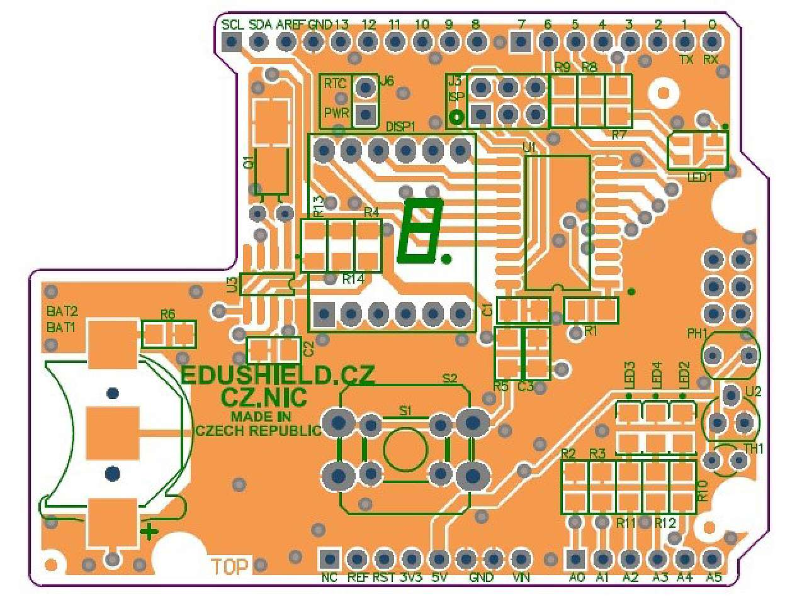
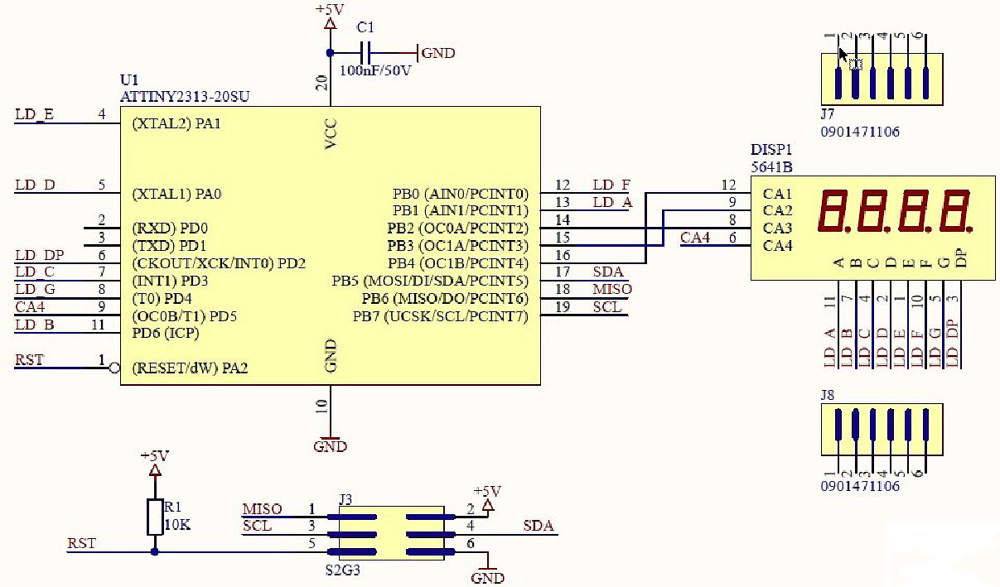

# EduShield {#edushield}

Použité piny na Arduino

| Pin | Funkce | Pin | Funkce |
| --- | --- | --- | --- |
| D2 (INT) | Button | A0(D14) | Fotorezistor |
| D3 (INT) | RTC SQW out | A1(D15) | Termistor |
| D4 | --- | A2(D16) | Red LED |
| D5 (PWM) | RGB LED – G | A3(D17) | Orange LED |
| D6 (PWM) | RGB LED – B | A4(D18) | I2C SDA pin |
| D7 | --- | A5(D19) | I2C SCK pin |
| D8 | --- |  |  |
| D9 (PWM) | RGB LED – R |  |  |
| D10 | --- |  |  |
| D11 | --- |  |  |
| D12 | --- |  |  |
| D13 | Green LED |  |  |

Přiřazení pinů v ATtiny2313 k vývodům na konektoru pro displej (pin 1 je vlevo dole):

AVR

| PB4 | PB1 | PB0 | PB3 | PB2 | PD6 |
| --- | --- | --- | --- | --- | --- |
| PA1 | PA0 | PD2 | PD3 | PD4 | PD5 |

Arduino

| D13 | D10 | D9 | D12 | D11 | D8 |
| --- | --- | --- | --- | --- | --- |
| D2 | D3 | D4 | D5 | D6 | D7 |

LED (CA označují pozice, SEG jednotlivé segmenty)

| CA1 | SEGA | SEGF | CA2 | CA3 | SEGB |
| --- | --- | --- | --- | --- | --- |
| SEGE | SEGD | SEGH(DP) | SEGC | SEGG | CA4 |