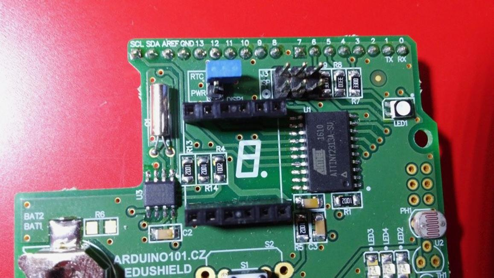
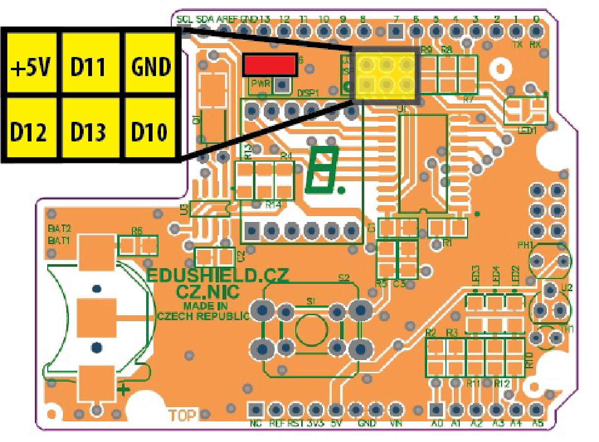
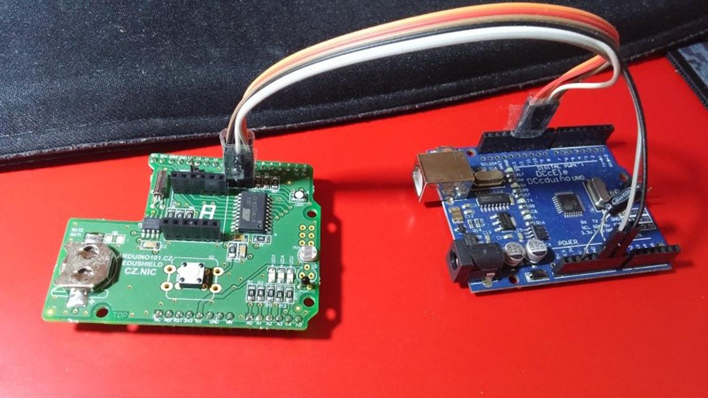
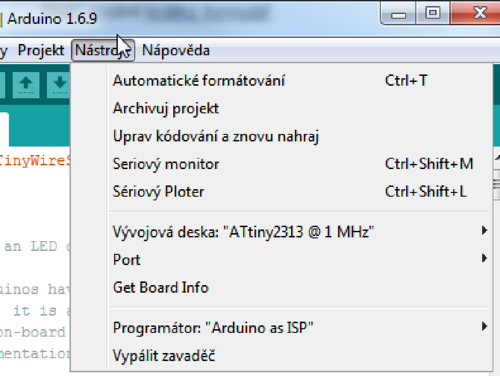

# Nahrání firmware do EduShieldu {#nahr-n-firmware-do-edushieldu}

V EduShieldu je displej řízen pomocí ATtiny2313\. V něm je firmware, napsaný ve Wiring. Tento firmware se dá jednoduše nahrát pomocí Arduina a Arduino IDE.

1.

Aktualizujte Arduino IDE na nejnovější verzi.

2.

Stáhněte si aktuální software pro EduShield ([github.com/arduino-edushield/edushield](https://github.com/arduino-edushield/edushield)) – můžete použít i Správce knihoven v Arduino IDE.

3.

Ve složce _firmware naleznete podsložky „hardware“, „libraries“ a „tiny2313“. Obsah složek „hardware“ a „libraries“ zkopírujte do pracovního adresáře Arduina (nejčastěji v domovském adresáři, podsložka Arduino). Složka „libraries“ bude pravděpodobně existovat, „hardware“ možná ne, tak jej vytvořte.

4.

Spusťte Arduino IDE a připojte Arduino Uno, kterým budete programovat. Bez EduShieldu!

5.

Z menu „Soubor – příklady“ vyberte „Arduino ISP“ a běžným způsobem jej nahrajte do Arduina.

6.

Z EduShieldu sundejte displej.

7.

Switch J6 nad displejem rozpojte, viz obrázek (to je to modré nahoře pod piny 12, 11, označené RTC PWR):

8.

Propojte pomocí šesti propojovacích vodičů EduShield (šestivývodový konektor označený J3 ISP) s Arduinem (+ 5 V, GND, datové piny 10, 11, 12 a 13). Správné propojení je naznačeno na následujícím obrázku:

9.

Propojené komponenty by měly vypadat zhruba takto:

10.

Spusťte Arduino IDE a otevřete sketch Tiny2313 ze složky _firmware.

11.

Vyberte jako desku „ATtiny2313 @ 1 MHz“ a jako programátor „Arduino as ISP“, viz screenshot:

12.

Přeložte a spusťte nahrávání.

13.

Po úspěšném nahrání odpojte EduShield od Arduina.

14.

Vraťte zpátky switch J6 (musí spojovat oba vývody) a nasaďte displej.