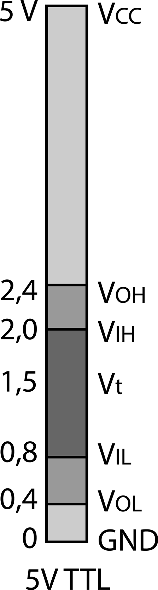
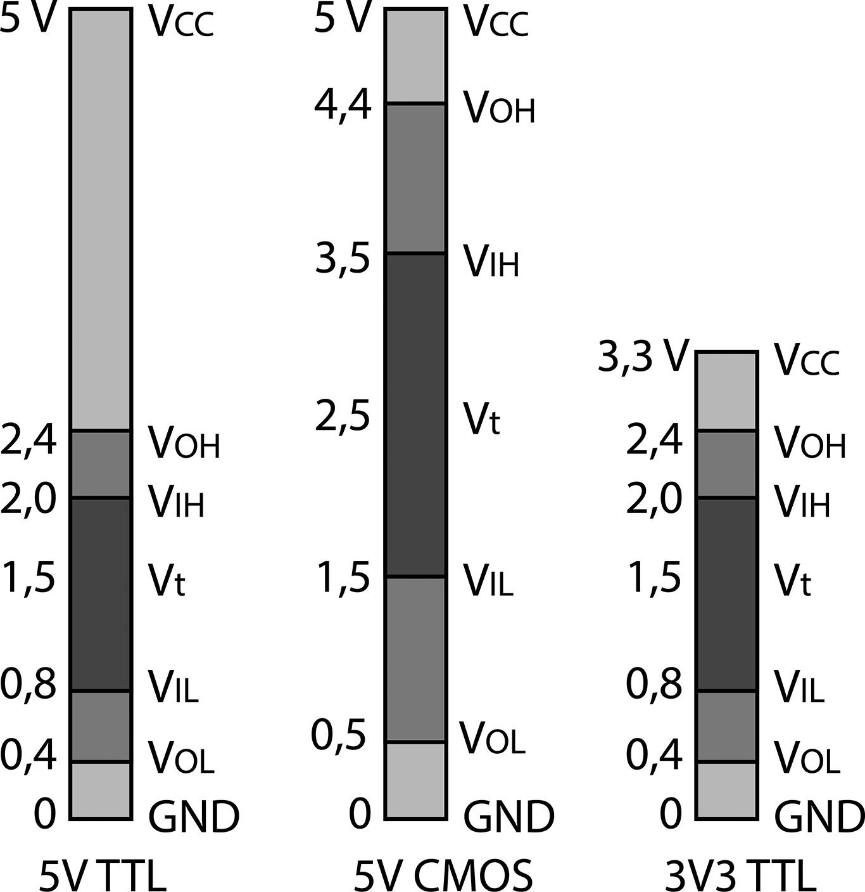

### 13.2.4 {#13-2-4}

Zpátky k technice

Když jsme si zopakovali, jak pomocí dvojkové soustavy můžeme přenést diskrétní informaci, pojďme se podívat, jak je to vlastně realizované fyzicky. Už jsem to tu naznačil, tak to pojďme dokončit.

Nejjednodušší způsob, jak vyjádřit logickou informaci pomocí elektřiny, je ten, že jedné logické úrovni bude odpovídat nějaké napětí, jiné logické úrovni napětí jiné. Nabízí se, že logická nula bude 0 voltů, stav bez napětí, a logická jednička pak nějaké konkrétní dohodnuté napětí – třeba + 5 voltů. No a tak tomu je v podstatě doposud.

Ne že by neexistovaly jiné způsoby. Například u jednoho sériového rozhraní je to tak, že logická 0 je definováno jako napětí + 15 voltů proti zemi, logická 1 je napětí - 15 voltů proti zemi. Některé logické obvody byly dřív stavěny tak, že logická 1 byla definována jako záporné napětí, ještě jiné pracovaly s obrácenou logikou, ale nakonec se jako nejpoužívanější uchytily dvě technologie, které zároveň definují onu otázku: „Kolik voltů je logická 1?“

13.3

TTL a CMOS

Jako první přišly číslicové obvody typu RTL (Resistor-Transistor Logic) a DTL (Diode-Transistor Logic). Z nejrůznějších důvodů, jako je třeba „vysoká spotřeba“ a „nízká rychlost“ se moc neuchytily. I když – jak se to vezme. Řídicí počítač pro lunární misi Apollo používal právě obvody RTL. Ale brzy přišly obvody lepší, rychlejší...

Až další evoluční krok, nazvaný TTL (Transistor-Transistor Logic), vyšel. S touto technologií bylo navrženo a vyrobeno velké množství typů číslicových obvodů, a dá se s nimi potkat dodnes.

Technologie TTL stanovovala výše zmíněné úrovně: 0 voltů pro logickou 0, + 5 voltů pro logickou 1\. Díky technologii, která byla použitá, nejsou hodnoty naprosto striktní. Běžný TTL obvod vezme jako logickou 0 jakékoli napětí mezi 0 a 0,8 voltu a jako logickou 1 napětí mezi 2 a 5 volty. Tyto hranice se označují jako VIL a VIH. Proč?

Je takový zvyk označovat logickou nulu písmenem L (Low, nízký, nepravda, false, ...) a logickou jedničku písmenem H (High, vysoký, pravda, true, ...) Používá se to tam, kde by se mohlo plést označení 0 a 1 s nějakými jinými číselnými hodnotami. Ale zvykněte si, že veškerá literatura nakládá s tímto označením naprosto volně, v jednom datasheetu se setkáte s H, L, v druhém s 1, 0… Mělo by platit, že 0 a 1 se používá tam, kde se hovoří o logické hodnotě, L a H tam, kde jde o konkrétní vyjádření těchto hodnot, jenže naprosto běžně uslyšíte mluvit dva techniky, že „mají ten vstup v jedničce“. Takže doporučuju se s tím smířit.

Označení VIL tedy znamená Voltage on Input in Low a VIH je Voltage on Input in High. Tedy (nejvyšší) napětí na vstupu, které se ještě považuje za 0 (L), a (nejnižší) napětí na vstupu, které se už považuje za 1 (H). Logická nula je tedy od 0 voltů do VIL, logická jednička od VIH do Vcc.

Samozřejmě že existují dva obdobné údaje pro výstup: VOL a VOH. Tedy maximální napětí na výstupu pro log. 0 a minimální napětí na výstupu pro log. 1\. U TTL to je 0,4 voltu pro L a 2,4 pro H.

Logická otázka: Co se stane, pokud je na vstupu třeba 1,5 voltu? To je správná otázka, a odpověď zní: Je průšvih! Integrovaný obvod neví, jestli se má otevřít, nebo zavřít, tak je v takovém divném mezistavu, ani ryba, ani rak, je polootevřený, teče skrz něj velké množství energie a jeho stav nelze předvídat ani definovat. Proto se snažíme těmto hodnotám vyhnout a dodržet je co nejblíž maximům, tj. 0 a 5 V.

Totéž platí pro vstup, který není s ničím propojený a, jak se říká, „visí ve vzduchu“ (někdy doslova). Takový vstup způsobuje jen a pouze problémy, protože velmi rád chytá indukcí rušení z okolí.

Postupem času se původní technologie TTL zlepšovala a přišly novější. Jako první přišla řada „TTL-S“ (Schottky), která byla rychlejší, ale měla vyšší spotřebu. K ní komplementárně přišla technologie TTL-L (Low Power), která měla menší spotřebu, zato byla pomalejší. Až po letech se podařilo zkombinovat obě do technologie TTL-LS, která má menší spotřebu, a zároveň je rychlejší. Ta byla pak opět vylepšena do podoby TTL-ALS (Advanced Low Power Schottky).

Obvody TTL zpočátku vyráběli výrobci stylem „každý pes jiná ves“, ale brzy se jako standard uchytila řada 74xx od Texas Instruments. Ostatní výrobci začali vyrábět stejné obvody, označené stejným číslem, jen jiným kódem výrobce. Například originál od Texas Instruments měl označení SN7404\. Československá Tesla vyráběla ekvivalentní obvod se stejnou funkcí a stejným zapojením pod označením MH7404, Polsko jej označovalo UCY7404, tehdejší východní Německo vyrábělo ekvivalentní D104, maďarský Tungsram dodával týž obvod jako 7404APC. Americký National Semiconductors používal písmena DM: DM7404\. A tak dále.

Platí, že bez větších problémů můžeme nahradit třeba obvod SN7404 obvodem MH7404 nebo jiným 7404\. Měl by mít stejnou spotřebu i rychlost. Do jisté míry můžeme i obyčejný obvod 7404 nahradit obvodem z řady L, S, LS, ALS – například SN74ALS04\. Pokud nejde o nějaké zapojení, kde je kritická rychlost obvodu nebo jeho zisk (vysvětlím později), nebude s tím problém.

Existovaly i řady 54xx a 84xx, které byly určené pro náročnější výrobky, třeba pro takové, co musely pracovat v extrémních teplotách apod. Jinak se od verze 74xx neliší (snad krom ceny).

Časem se ukázalo, že technologie TTL má dvě velké nectnosti – velkou spotřebu, která se projevovala v tom, že obvody hřály, a že zabírají hodně místa, takže se na křemíkový čip vešlo jen omezené množství tranzistorů.

Druhý problém řešila jiná technologie, nazvaná MOS. Ta místo tranzistorů bipolárních používala tranzistory MOSFET. Nejprve jako PMOS, později NMOS, a nakonec CMOS – ta je tvořena dvojicí tranzistorů PMOS a NMOS, které jsou zapojeny „proti sobě“. CMOS má tu výhodu, že má proti TTL nepatrný odběr. Vzpomeňte si: bipolárními tranzistory musí téct proud mezi bází a emitorem, aby se otevřely, u tranzistorů MOS stačí připojené napětí na řídicí elektrodu Gate, a proud skrz ně teče minimální. K přepnutí proto není zapotřebí, aby obvodem tekly velké proudy, stačí jen napětí.

Technologie CMOS měla také podobnou základní řadu jako byla 74xx. U CMOS to byla řada 40xx, ovšem obvody nebyly navzájem kompatibilní a číslování bylo taky jiné (například ekvivalent 7400 byl v CMOS řadě 4011 apod.)

CMOS řada má navíc ještě některé výhody, například široký rozptyl napájecího napětí (až k 15 voltům). Ovšem problém nastal při vzájemném spojování obvodů CMOS a TTL. CMOS mají totiž jiné prahové hodnoty VIL, VIH, VOL a VIOH. U CMOS je při napájení 5 V logická nula na vstupu zaručena od 0 do 1,5 V, logická 1 od 3,5 do 5 V. A tady nastává problém – na výstupu TTL může být při log. 1 pouhých 2,4 V, a to pro CMOS nestačí. Pokud bylo potřeba zapojit výstup TTL na vstup CMOS, používaly se budiče, třeba tranzistory, nebo specializované obvody (převodníky), což celou konstrukci prodražovalo.

Nakonec přišla technologie HCT, která zkombinovala rychlé, levné a nízkopříkonové obvody CMOS a napěťové úrovně kompatibilní s TTL. V řadě 74xx teď můžeme koupit obvody 74HCTxx, které jsou sice technologií výroby CMOS, ale úrovněmi kompatibilní se starými obvody z řady 74xx. Podobné jsou řady AC, ACT, AHC, AHCT, …

Technologie CMOS a její vylepšené varianty je v současnosti nejpoužívanější technologií pro výrobu číslicových integrovaných obvodů. Technologie TTL ale nezůstala zapomenuta, dodneška se obvody v řadě 74xx vyrábějí, a hlavně: dodneška se používá „pětivoltová logika“ TTL.

Postupem času ale bylo potřeba řešit i ten první problém, totiž spotřebu a ztrátový výkon, proměněný na teplo. Logická cesta vedla přes snižování napájecího napětí. Nejprve na 3,3 voltů, později na 2,5 V, pak na 1,8 V, dneska už i 1,2 V a 1 V. Některé součástky, používající 3,3 voltovou logiku (též označovanou 3V3), jsou takzvaně „5 V-tolerantní“, což znamená, že když na jejich vstupy přivedete signál z 5 V obvodu, který bude mít třeba i těch 5 voltů, tak je nespálí. Jiné obvody (například procesor ve známém Raspberry Pi – tak na to pozor, prosím) nejsou 5 V-tolerantní, to znamená, že je vyšší napětí může poškodit. Výhodou 3V3 logiky je to, že má úrovně VIL, VIH, VOL a VIOH shodné s 5 V, takže není problém takové součástky navzájem propojovat (vždy je ale třeba dbát na to, jestli jsou 3V3 součástky na vstupu 5 V-tolerantní). Víc naznačí obrázek:

