### 13.3.1 {#13-3-1}

Propojení CMOS a TTL

Pokud u CMOS dodržíte napájecí napětí stejné jako u TTL, tedy 5 voltů, je s trochou dobré vůle možné tyto dvě technologie kombinovat. Co obnáší ta „dobrá vůle“? V zásadě dvě hlavní pravidla:

•

Výstup CMOS můžete připojit na vstup TTL. Ale CMOS mají malé výstupní proudy, takže jedním výstupem CMOS můžete budit vždy jen jeden vstup TTL.

•

Výstup TTL může mít v log. 1 úroveň napětí nižší, než je minimální napětí pro CMOS (3,5 V). Nejjednodušší řešení je „zvednout“ výstup TTL pomocí pull-up rezistoru (pojem pull-up si vysvětlíme později) o velikosti cca 10K.

13.4

Operace s bity

Už víme, jak budeme předávat informace. Když budeme chtít do vodiče poslat logickou 1, tedy vysokou úroveň (H), bude to pro nás 5 voltů (přesněji 2 až 5, ale držme se raději té vyšší hodnoty). Logická 0 bude reprezentována stavem bez napětí, popř. nižším než 0,4 V. Tak.

A co s těmi informacemi budeme dělat? Možná vás to překvapí, ale škála možností není zas tak velká. Jediné, co máme k dispozici, jsou takzvané logické funkce. Vše složitější si ale naštěstí můžeme postavit z nich.

Možná je znáte z matematiky, možná je znáte z programování, možná odjinud. Někde se tomu říká i Booleova algebra, a pokud vám to připomíná typ Boolean, jste na správné stopě. Dovolte drobné opakování.

13.5

Booleova algebra, výroková logika

Booleova algebra (kterou nám připomínají typy Boolean nebo Bool z některých programovacích jazyků) je širší pojem, který se v číslicové technice scvrkává na operace s logickými hodnotami. Logické hodnoty, též pravdivostní, jsou hodnoty logických výroků, které nabývají dvou různých stavů: Pravda a Nepravda. Anglicky True a False. Typicky:

•

Venku prší. Ano, nebo ne? Pravda, nebo nepravda?

•

Mám deštník. Mám, nebo nemám? Pravda? Nepravda?

•

Přines mi jídlo. Tohle není výrok, u kterého můžeme rozhodnout o jeho pravdivosti. Pardon, to jen na ukázku, že ne všechno je výrok.

•

Přinesl jsi mi jídlo. Tady už rozhodnout lze. Přinesl? Nepřinesl? Ano, nebo ne?

Takovéto výroky jsou výroky jednoduché. Jazyk (a každodenní zkušenost“ nás učí, že takovéto jednoduché výroky můžeme spojovat do složitějších složených výroků pomocí spojek, jako je „a“ či „nebo“. Venku prší a mám deštník.

Funkci spojek zastávají ve výrokové logice takzvané logické operátory. Představme si je podobně jako v matematice – třeba operátor sčítání, operátor násobení, … Můžeme je převést i do podoby logické funkce a místo A AND B zapisovat AND (A, B).

Pojďme si dát příklad:

Čtyři sběratelé, Adam, Bořek, Cyril a David (a je jen náhoda, že si je můžu označit A, B, C a D), sbírají různé věci, a to takto:

•

Adam sbírá známky a krabičky od zápalek.

•

Bořek sbírá mince.

•

Cyril sbírá známky i mince.

•

David sbírá mince a krabičky od zápalek.

Ke každému pánovi můžeme vytvořit sadu výroků: „Sbírá mince“, „sbírá známky“, „sbírá krabičky od zápalek“, a o každém výroku můžeme říct, zda je pravdivý nebo ne. Tedy: „A sbírá mince“ je výrok nepravdivý, „A sbírá známky“ je výrok pravdivý, a tak dále. Zapíšeme si to do takzvané „pravdivostní tabulky“:

|  | Sbírá mince | Sbírá známky | Sbírá krabičky |
| --- | --- | --- | --- |
| Adam | ne | ano | ano |
| Bořek | ano | ne | ne |
| Cyril | ano | ano | ne |
| David | ano | ne | ano |

Teď otázka: Je tu někdo, kdo sbírá mince a známky zároveň? O kom můžeme říct „Ten sbírá známky i mince“? Jsou to vlastně dva výroky, „sbírá známky“ a „sbírá mince“, a výsledek je pravdivý pouze tehdy, když oba výroky platí. Tedy musí platit, že „sbírá známky = ano“ a „sbírá mince = ano“. Koukneme do tabulky a vidíme: Cyril je ten pán!

A teď otázka číslo dva: Je mezi pány někdo, kdo sbírá známky nebo krabičky od zápalek? Jsou to opět dva výroky, „sbírá známky“ a „sbírá krabičky“, ale tentokrát nechceme, aby dělal nutně obojí naráz, stačí nám alespoň jedna varianta. Z tabulky vyplývá, že podmínku splňují pánové Adam, Cyril a David. Bořek ne, ten sbírá mince.

Otázka tři: Je mezi pány někdo, kdo nesbírá mince? Tedy o kom platí, že „sbírá mince je nepravda“? Ano, máme tu takového pána, Adama.

Ta první otázka ukázala logický operátor AND (tedy „a“, „i“). Výsledek je pravda tehdy a jen tehdy, pokud jsou jednotlivá tvrzení pravdivá.

Druhá otázka ukazovala operátor OR (tedy „nebo“ ve slučovacím tvaru). Výsledek je pravda tehdy, když je pravda alespoň jedno tvrzení. Pozor, nepleťte si to s tím druhým tvarem, vylučovacím, tedy buď – anebo! Tomu říkáme „vylučovací NEBO“ a značíme ho XOR. K němu se ještě dostaneme. Mimochodem, víte, že v češtině se mezi těmito tvary rozlišuje? Když napíšu „dáte si brambory, nebo rýži?“ – s čárkou před „nebo“ – znamená to, že platí jen jedna varianta. Buď brambory, nebo rýže. To je „vylučovací, exkluzivní OR“ (XOR). Když ale napíšu „podíváte se se mnou na rezistory, kondenzátory nebo diody“, znamená to, že mohou nastat všechny varianty, a to je to naše „obyčejné“ OR.

Třetí otázka ukazovala operátor NOT. Jeho výsledek je pravda, pokud je tvrzení nepravdivé.

Programátorům toto určitě připadá jako jasné a samozřejmé. Ale pro jistotu jsem to rozepsal.

AND se nazývá taky „logický součin“, OR „logický součet“ a NOT je „negace“. Čímž se odkazujeme k matematice: AND nahradíme násobením, OR sčítáním, místo „pravda“ použijeme 1, místo „nepravda“ použijeme 0\. Někdy se můžete setkat i se zápisem pomocí matematických značek ⋁ a ⋀ (NEBO, A).

Uděláme si tabulku pro dvě proměnné, A a B, a výsledky funkcí AND a OR:

| A | B | A OR B | A AND B |
| --- | --- | --- | --- |
| 0 | 0 | 0 | 0 |
| 0 | 1 | 1 | 0 |
| 1 | 0 | 1 | 0 |
| 1 | 1 | 1 | 1 |

Máme čtyři možné kombinace, do jakých se vstupy mohou (legitimně) dostat. Z tabulky je vidět, že obě funkce jsou komutativní, to znamená, že když jim prohodíte hodnoty A a B, bude to jedno.

Třetí logická funkce do party je NOT, též logická negace (značí se ¬ před parametrem, nebo vodorovnou čárou nad výrazem) – je to funkce s jedním parametrem a jednou hodnotou, a pokud je parametr 0, je hodnota 1 a obráceně:

| A | NOT A |
| --- | --- |
| 0 | 1 |
| 1 | 0 |

Negované signály se značí různými způsoby. Nejčastěji tak, že nad názvem signálu je vodorovná čárka: Q a Q Nadtržení se ale zapisuje velmi nepohodlně, proto se někdy setkáte s tím, že negovaný signál bývá označen lomítkem: /Q. Tohoto zvyku se přidržím i já. Další možnost je označit takový signál písmenkem „n“ – nQ, nREADY, nBUSY…

13.6

Logika v číslicové technice

Už jsme si říkali, že v digitální technice používáme jen dva stavy, Pravda a Nepravda, tedy True a False, a řešíme to tak, že buď je někde napájecí napětí (a pak to je 1), nebo tam není, je to spojené se zemí, a pak to je 0.

Neexistuje žádná hodnota „0.5“, třeba že bychom pustili „ne úplně napájecí napětí, ale jen trochu“. Ne, buď 0, nebo 1! Pokud bude na vstupu nejasná hodnota, bude výsledek podivný a chybný.

Asi už tušíte, že jsem o logických funkcích nepsal jen tak zbůhdarma, a máte pravdu. Tyto základní logické funkce mají totiž svou fyzickou podobu – existují číslicové obvody, které dělají přesně tyto operace. Vstupy i výstupy jsou signálové vodiče (opravdové fyzické spoje), a součástka dělá AND, OR, NOT, NAND, NOR, ...

Moment, NAND? NOR?

Ano, ve světě číslicové techniky jsme si rozšířili základní typy logických operací pro dva vstupy na 4\. K AND existuje NAND, tedy „negovaný AND“, a k OR existuje NOR, čili „negovaný OR“. Zkrátka za výstupem je ještě zapojený invertor, takže tabulka hodnot vypadá takto:

| A | B | A OR B | A NOR B | A ANDB | A NAND B |
| --- | --- | --- | --- | --- | --- |
| 0 | 0 | 0 | 1 | 0 | 1 |
| 0 | 1 | 1 | 0 | 0 | 1 |
| 1 | 0 | 1 | 0 | 0 | 1 |
| 1 | 1 | 1 | 0 | 1 | 0 |

Každá logická funkce (hradlo) má i vlastní schematickou značku. Ty jsou shrnuty v obrázku (včetně hradla XOR, k němuž se ještě dostaneme). Schematické značky, co používám, jsou podle normy ANSI. V ČSSR se koncem osmdesátých let začala prosazovat evropská norma IEC, kde všechny vypadají jako obdélníčky se symbolem; setkáte se s oběma typy schematických značek. Jedno mají společné: Negovaný vstup nebo výstup se značí kroužkem:

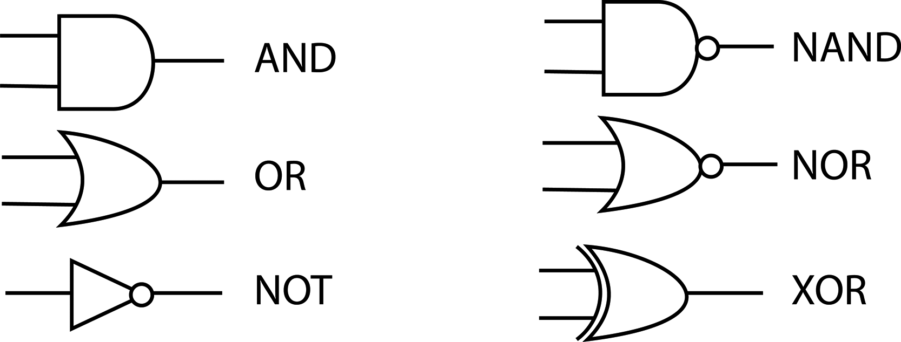

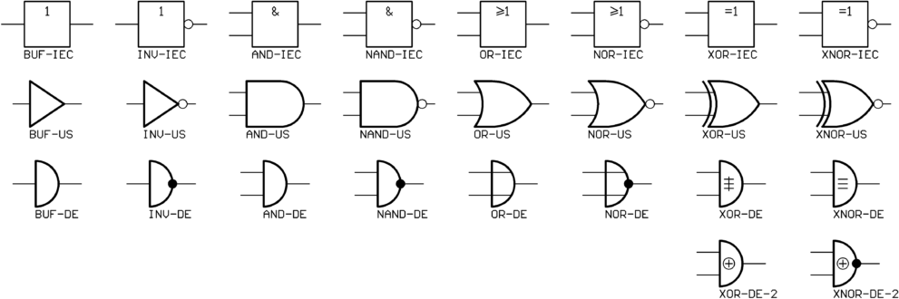

Ta první funkce, označená jako „BUF“ (z anglického Buffer, česky se pro tuto součástku používá slovo „budič“), je vlastně něco-jako-invertor, který neinvertuje. Když je na vstupu 0, na výstupu je taky 0\. Když je na vstupu 1, na výstupu je taky 1\. Možná si říkáte, že taková součástka je úplně na... zbytečná, ale přeci jen se někdy hodí: v případě, že potřebujeme signál přivést k více dalším zařízením, hodí se posilovač – budič. Takové součástky většinou dokáží spolehlivě dodat dostatek proudu k tomu, aby signál mohl být přiveden do několika různých obvodů najednou. Pro klasické obvody TTL platí, že k jejich výstupu můžete připojit maximálně 10 vstupů dalších obvodů TTL. Pro CMOS je tento počet mnohem nižší – a tam se hodí právě budič.

Mimochodem, tomu číslu, které říká, kolik vstupů může být připojeno na jeden výstup, se říká logický zisk a je dobré ho znát a vzpomenout si na něj pokaždé, když jeden výstup budete připojovat na víc vstupů. Je to vlastně poměr mezi proudem, který může téct výstupem jednoho hradla, a proudem, který musí téct vstupy dalších hradel. Pokud je výstupní proud desetkrát větší než vstupní, můžete připojit deset vstupů na jeden výstup a máte logický zisk 10.

13.7

U-káz-ka! U-káz-ka!

Dobrá, pojďte si zazapojovat.

Vezměte si obvod 7400\. Teď už víte, že jeho označení bude třeba SN74ALS00, nebo SN74HCT00, nebo klidně i MH74LS00, nebo jen 74HC00, nebo … v podstatě cokoli z kombinace xx74xx00xx. Prostě nějaký takový obvod vezměte a zapojte ho do nepájivého pole stejně, jako jste to dělali v první kapitole. Pamatujete? Pěkně doprostřed, a podívejte se na něj – klíč, ta značka na pouzdru, ať je hezky vlevo, ať máme vývod číslo 1 vlevo dole.

Pokud si nepamatujete, nalistujte si první kapitolu, zapojování blikače – orientaci obvodu určíte podle popisku a výlisku na pouzdru, pokud máme popisky správně orientované a výlisek vlevo, tak vlevo dole je vývod 1, vedle něj 2, a číslování pokračuje ve spodní řadě doprava. Na konci pokračuje proti směru hodinových ručiček nahoře, zprava doleva.

Tak. Obvod bychom měli. Co s ním? Jak zjistíte, co máte kam připojit? No, schválně, kdo si to pamatuje? Správně, podíváte se do datasheetu. Ale protože jsem na vás hodný, tak vám sem ten nejdůležitější obrázek zkopíruju. To je on:

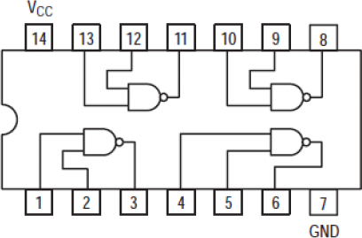

Vidíte, jak je uspořádaný obvod uvnitř: jsou tam čtyři hradla NAND, zapojená na vývody 1-2-3, 4-5-6, 13-12-11 a 10-9-8\. Vývod 7, označený GND, je zem (Ground), tedy pro nás záporný pól napájecího zdroje, vývod 14 je Vcc, neboli napájecí napětí.

Jak poznáte, který vstup je A a který B? Nepoznáte. Je to přeci úplně jedno! U hradla NAND můžete vstupy zaměnit.

Pamatujte si: Napájecí napětí se ve schématech značí buď Vcc, nebo Vdd, nebo prostě „+ 5 V“; zem je GND, Vss, Vee, nebo „0“. Proč? No, protože kladný pól, tedy napájecí napětí, bývá spojeno s kolektorem tranzistorů u obvodů TTL (odtud Vcc – Voltage Collector), případně s elektrodou Drain u MOS (Vdd – Voltage Drain). Analogicky Vee bude souviset s emitorem (TTL), Vss s elektrodou Source (MOS). Ale pro nás je Vcc totéž jako Vdd, a Vss budiž totožné s Vee i s GND.

Napájecí napětí se tedy připojuje stejně jako u blikače. Podíváme se na funkci jednoho hradla. Třeba toho, jak má vstupy 1 a 2 a výstup 3\. Na výstup (nožička číslo 3) si připojte LEDku (samozřejmě přes rezistor 330 ohmů!). Vstupy (1 a 2) propojte se zemí (se záporným pólem napájení). Oba.

Co s těmi ostatními hradly v pouzdru? Teď nic, ale v reálných konstrukcích je dobré připojit jejich vstupy k některému pólu napájení, ideálně oba k + 5 V. Vývody mohou zůstat nezapojené, pokud dané hradlo nepoužíváte. Proč? No, pokud ty nepoužité necháte úplně nezapojené, mohou se vlivem rušení náhodně překlápět, čímž budou zvyšovat odběr a přenášet rušení do napájecího vedení.

Když teď zapnete napájení, měla by LED svítit. Oba vstupy spojené se zemí znamenají, že na vstupech jsou hodnoty 0, a výsledek 0 NAND 0 = 1.

Když teď oba vstupy připojíte na kladný pól napájení, LED zhasne.

Otázka: Můžete to dělat při zapnutém napájení? Odpověď správná: Ne, nikdy to nedělejte! Odpověď realistická: Sice to někteří někdy dělají a nic se nestane, ale nezvykejte si na to a fakt to radši nedělejte, protože občas se holt něco stát může, a hezké to nebude…

Zkuste si přepojováním vstupů 1 a 2 nasimulovat všechny možné kombinace vstupních hodnot a podívat se, jaký bude výstup.

Pokud vám LED nesvítí vůbec, máte problém. Zkuste ji nejprve přepojit místo na vývod číslo 3 na napájecí napětí. Samozřejmě přes ten rezistor. Pokud stále nesvítí, může to mít tři příčiny: Máte LED obráceně (vzpomeňte si na kapitolu o diodách), máte LED spálenou, nebo vám nefunguje napájení.

Pokud vám LED svítí naopak pořád, i když zapojíte vstupy 1 a 2 na napájecí napětí, máte pravděpodobně vadný obvod 7400\. Zkuste to popřepojovat jinak, třeba na vstupy 4, 5 a výstup 6.

Jde ty vstupy udělat jinak, než pomocí drátků?

Jasně že to jde. Jako vstup můžeme použít třeba tlačítko, nebo přepínač.

13.8

Tlačítko a přepínač

Tlačítka, přepínače, vypínače, spínače a jiné zapínače a odpínače patří hned vedle zásuvek a žárovek k základním elektrotechnickým komponentám, které zná úplně každý z každodenní zkušenosti. Všechny tyto součástky slouží k tomu, aby buď přerušily nebo naopak spojily obvod, a to dočasně, po dobu stisknutí tlačítka, nebo trvaleji, do dalšího přecvaknutí přepínače…

Hodně o jejich funkci napoví schematické značky:

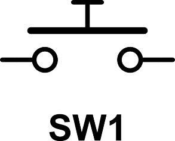

Toto je schematická značka tlačítka. Všimněte si, že vodič je přerušený, a je nad ním ploška. Přesně tak vypadá tlačítko uvnitř: jsou tam dva póly a nad nimi pružný plíšek, na který tlačí plastový hmatník. Jakmile zatlačíte prstem, tak se plíšek při určitém tlaku prohne (s typickým cvaknutím) a oba póly propojí. Když tlak přestane, plíšek se opět prohne na druhou stranu a obvod zase rozpojí.

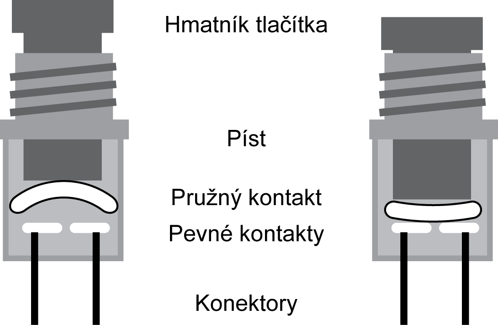

Tlačítka, která budete používat nejčastěji, jsou malá mikrotlačítka, která mají čtyři vývody. Vždy dva a dva jsou spojeny dohromady, a mezi těmito dvěma páry je právě samotný mechanismus tlačítka.

Pokud si nejste jistí, které dva vývody jsou spolu propojené a které ne, tak je nejjednodušší způsob si to prostě změřit. Vážně, doporučuju…

Tlačítko tedy spíná pouze po tu dobu, kdy ho někdo tiskne, nespisovně mačká. Znáte třeba z domovního zvonku. Druhá možnost je, že tlačítko za normálních okolností vede, při stisku se naopak rozpojí, ale taková tlačítka jsou méně častá. První typ se označuje NO (Normally Open), druhý typ NC (Normally Closed), podle toho, jestli je tlačítko samo o sobě, tj. bez vnější síly, otevřené a rozpojené (NO), nebo zavřené, propojené (NC).

Pro naše experimenty s LEDkami je tlačítko dostatečně dobré zařízení, ale jakmile začnete stavět něco s rychlými procesory, zjistíte, že s tlačítkem může být problém. Totiž – člověk jednou zmáčkne, a procesor zachytí třeba dva nebo tři po sobě jdoucí stisknutí.

Tomuto efektu se říká zákmit, a je způsoben právě tím, jak je mechanicky tlačítko uspořádané. Plíšek má totiž nějakou svou pružnost, a když se „přecvakne“ do pozice stisknuto, tak si ještě několikrát zavibruje, a tím způsobí několik rozpojení a spojení. U pomalých obvodů to nevadí, ale rychlý jednočip napočítá klidně i několik stisknutí, a to může přinášet problémy.

Zákmity tlačítek lze řešit několika způsoby. Mechanicky – tedy použitím bezzákmitových tlačítek. Ale ta jsou velmi drahá. Pak elektricky – přidáním kondenzátoru, který rychlé pulsy odfiltruje, a Schmittova obvodu (k tomu se ještě dostaneme), který upraví signál. Nebo pomocí monostabilního klopného obvodu. No a nakonec softwarově – nejjednodušší řešení je při každém stisknutí tlačítka počkat třeba tři milisekundy (to je empiricky zjištěná hodnota pro běžná mikrotlačítka), zkontrolovat, zda je tlačítko stále stisknuté, a teprve poté dělat nějakou akci. Anglicky se těmto postupům říká debouncing – občas se s tím setkáte, tak abyste věděli…

Přepínač funguje podobně, ale „pamatuje si“ poslední stav.

Uvnitř bývá mechanická propojka, která vždy spojí prostřední vývod (společný, C – Common) s jedním z krajních vývodů. Mechanismus je navržen tak, aby k přepnutí došlo co nejrychleji, skokově, aby se minimalizovala doba, kdy jsou oba vývody odpojené a aby se vyloučilo, že budou zapojené oba naráz. (Existují i přepínače se třemi polohami, kdy uprostřed jsou oba vývody odpojené.)

Přepínač nemusí být jen páčkový, jak jej známe ze starších elektronických výrobků. Může být třeba posuvný.

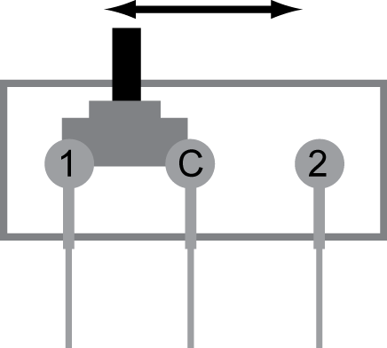

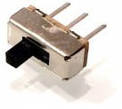

Tento přepínač se dá, při troše dobré vůle, použít i do nepájivého kontaktního pole. Bohužel, rozteč vývodů u některých laciných přepínačů může být pouze 2,5 mm, ne 2,54, a tak lehce nesedí, což je škoda. Snažte se proto sehnat takové, které mají rozteč 2,54 mm.

Pokud u přepínače jeden krajní vývod vynecháme, dostaneme spínač (popřípadě vypínač, ono je to totéž). Velmi časté jsou spínače a přepínače dvoupólové, tedy takové, kde jsou vlastně dva spínače / přepínače v jednom pouzdru, jen páčka je společná. Abychom se v tom trochu vyznali, tak jsou zavedené zkratky:

SPST – Single pole (jednopólový), single throw (s jedním vývodem, tedy spínač)

SPDT – Single pole (jednopólový), dual throw (s dvěma vývody, tedy přepínač)

DPST – Dual pole (dvoupólový), single throw (s jedním vývodem, tedy spínač)

DPDT – Dual pole (dvoupólový), dual throw (s dvěma vývody, tedy přepínač)

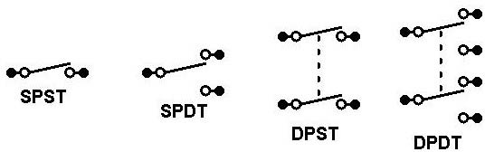

13.9

Pull Up a Pull Down

Fajn, už víte, jaké možnosti máte. A teď tedy zpátky k našemu problému, totiž vyřešit nějak nastavování jedniček a nul: co zapojit? A jak?

Klasické přepínače a spínače by šly použít, ale museli byste si k nim připájet vývody, co jdou zapojit do nepájivého kontaktního pole (NKP).

Můžete použít tahový přepínač, který jde sice do kontaktního pole zasunout, ale nedrží tam moc dobře, protože mívají krátké nožičky. Ale šlo by to: Na vstup hradla připojíte prostřední vývod (C), jeden krajní zapojíte na zem, druhý na Vcc, a bude to. Podle toho, jak přepnete, bude vývod C přepínače spojen buď se zemí, nebo s napájením, a bude na něm tedy buď log. 0, nebo log. 1\. A když budete přepínat rychle, tak minimalizujete i okamžiky, kdy na vstupu nebude ani zem, ani napájecí napětí, což je pro nás zakázaný stav.

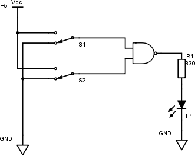

Nebo můžete použít mikrotlačítko, které do NKP sedne docela dobře, jenže neumí přepnout mezi dvěma póly. (Jsou taková tlačítka, spíš „přepínače s pružinou“, která se vždy vrací do výchozí polohy, ale ty teď neuvažujme.) Jak to uděláte?

Tak, v první řadě – zapojíte tlačítko mezi vstup hradla a napájecí napětí. Pokud bude tlačítko stisknuté, propojí vstup s Vcc a na vstupu bude tedy logická 1\. Pokud bude tlačítko rozpojené, tak… Co? No, v takovém případě nebude na vstupu nic konkrétního. Záleží na technologii obvodu, jak si s takovým stavem poradí, ale upřímně říkám, že třeba u obvodů CMOS stačí přiblížit ruku a stav se změní (vzpomeňte si na pokus s tranzistorem JFET)… Takže by bylo fajn tam mít po zbytek času zem.

A jestli mi nevěříte, zkuste si to sami. Použijte třeba 74HC00 (tady je to HC důležité, s obvodem LS, ALS apod. to fungovat nebude), zapojte LED na výstup hradla, jeden vstup připojte na + 5 V, druhý nechte nezapojený a podívejte se co se stane, když budete kolem toho nezapojeného šátrat prstem. Když k nezapojenému vstupu připojíte jeden konec vodiče a druhý necháte bimbat prostorem, stvoříte navíc anténu, citlivou i na statickou elektřinu, a nebudete se stačit divit, jak se bude LED chovat. Tedy až do té chvíle, kdy se zapomenete, poškrábete se zamyšleně na triku, tím si vytvoříte větší statický náboj, a když pak ruku přiblížíte k téhle anténě, tak se ozve suché zapraskání, které vám zároveň oznámí, že jste pravděpodobně právě zničili celý integrovaný obvod.

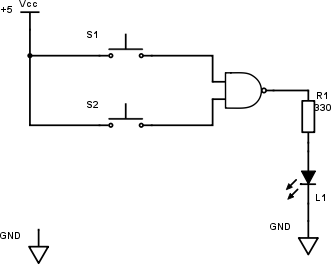

Říkáte si dobře, tak to propojím se zemí, aby byl klid a žádné rušení? To není moc dobrý nápad. Co by se stalo? Dokud není tlačítko stisknuté, tak je vstup propojen se zemí a je na něm log. 0\. Jakmile tlačítko zmáčknete, tak se propojí napájecí napětí se zemí, vytvoří se zkrat, kterým poteče tolik proudu, kolik jen zdroj dokáže dát a kolik vodiče snesou, ostatní obvody zůstanou bez proudu (většina poteče zkratem) a je zle. Takhle tedy ne!

Dělá se to tedy tak, že mezi vstup a zemi zapojíte rezistor, třeba 10k. Pokud je tlačítko rozpojené, tak je vstup obvodu skrz něj připojen k zemi, a je tam tedy nula. Když stisknete tlačítko, tak sice vznikne zkrat, kterým poteče I = U / R = 5 / 10000 = 0,5 mA, ale zároveň dostanete na vstup požadovaných (skoro) 5 V.

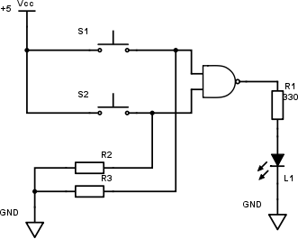

[eknh.cz/7400](https://eknh.cz/7400)

Této technice se říká pull-down rezistor – jako že „táhne vstup dolů, k zemi, k nule“. Když to zapojíte obráceně, tedy tlačítko na zem a rezistor na napájecí napětí, stvoříte pull-up, tedy zapojení, kde rezistor „táhne vstup nahoru“ – myšleno k logické 1\. Tento model je velmi častý a setkáte se s ním u spousty zapojení. Ovšem funkce tlačítka pak bude obrácená: při stisknutí spojí vývod na log. 0, při puštění log. 1.