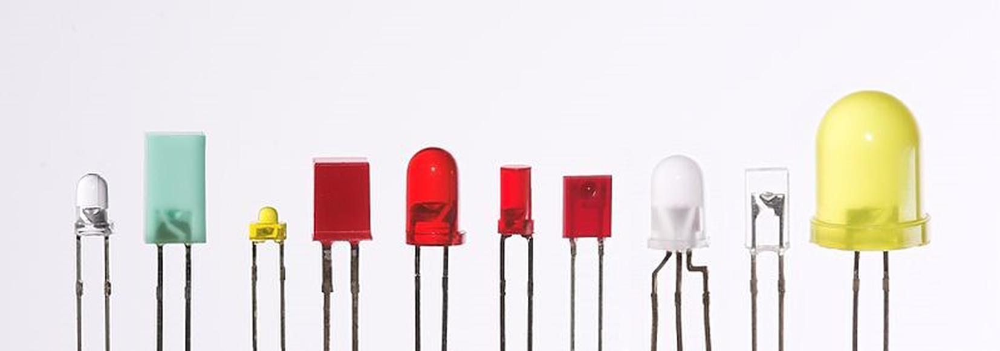

### 1.4.1 {#1-4-1}

LED

Především jsou to LED. LED je akronym anglických slov Light Emitting Diode, tedy „světlo vyzařující dioda“. Neříkejte proto prosím „LED dioda“, protože říkáte vlastně „Světlo vyzařující dioda dioda“. Někteří obhajují slovní spojení „LED dioda„ kvůli tomu, že slovo „dioda“ můžete skloňovat: LED diodou, LED diody, … Já s dovolením sklouznu k nespisovnému, ale používanému výrazu LEDka.

Ale zpět k věci: LED jsou v nejrůznějších barvách, nejčastěji červená, žlutá, zelená, modrá a bílá. Jsou i vícebarevné diody, dvoubarevné, trojbarevné (RGB – červená, zelená, modrá) i čtyřbarevné (RGBW – jako předchozí, ale navíc s bílou). Jsou diody se zabudovaným řídicím obvodem, který umožňuje sofistikované řízení, např. v různých LED páskách. Ale ty potřebovat nebudete. Kupte si do začátku úplně obyčejné jednobarevné LED, třeba pět kusů od každé barvy. Jestli zvolíte průměr 5 mm, nebo 3 mm, to je jedno. Ty větší líp „sednou do ruky“ při manipulaci, ty menší zase snáze dáte vedle sebe. Já používám pětimilimetrovou verzi…

CC-BY-SA, autor Afrank99